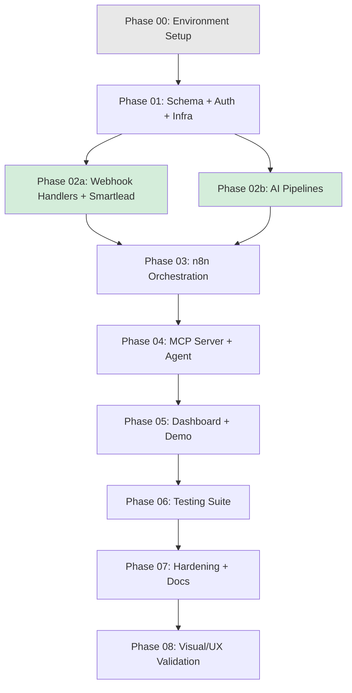

# BUILDPLAN: BenchworksAI Outbound Engine

**Spec Version:** v2 (LOCKED)  
**SOW Reference:** benchworks-outbound-sow.md (v1.1)  
**Generated:** April 8, 2026  
**Target Stack:** Next.js 14+ / FastAPI / Supabase (PostgreSQL + RLS) / Redis / n8n / Smartlead MCP+CLI / Apollo / Claude API / Cal.com / Resend / Caddy / Docker Compose on Hetzner CX41  
**Deployment Target:** Single Hetzner VPS, Docker Compose  
**Operator:** Claude Code

---

## Build Sequence

**Parallel phases:** 02a and 02b can run simultaneously in separate Claude Code sessions (no shared dependencies beyond Phase 01). All other phases are sequential.

---

## Phase Summary

| Phase | Name | Complexity | Est. Turns | Prerequisites | SOW Features | Operator File | Status |
|-------|------|-----------|------------|---------------|-------------|---------------|--------|
| 00 | Environment Setup | Low | 5–10 | None | — | `phase-00-environment.md` | ⬜ |
| 01 | Schema + Auth + Infra | High | 25–35 | Phase 00 | F-010, F-015, F-016, F-020, F-021, F-025 | `phase-01-foundation.md` | ⬜ |
| 02a | Webhook Handlers + Smartlead | Medium | 15–20 | Phase 01 | F-003, F-008, F-023, F-024 | `phase-02a-webhooks.md` | ⬜ |
| 02b | AI Pipelines | Medium | 15–20 | Phase 01 | F-002, F-003, F-005 | `phase-02b-ai-pipelines.md` | ⬜ |
| 03 | n8n Orchestration | High | 25–35 | Phase 02a + 02b | F-001, F-002, F-004, F-005, F-007, F-017, F-019 | `phase-03-orchestration.md` | ⬜ |
| 04 | MCP Server + Agent | Medium | 15–25 | Phase 03 | F-006 | `phase-04-mcp-agent.md` | ⬜ |
| 05 | Dashboard + Demo | High | 30–40 | Phase 04 | F-009, F-026, F-027 | `phase-05-dashboard.md` | ⬜ |
| 06 | Testing Suite | Medium | 15–25 | Phase 05 | F-018 | `phase-06-testing.md` | ⬜ |
| 07 | Hardening + Docs + Deploy | Medium | 15–20 | Phase 06 | F-019, F-007 | `phase-07-hardening.md` | ⬜ |
| 08 | Visual/UX Validation | Low | Human-driven | Phase 07 | F-009 | `phase-08-visual.md` | ⬜ |

---

## Feature Traceability

| SOW Feature | Description | Build Phase | Spec Sections | Status |
|-------------|-------------|-------------|---------------|--------|
| F-001 | Campaign Launch Automation | 02b (generation) + 03 (workflow) | 3.2, 5.1, 5.3 | ⬜ |
| F-002 | Lead Enrichment Pipeline | 02b (scoring) + 03 (workflow) | 2.2, 3.2, 5.2, 5.3 | ⬜ |
| F-003 | Reply Detection + Classification | 02a (webhooks) + 02b (classify) | 3.4, 5.3 | ⬜ |
| F-004 | Deliverability Monitoring | 03 | 2.2, 5.1 | ⬜ |
| F-005 | Client Reporting | 02b (narrative) + 03 (cron) | 2.2, 3.2, 5.3, 5.6 | ⬜ |
| F-006 | Multi-Client Orchestration | 04 | 3.3 | ⬜ |
| F-007 | Internal Prospecting Engine | 03 (cron) + 07 (demo script) | 5.1, 5.2, 5.3 | ⬜ |
| F-008 | Cal.com Booking Flow | 02a | 3.4, 5.4 | ⬜ |
| F-009 | Ops Dashboard | 05 | 4.1–4.5 | ⬜ |
| F-010 | Supabase + RLS | 01 | 2.1–2.4 | ⬜ |
| F-015 | Auth (Google OAuth + JWT) | 01 | 7.1–7.2 | ⬜ |
| F-016 | API Key Management | 01 | 7.3 | ⬜ |
| F-017 | Rate Limiting | 03 | 3.1, 8.4 | ⬜ |
| F-018 | Tiered Test Suite | 06 | 9.1–9.5 | ⬜ |
| F-019 | Health Monitoring + Alerting | 03 + 07 | 8.3 | ⬜ |
| F-020 | TLS | 01 | 1.3 | ⬜ |
| F-021 | Append-Only Audit Log | 01 | 2.2 | ⬜ |
| F-023 | Global Suppression List | 02a | 2.2, 3.2 | ⬜ |
| F-024 | CAN-SPAM Compliance | 02a | 2.2 | ⬜ |
| F-025 | Smartlead Integration Layer | 01 (setup) + 02a (webhooks) | 5.1 | ⬜ |
| F-026 | Lead Journey Timeline | 05 | 2.2, 4.2 | ⬜ |
| F-027 | ICP Score Explainability | 05 | 2.2, 4.2, 5.3 | ⬜ |

All 22 SOW features mapped. No orphans.

---

## Phase Details

### Phase 00: Environment Setup
**Complexity:** Low | **Est. Turns:** 5–10 | **Prerequisites:** None  
**Operator Prompt:** `benchworks-outbound-phase-00-environment.md`

**Objective:** Scaffolded project repo with Docker Compose running all services, .env configured, and clean startup verified.

**Components Built:**
- [ ] Project directory structure (Next.js app + FastAPI app + docker-compose.yml)
- [ ] Docker Compose: caddy, nextjs, fastapi, n8n, calcom, redis (all containers start)
- [ ] Caddy config with HTTPS + X-Request-ID injection
- [ ] Redis with --requirepass + --appendonly + Docker volume
- [ ] .env.example with all env var placeholders
- [ ] Python pyproject.toml with FastAPI + dependencies
- [ ] Node package.json with Next.js + NextAuth + React Query + dependencies
- [ ] Basic health endpoint on FastAPI (/v1/health — returns service name only)

**Acceptance Criteria:**
- [ ] `docker compose up -d` starts all 6 containers without errors
- [ ] `curl https://localhost/v1/health` returns 200 (via Caddy)
- [ ] Redis requires auth (PING without auth fails)
- [ ] .env.example documents every required variable

---

### Phase 01: Schema + Auth + Infrastructure Foundation
**Complexity:** High | **Est. Turns:** 25–35 | **Prerequisites:** Phase 00  
**Operator Prompt:** `benchworks-outbound-phase-01-foundation.md`

**Objective:** Full database schema deployed with RLS, Google OAuth working, JWT middleware verified, Smartlead CLI responsive, and all infrastructure hardened.

**Components Built:**
- [ ] All Supabase table migrations (10 tables + sessions + triggers + materialized view)
- [ ] RLS policies on all client-scoped tables
- [ ] Append-only RLS on action_log (no UPDATE/DELETE)
- [ ] Seed data (BenchworksAI internal client + system_config)
- [ ] updated_at auto-trigger function
- [ ] client_summary_mv materialized view + pg_cron refresh
- [ ] NextAuth Google OAuth with signed JWT (HS256, 8hr maxAge)
- [ ] Sessions table integration (server-side invalidation)
- [ ] POST /v1/auth/logout endpoint
- [ ] FastAPI JWT middleware (verify signature + check sessions table)
- [ ] Service key auth middleware (restricted n8n role)
- [ ] Rate limiting middleware (slowapi + Redis + X-Forwarded-For trust)
- [ ] Caddy X-Request-ID propagation
- [ ] Smartlead CLI installed + verified
- [ ] n8n configured with DB_TYPE=postgresdb
- [ ] FastAPI structured logging with request_id

**Acceptance Criteria:**
- [ ] All migrations apply cleanly to fresh Supabase project
- [ ] RLS isolation test: Client A query returns zero Client B rows
- [ ] action_log UPDATE returns permission denied
- [ ] Google OAuth login works → JWT issued → session in DB
- [ ] Logout invalidates session → subsequent requests 401
- [ ] Unauthenticated requests return 401
- [ ] Service key with restricted scope cannot call PATCH /v1/campaigns/status
- [ ] Rate limit returns 429 on excess requests
- [ ] Smartlead CLI `smartlead campaigns list` returns data
- [ ] client_summary_mv refreshes without error

---

### Phase 02a: Webhook Handlers + Smartlead Integration
**Complexity:** Medium | **Est. Turns:** 15–20 | **Prerequisites:** Phase 01  
**Operator Prompt:** `benchworks-outbound-phase-02a-webhooks.md`  
**Can run in parallel with Phase 02b.**

**Components Built:**
- [ ] Shared webhook security middleware (HMAC-SHA256, timestamp, event dedup)
- [ ] POST /v1/webhooks/smartlead/reply handler (validate → match lead → queue for classification)
- [ ] POST /v1/webhooks/smartlead/bounce handler (→ suppression + stage update)
- [ ] POST /v1/webhooks/calcom/booking handler (→ lead match → stage update → brief trigger)
- [ ] POST /v1/webhooks/calcom/cancelled handler (→ booking_status, one-off re-engagement)
- [ ] Suppression list CRUD endpoints (GET/POST/DELETE /v1/suppression)
- [ ] Suppression check integrated into lead import path
- [ ] CAN-SPAM template validation + auto-append logic
- [ ] Unsubscribe → Smartlead campaign removal (MCP/CLI sync)

**Acceptance Criteria:**
- [ ] Webhook with valid HMAC signature processes correctly
- [ ] Webhook with bad signature returns 401
- [ ] Duplicate webhook (same event_id) processes only once
- [ ] Expired timestamp webhook rejected
- [ ] Unsubscribe adds to suppression and removes from Smartlead
- [ ] Suppressed email blocked on import attempt
- [ ] Template without compliance footer gets auto-appended

---

### Phase 02b: AI Pipelines (Classification, Scoring, Generation)
**Complexity:** Medium | **Est. Turns:** 15–20 | **Prerequisites:** Phase 01  
**Operator Prompt:** `benchworks-outbound-phase-02b-ai-pipelines.md`  
**Can run in parallel with Phase 02a.**

**Components Built:**
- [ ] Claude API client with tool_choice for structured JSON
- [ ] Reply classification function (6 categories + confidence + sentiment)
- [ ] ICP scoring function (per-criterion breakdown + reasoning)
- [ ] Sequence copy generation function (subject + body per step)
- [ ] Report narrative generation function (metrics → natural language)
- [ ] Pre-call brief generation function (lead context → briefing doc)
- [ ] Classification confidence routing (≥0.85 auto-route, <0.85 needs_review)
- [ ] Circuit breaker wrapper for Claude API calls

**Acceptance Criteria:**
- [ ] Classification returns valid structured JSON via tool_choice (no parsing failures)
- [ ] Scoring returns per-criterion breakdown matching ICP schema
- [ ] Sequence generation produces 4 steps with subject + body
- [ ] Confidence < 0.85 sets needs_review = true
- [ ] Circuit breaker trips after 5 consecutive failures, recovers after TTL

---

### Phase 03: n8n Orchestration Workflows
**Complexity:** High | **Est. Turns:** 25–35 | **Prerequisites:** Phase 02a + 02b  
**Operator Prompt:** `benchworks-outbound-phase-03-orchestration.md`

**Components Built:**
- [ ] Campaign launch workflow (staged: provisioning → mailboxes → sequence → enrichment → active)
- [ ] Lead enrichment workflow (Apollo + scoring + import + suppression check + FOR UPDATE SKIP LOCKED)
- [ ] Reply classification workflow (FastAPI webhook → fetch thread → classify → route)
- [ ] Deliverability monitoring cron (6h: CLI health → score → rotate → warm pool guard)
- [ ] Weekly reporting cron (Monday 8am: CLI analytics + Supabase → Claude narrative → Resend/Slack)
- [ ] Internal prospecting cron (weekly: Apollo search → enrich → score → import)
- [ ] System health monitoring cron (15min: ping services → Slack alert)
- [ ] Circuit breakers on Apollo + Smartlead calls
- [ ] Rate limiting config for external API calls
- [ ] Smartlead CLI auth via container env var

**Acceptance Criteria:**
- [ ] Campaign launch creates Smartlead campaign + assigns mailboxes + generates sequence + imports leads
- [ ] Partial failure freezes at correct provision_stage
- [ ] Enrichment cron doesn't double-process leads (locking verified)
- [ ] RED mailbox detected and rotated; warm pool depleted → campaign paused + alert
- [ ] Weekly report generated with accurate metrics
- [ ] Health check fires Slack alert on simulated failure
- [ ] All Smartlead CLI commands use $SMARTLEAD_API_KEY from container env

---

### Phase 04: MCP Server + Agent Layer
**Complexity:** Medium | **Est. Turns:** 15–25 | **Prerequisites:** Phase 03  
**Operator Prompt:** `benchworks-outbound-phase-04-mcp-agent.md`

**Components Built:**
- [ ] All 13 custom MCP tools with real Supabase implementations (replace stubs)
- [ ] MCP protocol handler in FastAPI
- [ ] Dual MCP composition testing (Smartlead MCP + custom MCP)
- [ ] Natural language command patterns validated

**Acceptance Criteria:**
- [ ] Each of 13 MCP tools returns correct data from live Supabase
- [ ] "pause client X's campaign" → Smartlead MCP pause + Supabase status update
- [ ] "show me all clients with reply rate below 2%" → correct aggregation
- [ ] All tool calls logged to action_log

---

### Phase 05: Dashboard + Demo Instrumentation
**Complexity:** High | **Est. Turns:** 30–40 | **Prerequisites:** Phase 04  
**Operator Prompt:** `benchworks-outbound-phase-05-dashboard.md`  
**Skills:** `frontend-design` (MUST read before any React/HTML)

**Components Built:**
- [ ] All pages from Section 4.1 component tree (including /clients/new, /review)
- [ ] All shared components from Section 4.2
- [ ] LeadJourneyTimeline (demo hero component)
- [ ] IcpScoreBreakdown (per-criterion display)
- [ ] CommandBar (NL → agent → response)
- [ ] ReplyReviewQueue
- [ ] ClientOnboardingWizard
- [ ] MailboxHealthGrid
- [ ] PipelineFunnel (scoped to call_booked)
- [ ] All empty/error/loading states from Section 4.5
- [ ] React Query integration with 30s stale time
- [ ] BFF proxy with X-Forwarded-For

**Acceptance Criteria:**
- [ ] Dashboard loads with real data from all previous phases
- [ ] Client → Campaign → Lead navigation with breadcrumbs
- [ ] Journey timeline renders chronological events for leads with ≥3 events
- [ ] ICP breakdown shows per-criterion points and reasoning
- [ ] Command bar executes MCP commands
- [ ] Empty states render correctly with 0 data
- [ ] Error boundaries catch and display errors gracefully
- [ ] All pages load in <2 seconds
- [ ] Screen-share ready visual quality

---

### Phase 06: Testing Suite
**Complexity:** Medium | **Est. Turns:** 15–25 | **Prerequisites:** Phase 05  
**Operator Prompt:** `benchworks-outbound-phase-06-testing.md`

**Components Built:**
- [ ] Tier 1 test suite (Pytest): classification, scoring, RLS, webhooks, auth, dedup, warm pool, session invalidation
- [ ] Tier 2 test suite (Playwright + Pytest): dashboard login, navigation, command bar, deliverability logic, reporting
- [ ] Test fixtures (50+ classification, 20+ scoring, webhook payloads)
- [ ] Test runner scripts (make test-tier1, make test-tier2)

**Acceptance Criteria:**
- [ ] Tier 1 passes in <5 minutes
- [ ] Classification accuracy ≥90% on fixtures
- [ ] RLS isolation verified
- [ ] Tier 2 Playwright tests pass
- [ ] All fixtures documented

---

### Phase 07: Hardening + Docs + Deployment
**Complexity:** Medium | **Est. Turns:** 15–20 | **Prerequisites:** Phase 06  
**Operator Prompt:** `benchworks-outbound-phase-07-hardening.md`  
**Skills:** `docx` (runbook, optional)

**Components Built:**
- [ ] Security audit (RLS review, rate limits, auth flows, key storage)
- [ ] DR drill (pg_restore to fresh project, verify RLS + FKs)
- [ ] action_log archival cron (90-day move to archive)
- [ ] Operator runbook (daily checks, weekly tasks, troubleshooting, key rotation, DR)
- [ ] Client onboarding checklist
- [ ] Demo walkthrough script (F-007 live proof of concept)
- [ ] Deploy rollback procedure documented
- [ ] Performance audit (query indexes, N+1 check, page load targets)

**Acceptance Criteria:**
- [ ] Security audit produces no CRITICAL findings
- [ ] DR restore succeeds to fresh Supabase project
- [ ] Runbook covers all routine operations
- [ ] Demo script walks through complete prospect journey
- [ ] All pages load in <2 seconds

---

### Phase 08: Visual/UX Validation (Claude in Chrome)
**Complexity:** Low | **Est. Turns:** Human-driven  
**Operator Prompt:** `benchworks-outbound-phase-08-visual.md`

Human-triggered validation using Claude in Chrome on the deployed application. Not an automated build phase.

---

## Progress Tracker

| Phase | Started | Completed | Reviewed | Verdict | Notes |
|-------|---------|-----------|----------|---------|-------|
| 00 | | | | | |
| 01 | | | | | |
| 02a | | | | | |
| 02b | | | | | |
| 03 | | | | | |
| 04 | | | | | |
| 05 | | | | | |
| 06 | | | | | |
| 07 | | | | | |
| 08 | | | | | |
