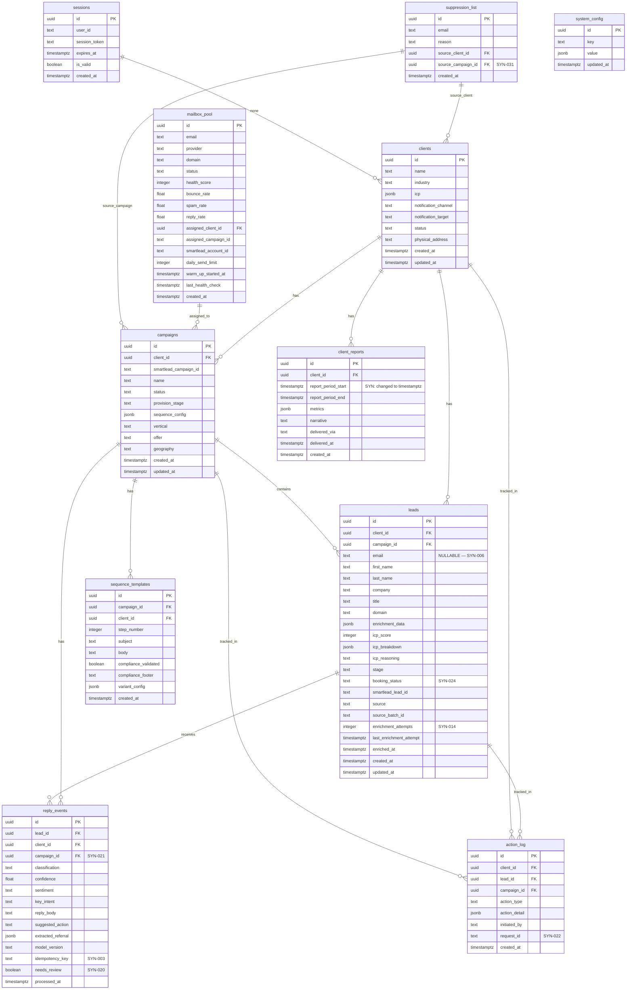

# Master Architecture Specification: BenchworksAI Outbound Engine

**Version:** 2  
**SOW Reference:** benchworks-outbound-sow.md (v1.1)  
**Date:** April 8, 2026  
**Status:** LOCKED  
**Changes from v1:** 35 findings incorporated (6 CRITICAL, 12 HIGH, 17 MEDIUM). See benchworks-outbound-changelog-v2.md.

---

## 1. System Architecture Overview

### 1.1 Architecture Diagram

**v2 change (SYN-005):** All external webhooks route directly to FastAPI. n8n is NOT in the webhook ingress path. n8n triggers downstream workflows via FastAPI → n8n webhook calls when visual orchestration is needed.

```mermaid
graph TB
    subgraph User Layer
        OP[Operator Browser]
        PROSPECT[Prospect Email Client]
    end

    subgraph Frontend — Hetzner VPS
        NEXT[Next.js Ops Dashboard<br/>F-009, F-026, F-027]
    end

    subgraph Agent Layer
        CLAUDE_AGENT[Claude Agent<br/>Tool-Use / MCP Client<br/>F-006]
    end

    subgraph MCP Servers
        SL_MCP[Smartlead Native MCP<br/>Campaign CRUD, Leads,<br/>Mailboxes, Inbox]
        CUSTOM_MCP[Custom MCP Server — FastAPI<br/>Supabase State, Scoring,<br/>Routing, Reporting, Logging<br/>F-006, F-025]
    end

    subgraph Orchestration — Hetzner VPS
        N8N[n8n Self-Hosted<br/>Scheduled Workflows + Crons<br/>F-001, F-002, F-004, F-005, F-007]
        SL_CLI[Smartlead CLI<br/>Analytics, Exports,<br/>Health Metrics]
    end

    subgraph Backend — Hetzner VPS
        FASTAPI[FastAPI Application<br/>Auth, API, MCP Server,<br/>Webhook Handlers,<br/>Circuit Breakers<br/>F-003, F-008, F-015–F-025]
        CADDY[Caddy Reverse Proxy<br/>HTTPS + X-Request-ID<br/>F-020]
        REDIS[Redis — Authenticated<br/>Sessions, Cache,<br/>Rate Limiting, Circuit State]
    end

    subgraph Data Layer
        SUPA[(Supabase Cloud<br/>PostgreSQL + RLS<br/>+ Materialized Views<br/>F-010)]
    end

    subgraph External Services
        SMARTLEAD[Smartlead.ai]
        APOLLO[Apollo.io]
        CLAUDE_API[Claude API — Anthropic]
        CALCOM[Cal.com Self-Hosted]
        SLACK[Slack Webhooks]
        RESEND[Resend — Transactional Email]
    end

    OP --> CADDY --> NEXT
    NEXT -- Command Bar --> CLAUDE_AGENT
    CLAUDE_AGENT --> SL_MCP --> SMARTLEAD
    CLAUDE_AGENT --> CUSTOM_MCP --> SUPA

    N8N -- Bash Nodes --> SL_CLI --> SMARTLEAD
    N8N -- HTTP Requests --> FASTAPI
    N8N --> APOLLO
    N8N --> CLAUDE_API
    N8N --> SUPA
    N8N --> SLACK

    SMARTLEAD -- Reply/Bounce Webhooks --> FASTAPI
    CALCOM -- Booking Webhooks --> FASTAPI
    FASTAPI --> SUPA
    FASTAPI --> REDIS
    FASTAPI --> CLAUDE_API
    FASTAPI --> RESEND
    FASTAPI -- Trigger Workflows --> N8N

    SMARTLEAD -- Sends Email --> PROSPECT
    PROSPECT -- Replies --> SMARTLEAD
    PROSPECT -- Books Call --> CALCOM
```

### 1.2 Technology Stack

| Layer | Technology | Version | Rationale |
|-------|-----------|---------|-----------|
| Frontend | Next.js (App Router) | 14+ | React server components, file-based routing, BFF proxy pattern |
| Backend / MCP | FastAPI | 0.110+ | Async Python, Pydantic validation, OpenAPI, MCP SDK, webhook handler |
| Database | Supabase Cloud (PostgreSQL) | 15+ | Managed Postgres with RLS, JS client, pg_cron for materialized views |
| Cache / Rate Limit / Circuit | Redis (authenticated, persistent) | 7+ | Session cache, rate limits, circuit breaker state, response TTL cache |
| Auth | NextAuth.js (signed JWT) + FastAPI JWT | 4+ / custom | Google OAuth, signed HS256 JWT (not JWE), database sessions in Supabase |
| Orchestration | n8n (self-hosted, Postgres-backed) | 1.30+ | Visual workflows, cron scheduling, Bash nodes for CLI; DB in Supabase |
| Sending Platform | Smartlead (MCP + CLI + API) | Latest | Native MCP for agent, CLI for crons, webhooks to FastAPI |
| Enrichment | Apollo.io API | v1 | People + Organization enrichment with cron-safe locking |
| AI | Claude API (Anthropic) | claude-sonnet-4-20250514 | Structured output via tool_choice for classification/scoring |
| Transactional Email | Resend | Latest | Client reports, booking confirmations, pre-call briefs (SYN-017) |
| Calendar | Cal.com (self-hosted) | Latest | Webhooks direct to FastAPI |
| Reverse Proxy | Caddy | 2+ | Auto HTTPS, X-Request-ID injection, IP forwarding |
| Hosting | Hetzner VPS (Docker Compose) | CX41 | 8 vCPU, 16GB RAM |

### 1.3 Deployment Topology

```
Hetzner CX41
├── docker-compose.yml
│   ├── caddy          (80, 443)    → HTTPS + X-Request-ID header injection
│   ├── nextjs         (3000)       → ops dashboard
│   ├── fastapi        (8000)       → API + MCP + webhook handlers
│   ├── n8n            (5678)       → orchestration (DB_TYPE=postgresdb → Supabase)
│   ├── calcom         (3001)       → booking
│   └── redis          (6379)       → authenticated (--requirepass), persistent (--appendonly yes), Docker volume /data
├── .env                             → all secrets (encrypted at rest via LUKS)
├── .env.example                     → template with placeholder values
└── backups/                         → daily pg_dump + n8n workflow JSON export
```

**n8n Security (SYN-007):** `N8N_BASIC_AUTH_ACTIVE=true`, `N8N_BASIC_AUTH_USER`, `N8N_BASIC_AUTH_PASSWORD` in .env. Caddy IP allowlist on n8n.benchworksai.com restricts to operator IP.

**n8n Database (SYN-013):** `DB_TYPE=postgresdb` pointing to dedicated `n8n` schema in Supabase. This brings n8n state (workflows, credentials, execution history) under the existing pg_dump backup. Daily `n8n export:workflow --all --output=/backups/n8n-workflows.json` for redundancy.

**Redis Security (SYN-008):** `command: redis-server --requirepass ${REDIS_PASSWORD} --appendonly yes`. Docker volume mapped for `/data`. All Redis clients configured with password. Persistent storage survives container restart.

**Deployment Process (SYN-016):**
```bash
# Before deploy: tag current images as rollback target
docker tag benchworks-fastapi:latest benchworks-fastapi:previous
docker tag benchworks-nextjs:latest benchworks-nextjs:previous
# Deploy per-service (old container runs until new build succeeds)
docker compose up -d --build --no-deps fastapi
docker compose up -d --build --no-deps nextjs
# Rollback if needed:
docker tag benchworks-fastapi:previous benchworks-fastapi:latest
docker compose up -d --no-deps fastapi
```

**Backup Strategy:**
- Daily Supabase pg_dump to Hetzner Storage Box (30-day retention)
- Daily n8n workflow JSON export to Storage Box
- **Break-glass SSH key (SYN-015):** Secondary SSH key stored offline (encrypted USB or password manager vault). Documented in runbook. Hetzner Rescue System as last resort.

**Disaster Recovery (SYN-015):** Tested in Phase 7. Procedure: provision new VPS → restore docker-compose + .env → pg_restore to fresh Supabase → verify RLS → re-issue Caddy certs → verify health. Documented with exact commands in runbook. Monthly restore-test reminder in system_config.

---

## 2. Database Schema

### 2.1 Entity Relationship Diagram

**v2 changes:** Added `sessions` table (SYN-001), `campaign_id` on reply_events (SYN-021), `booking_status` on leads (SYN-024), `needs_review` on reply_events (SYN-020), `action_log_archive` (SYN-023), suppression_list → campaigns FK (SYN-031), `client_summary_mv` materialized view (SYN-012).



### 2.2 Table Definitions — Key Changes from v1

*Only sections that changed are shown. All v1 table definitions remain valid unless modified below.*

#### `leads` — v2 Changes
**SYN-003, SYN-006, SYN-024:**

| Column | Change | Detail |
|--------|--------|--------|
| email | Changed to NULLABLE | Leads imported without email stay at `stage='new'` until Apollo enrichment provides email. Must be non-null before `stage='qualified'`. |
| booking_status | NEW column | `text, DEFAULT null`. Values: `null`, `'booked'`, `'cancelled'`. Set by Cal.com webhooks. Independent of pipeline stage. |
| enrichment_attempts | NEW column | `integer DEFAULT 0`. Incremented on each Apollo attempt. |
| last_enrichment_attempt | NEW column | `timestamptz`. Set on each attempt. |

**New constraint:** `UNIQUE (email, campaign_id) WHERE email IS NOT NULL` — partial unique index prevents duplicates while allowing multiple null-email leads during enrichment.

**New stage values:** Added `enrichment_failed` (Apollo couldn't find email after max retries), `nurture` removed (SYN-011 — not in MVP).

**Upsert pattern for imports:**
```sql
INSERT INTO leads (email, campaign_id, client_id, ...)
VALUES ($1, $2, $3, ...)
ON CONFLICT (email, campaign_id) WHERE email IS NOT NULL
DO UPDATE SET updated_at = now(), enrichment_data = EXCLUDED.enrichment_data, icp_score = EXCLUDED.icp_score
```

#### `reply_events` — v2 Changes
**SYN-003, SYN-020, SYN-021:**

| Column | Change | Detail |
|--------|--------|--------|
| campaign_id | NEW column | `uuid FK → campaigns(id)`. Denormalized from lead at insert time. |
| idempotency_key | NEW column | `text UNIQUE`. Composite of `smartlead_lead_id + event_type + received_at` to prevent duplicate processing on webhook retry. |
| needs_review | NEW column | `boolean DEFAULT false`. Set true for: question classification, any classification with confidence < 0.85. |

**New indexes:**
- `idx_reply_events_campaign_id` on `campaign_id`
- `idx_reply_events_client_processed` on `(client_id, processed_at DESC)` — reporting time-range queries
- `idx_reply_events_needs_review` on `needs_review` WHERE `needs_review = true` — review queue queries
- `idx_reply_events_idempotency` on `idempotency_key` UNIQUE

#### `campaigns` — v2 Changes
**SYN-027:**

| Column | Change | Detail |
|--------|--------|--------|
| provision_stage | NEW column | `text DEFAULT null`. Tracks campaign launch progress: `'provisioning'` → `'mailboxes_assigned'` → `'sequence_generated'` → `'enrichment_started'` → `null` (complete). Partial failure freezes at the failed stage. |

#### `action_log` — v2 Changes
**SYN-022:**

| Column | Change | Detail |
|--------|--------|--------|
| request_id | NEW column | `text`. Correlation ID propagated from Caddy X-Request-ID through all services. Enables end-to-end request tracing. |

#### `sessions` — NEW table (SYN-001)
**Implements:** F-015

| Column | Type | Constraints | Default | Description |
|--------|------|-------------|---------|-------------|
| id | uuid | PK | gen_random_uuid() | Primary key |
| user_id | text | NOT NULL | — | Google OAuth sub claim |
| session_token | text | NOT NULL, UNIQUE | — | JWT jti claim |
| expires_at | timestamptz | NOT NULL | — | Session expiry |
| is_valid | boolean | NOT NULL | true | False = invalidated/logged out |
| created_at | timestamptz | NOT NULL | now() | Creation time |

**RLS:** Service role only (FastAPI middleware checks this table).

#### `action_log_archive` — NEW table (SYN-023)

Identical schema to `action_log`. Monthly cron moves rows older than 90 days. Queryable by operator but not displayed in dashboard.

```sql
-- Monthly archival (pg_cron)
INSERT INTO action_log_archive SELECT * FROM action_log WHERE created_at < now() - interval '90 days';
DELETE FROM action_log WHERE created_at < now() - interval '90 days';
```

#### `client_summary_mv` — NEW materialized view (SYN-012)

```sql
CREATE MATERIALIZED VIEW client_summary_mv AS
SELECT
  c.id AS client_id,
  c.name,
  c.industry,
  c.status,
  COUNT(DISTINCT camp.id) FILTER (WHERE camp.status = 'active') AS active_campaigns,
  COUNT(DISTINCT l.id) AS total_leads,
  jsonb_object_agg(
    COALESCE(l.stage, 'unknown'),
    stage_counts.cnt
  ) AS leads_by_stage,
  COUNT(DISTINCT re.id) FILTER (WHERE re.classification = 'interested' AND re.processed_at > now() - interval '7 days') AS positive_replies_this_week
FROM clients c
LEFT JOIN campaigns camp ON camp.client_id = c.id
LEFT JOIN leads l ON l.client_id = c.id
LEFT JOIN reply_events re ON re.client_id = c.id
LEFT JOIN LATERAL (
  SELECT stage, COUNT(*) AS cnt FROM leads WHERE client_id = c.id GROUP BY stage
) stage_counts ON true
WHERE c.status = 'active'
GROUP BY c.id, c.name, c.industry, c.status;

-- Refresh every 5 minutes via pg_cron
SELECT cron.schedule('refresh_client_summary', '*/5 * * * *', 'REFRESH MATERIALIZED VIEW CONCURRENTLY client_summary_mv');
```

GET /v1/clients reads from this view instead of computing aggregations live.

### 2.3 Migrations Strategy

Same as v1, plus:

**updated_at auto-trigger (SYN-030):**
```sql
CREATE OR REPLACE FUNCTION update_updated_at_column()
RETURNS TRIGGER AS $$
BEGIN
  NEW.updated_at = now();
  RETURN NEW;
END;
$$ LANGUAGE plpgsql;

-- Apply to all tables with updated_at
CREATE TRIGGER set_updated_at BEFORE UPDATE ON clients FOR EACH ROW EXECUTE FUNCTION update_updated_at_column();
CREATE TRIGGER set_updated_at BEFORE UPDATE ON campaigns FOR EACH ROW EXECUTE FUNCTION update_updated_at_column();
CREATE TRIGGER set_updated_at BEFORE UPDATE ON leads FOR EACH ROW EXECUTE FUNCTION update_updated_at_column();
```

**Foreign key cascading (SYN-033):**
All child table `client_id` FKs use `ON DELETE CASCADE`. `suppression_list.source_campaign_id` uses `ON DELETE SET NULL`.

### 2.4 Seed Data

Same as v1 but: **removed `icp_score_threshold_nurture`** from system_config (SYN-011). Nurture tier is not in MVP. Added `resend_api_key_status` check placeholder.

---

## 3. API Design

### 3.1 API Conventions

Same as v1, plus:

**Rate limiting IP resolution (SYN-032):** FastAPI slowapi reads `X-Forwarded-For` header (set by Caddy and Next.js BFF proxy) for real client IP. Docker internal IPs are excluded from rate limiting.

**Redis failure mode (SYN-035):** If Redis is unavailable, rate limiting middleware fails open (requests are not rate-limited). Health endpoint reports `redis: down`. Slack alert fires. Documented solo-operator decision.

### 3.2 Endpoint Definitions — v2 Additions

#### Auth — Implements F-015 (SYN-001)

##### `POST /v1/auth/logout`
**Purpose:** Invalidate current session  
**Auth:** Operator JWT required

**Processing:** Set `sessions.is_valid = false` for the current session_token. Clear session cookie. Log to action_log.

##### `GET /v1/auth/session`
**Purpose:** Validate current session (called by FastAPI middleware)  
**Auth:** Internal only

#### Campaigns — v2 Changes (SYN-027)

##### `POST /v1/campaigns/launch` — Updated
**v2 change:** Campaign creation now progresses through tracked stages. Each stage is an async step. Partial failure pauses at the failed stage.

**Response (202):**
```json
{
  "campaign_id": "uuid",
  "provision_stage": "provisioning",
  "status": "draft"
}
```

**Stage progression (async):**
1. `provisioning` → Create Smartlead campaign → on success set `mailboxes_assigned`
2. `mailboxes_assigned` → Generate sequence via Claude → on success set `sequence_generated`
3. `sequence_generated` → Trigger enrichment pipeline → on success set `enrichment_started`
4. `enrichment_started` → Once qualified leads imported → clear provision_stage, set status `active`

**On failure at any stage:** Campaign stays at that provision_stage. Error logged to action_log. Slack alert fires. Operator can retry from failed stage via PATCH /v1/campaigns/{id}/retry-provision.

#### Leads — v2 Changes (SYN-020)

##### `GET /v1/reply-events` — NEW
**Purpose:** Query reply events with review queue filter  
**Auth:** Operator JWT

**Query params:** `?needs_review=true&client_id=uuid&limit=20`

#### Clients — v2 Additions (SYN-033)

##### `PATCH /v1/clients/{client_id}/churn`
**Purpose:** Churn a client — pause campaigns, archive data, finalize reports  
**Auth:** Operator JWT

**Processing:** Set `clients.status = 'churned'`. Pause all active campaigns via Smartlead MCP. Log action. Optionally trigger data purge.

#### Clients — v2 Addition (SYN-026)

##### Client onboarding form
**Route:** `/(dashboard)/clients/new/page.tsx`  
**Purpose:** Multi-step form for new client onboarding → POSTs to /v1/clients → triggers /v1/campaigns/launch

### 3.3 MCP Tool Definitions

Same as v1. All tools remain unchanged. Note: Smartlead MCP handles sending-layer operations; custom MCP handles business logic and Supabase state.

### 3.4 Webhook Handlers — v2 Overhaul (SYN-005)

**CRITICAL DESIGN DECISION:** All external webhooks fire directly to FastAPI endpoints. n8n is NOT in the webhook ingress path. FastAPI handles validation, idempotency, classification, and state writes. FastAPI triggers n8n workflows via n8n webhook URLs only when visual orchestration is needed for complex downstream flows.

#### Shared Webhook Security (SYN-002)

All webhook handlers implement:
1. **HMAC-SHA256 signature verification:** `hmac.new(SECRET, payload, sha256).hexdigest()` compared to signature header
2. **Timestamp validation:** Reject payloads older than ±5 minutes
3. **Event ID dedup:** `idempotency_key` checked via Redis SETNX (60-min TTL) before processing

```python
async def verify_webhook(request: Request, secret_env_var: str, signature_header: str):
    payload = await request.body()
    signature = request.headers.get(signature_header)
    timestamp = request.headers.get("X-Webhook-Timestamp")
    
    # Timestamp validation
    if abs(time.time() - float(timestamp)) > 300:
        raise HTTPException(401, "Webhook timestamp expired")
    
    # HMAC verification
    expected = hmac.new(os.environ[secret_env_var].encode(), payload, hashlib.sha256).hexdigest()
    if not hmac.compare_digest(expected, signature):
        raise HTTPException(401, "Invalid webhook signature")
    
    # Idempotency
    event_id = request.headers.get("X-Event-ID")
    if event_id and not redis.set(f"webhook:{event_id}", "1", nx=True, ex=3600):
        return None  # Already processed
    
    return json.loads(payload)
```

#### Smartlead Reply Webhook — Updated (SYN-005, SYN-018, SYN-010)

**Endpoint:** `POST /v1/webhooks/smartlead/reply`  
**Auth:** HMAC-SHA256 via `SMARTLEAD_WEBHOOK_SECRET`

**Processing (async in FastAPI):**
1. Verify signature + timestamp + dedup
2. Match `smartlead_lead_id` → internal `lead_id`
3. Fetch full thread from Smartlead (MCP or CLI)
4. Call Claude classification (via tool_choice — SYN-028)
5. Write `reply_events` record (with `idempotency_key`, `campaign_id`, `needs_review` flag)
6. **Route by classification:**
   - **INTERESTED** (confidence ≥ 0.85): Pause sequence (Smartlead MCP) → update lead stage → notify client via Slack/Resend → log
   - **INTERESTED** (confidence < 0.85): Set `needs_review = true` → notify operator via Slack #benchworks-review → log
   - **NOT_INTERESTED**: Remove from sequence → update stage → log
   - **UNSUBSCRIBE**: Add to suppression_list → **remove from ALL active Smartlead campaigns via MCP/CLI** (SYN-018) → update stage → log
   - **OOO**: Tag lead → keep in sequence (Smartlead handles re-send timing) → log
   - **REFERRAL** (SYN-010): Extract {name, email, context} → check suppression → if not suppressed: create new lead (source='referral', campaign_id=originating) → trigger enrichment → notify operator via Slack with referral context → log
   - **QUESTION**: Set `needs_review = true` → add to review queue → notify operator → log
7. Log to `action_log` with `request_id`

#### Cal.com Booking Webhook — Updated (SYN-005, SYN-024)

**Endpoint:** `POST /v1/webhooks/calcom/booking`  
**Auth:** HMAC-SHA256 via `CALCOM_WEBHOOK_SECRET`

**Processing:**
1. Extract booker email
2. Match to lead (by email → by domain fallback → if no match: create new lead flagged as `unmapped_booking` — SYN from Gemini REV-021)
3. Set `leads.booking_status = 'booked'` (**do not change pipeline stage** — SYN-024)
4. Update `leads.stage = 'call_booked'` only if current stage is earlier in pipeline
5. Generate pre-call brief via Claude → deliver to operator via Slack + Resend
6. Log to action_log

#### Cal.com Cancellation Webhook — Updated (SYN-024)

**Endpoint:** `POST /v1/webhooks/calcom/cancelled`

**Processing:**
1. Set `leads.booking_status = 'cancelled'` (**do not revert pipeline stage**)
2. Schedule one-off re-engagement email (24hr delay via Redis scheduled job)
3. Re-engagement: single email via Smartlead CLI one-off send, NOT sequence reactivation
4. Log to action_log

---

## 4. Component Architecture

### 4.1 Component Tree — v2 Addition (SYN-026)

```
app/
├── ...existing routes from v1...
├── (dashboard)/
│   ├── clients/
│   │   ├── new/page.tsx          — NEW: Client onboarding wizard (SYN-026)
│   │   ...
│   ├── review/
│   │   └── page.tsx              — NEW: Reply review queue (SYN-020)
```

### 4.2 Shared Components — v2 Additions

| Component | Props | Used By | Implements |
|-----------|-------|---------|------------|
| ...all v1 components... | | | |
| `ReplyReviewQueue` | reviews[], onResolve | Review page, Overview | F-003, SYN-020 |
| `ClientOnboardingWizard` | onSubmit | Clients/new page | F-001, SYN-026 |

**PipelineFunnel scope (SYN-025):** Renders stages: new → enriched → qualified → contacted → replied → interested → call_booked. Stages beyond call_booked are tracked in DB but **not shown in funnel for MVP**. Late-stage transitions (call_completed, proposal_sent, won, lost) are operator-driven via PATCH /v1/leads/{id}/stage or CommandBar.

**Campaign lead list (SYN-012):** Renders stage pill + ICP score only — **no journey data or enrichment_data**. Full journey loads only on dedicated lead detail page. Prevents N+1 action_log queries.

### 4.3–4.4

Unchanged from v1.

### 4.5 UI State Specifications — NEW (SYN-019)

#### Empty States
| Component | Empty Condition | Display |
|-----------|----------------|---------|
| Overview (0 clients) | clients array empty | "Welcome to BenchworksAI. Add your first client to get started." + CTA → /clients/new |
| Campaign lead list (0 leads) | leads array empty | "Import leads to get started. Use the enrichment pipeline or upload a CSV." |
| LeadJourneyTimeline (<3 events) | action_log entries < 3 | Show available events with note: "More events will appear as the campaign runs." |
| ReplyReviewQueue (0 items) | needs_review count = 0 | "All caught up. No replies need review." |
| AlertFeed (0 alerts) | alerts array empty | "All systems healthy. No active alerts." |
| MailboxHealthGrid (0 mailboxes) | mailbox_pool empty | "No mailboxes configured. Add sending accounts in Smartlead." |

#### Error States
All data-dependent components wrap in React ErrorBoundary. Fallback: component name + "Unable to load — retry" button + error detail collapsed. Errors logged to console with request_id.

#### Loading States
Skeleton loaders for: StatsBar, MailboxHealthGrid, LeadJourneyTimeline, PipelineFunnel, ClientMetricsCard, ReplyReviewQueue. React Query `isLoading` → skeleton; `isError` → error boundary.

---

## 5. Integration Requirements

### 5.1 Smartlead — v2 Updates

**Smartlead CLI auth in n8n (SYN-029):** `SMARTLEAD_API_KEY` set in n8n container environment (docker-compose.yml `environment` block). Bash nodes reference `$SMARTLEAD_API_KEY`. Do NOT use n8n expression syntax to inject key inline — avoids storing credentials in workflow JSON.

**Warm pool depletion guard (SYN-004):** If `warm_pool_count == 0` after dequeuing a replacement:
1. Set campaign status to `paused`
2. Log `action_type = 'system_alert'` with severity CRITICAL
3. Fire Slack alert: "CRITICAL: Warm pool depleted. Campaign {name} for client {name} paused. No replacement mailboxes available."
4. Do NOT attempt sends until operator provisions replacement

**Smartlead source-of-truth mapping:** MCP for agent operations, CLI for crons, API for webhooks. No operation should use more than one surface.

### 5.2 Apollo — v2 Updates (SYN-014, SYN-034)

**Circuit breaker (SYN-014):** See Section 8.4.

**Enrichment cron race prevention (SYN-034):** Before enriching, query with `SELECT ... FOR UPDATE SKIP LOCKED` or set `stage = 'enriching'` to prevent concurrent cron cycles from double-processing the same leads. If cron finds all pending leads locked, skip cycle.

**Max retry (SYN-014):** Leads with `enrichment_attempts >= 3` and still no email are set to `stage = 'enrichment_failed'`. Operator reviews via dashboard filter. Slack alert if enrichment backlog exceeds 50 leads.

### 5.3 Claude API — v2 Update (SYN-028)

**Structured output via tool_choice:** Both classification and scoring prompts use Claude's `tool_choice` parameter with defined JSON schemas. This forces strictly parseable JSON output, preventing "Here is your JSON:" preamble failures.

```python
response = client.messages.create(
    model="claude-sonnet-4-20250514",
    max_tokens=1024,
    tools=[{
        "name": "classify_reply",
        "description": "Classify a cold email reply",
        "input_schema": {
            "type": "object",
            "properties": {
                "classification": {"type": "string", "enum": ["interested", "not_interested", "ooo", "referral", "question", "unsubscribe"]},
                "confidence": {"type": "number", "minimum": 0, "maximum": 1},
                "sentiment": {"type": "string", "enum": ["positive", "neutral", "negative"]},
                "key_intent": {"type": "string"},
                "extracted_referral": {"type": ["object", "null"]},
                "suggested_action": {"type": "string"}
            },
            "required": ["classification", "confidence", "sentiment", "key_intent", "suggested_action"]
        }
    }],
    tool_choice={"type": "tool", "name": "classify_reply"},
    messages=[{"role": "user", "content": prompt}]
)
```

### 5.4–5.5

Same as v1 (Cal.com, Slack). Cal.com webhooks now fire direct to FastAPI per SYN-005.

### 5.6 Resend — Transactional Email — NEW (SYN-017)

- **Purpose:** Send HTML transactional emails that Smartlead cannot handle: weekly client reports, booking confirmations, pre-call briefs
- **API Docs:** https://resend.com/docs
- **Auth Method:** API key (env var: `RESEND_API_KEY`)
- **Sending domain:** `notifications.benchworksai.com` (configure DNS per Resend docs)
- **Data Flow:** FastAPI or n8n → Resend API → client/operator inbox
- **Failure Handling:** Retry 3x. If Resend down, fall back to Slack delivery for reports. Log delivery failure.
- **Rate Limits:** 100 emails/day free tier. Adequate for 15 clients × 1 report + bookings.
- **Cost:** $0 (free tier)

---

## 6. Build Phases

Same structure as v1 with these additions per phase:

**Phase 1:** Add sessions table migration, Redis auth config, n8n Postgres DB config, break-glass SSH key, Caddy X-Request-ID, Resend account setup.

**Phase 2:** All webhooks → FastAPI direct. Referral workflow. Suppression sync to Smartlead on unsubscribe. Campaign launch staged provisioning. Claude tool_choice integration. Reply review queue flag.

**Phase 3:** Circuit breaker implementation. Warm pool depletion guard. Enrichment cron locking.

**Phase 4:** Review queue dashboard component. Client onboarding wizard.

**Phase 5:** Empty/error/loading states per Section 4.5. Pipeline funnel scoped to call_booked.

**Phase 7:** DR drill. Restore test. Action_log archival cron. Runbook with all procedures.

---

## 7. Security & Authentication — v2 Updates

### 7.1 Authentication Flow — Rewritten (SYN-001)

```
Operator Login:
1. Operator navigates to app.benchworksai.com
2. Next.js redirects to Google OAuth (NextAuth.js)
3. Google returns auth code → NextAuth exchanges for tokens
4. NextAuth creates signed JWT (HS256, NOT JWE):
   - Claims: {sub: google_id, email, role: "operator", jti: uuid}
   - maxAge: 8 hours
   - Signing secret: NEXTAUTH_SECRET (shared with FastAPI)
5. Session record created in Supabase `sessions` table (jti, user_id, expires_at)
6. JWT stored in HTTP-only, Secure, SameSite=Strict cookie

FastAPI Middleware:
1. Extract JWT from Authorization header (BFF proxy forwards from cookie)
2. Verify HS256 signature with shared NEXTAUTH_SECRET
3. Check sessions table: is_valid = true AND expires_at > now()
4. If session invalid → 401
5. Extract role claim → pass to endpoint handler

Logout:
1. POST /v1/auth/logout
2. Set sessions.is_valid = false for current jti
3. Clear session cookie
4. Log to action_log
```

### 7.2 Authorization Model — v2 Updates (SYN-009)

| Role | Scope | Key Restriction |
|------|-------|-----------------|
| Operator | Full access | — |
| Service (n8n) | **Restricted** (SYN-009) | Only: POST /v1/leads/import, GET /v1/campaigns, POST /v1/webhooks/*, GET /v1/reports/*/metrics, POST /v1/reports/*/generate. NO: DELETE, PATCH /v1/campaigns/status, PATCH /v1/leads/*/stage |
| Agent (Claude) | Via MCP tools | All tools (operator delegates) |

**Service key rotation (SYN-009):** Generate new key → update .env → restart FastAPI + n8n → verify → revoke old. Rotate quarterly. Service key added to PII exclusion list (never logged).

### 7.3–7.4

Same as v1 with SYN-009 additions above.

---

## 8. Error Handling & Observability — v2 Updates

### 8.2 Logging Strategy — v2 Update (SYN-022)

**Correlation ID:** Caddy injects `X-Request-ID` (UUID) on every request. FastAPI logs it on every request. n8n HTTP Request nodes forward it. All action_log entries include `request_id` field. Enables end-to-end tracing: webhook receipt → classification → routing → state change.

### 8.4 Circuit Breaker Specification — NEW (SYN-014, SYN-035)

**Applied to:** Smartlead API/MCP calls, Apollo API calls, Claude API calls.

**Implementation:** Redis-backed counter per service.

| Parameter | Value |
|-----------|-------|
| Trip threshold | 5 consecutive 5xx responses within 60 seconds |
| Open state | `circuit:{service}:open` Redis key with 300s TTL |
| Half-open | After TTL expires, allow 1 probe call. If success: clear. If fail: reset 300s TTL. |
| Alert | Slack alert on circuit open (service name, failure count, affected workflows) |

**Library:** `tenacity` for retry + circuit pattern in Python.

**Redis failure mode (SYN-035):** If Redis unavailable: rate limiting fails open, circuit breakers fail open (assume closed — allow calls). Health endpoint reports redis: down. Slack alert fires. Solo-operator decision: availability over protection.

---

## 9. Testing Strategy

Same as v1 with these Tier 1 additions:
- `test_webhook_idempotency` — send same webhook payload twice, verify single reply_event created
- `test_webhook_signature_rejection` — send payload with bad signature, verify 401
- `test_session_invalidation` — logout, verify subsequent requests return 401
- `test_warm_pool_depletion` — deplete pool, verify campaign paused and alert fired
- `test_enrichment_locking` — concurrent enrichment crons, verify no duplicate processing

---

## 10. Feature-to-Component Traceability Matrix

Same as v1. All 22 SOW features remain mapped. New spec sections (sessions, circuit breaker, review queue, client onboarding) map to existing feature IDs — no new SOW features required.

---

*End of Specification — Version 2 (DRAFT — Post-Review Cycle 1)*
