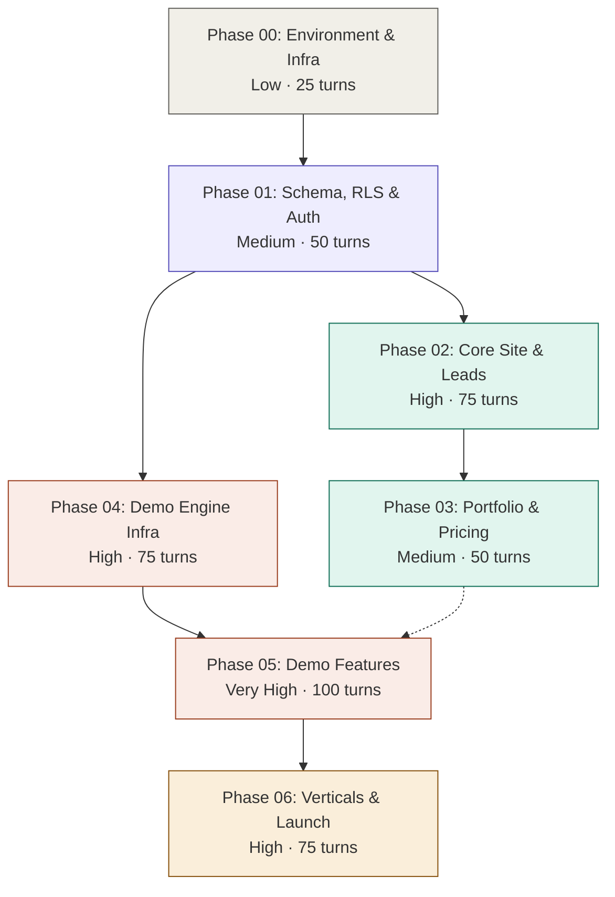

# BUILDPLAN: Larkin Tech

**Spec Version:** v2 (LOCKED)
**SOW Reference:** larkintech-sow.md
**Generated:** March 27, 2026
**Target Stack:** Next.js 14+ / TypeScript / Tailwind / Supabase / Docker / Hetzner VPS
**Deployment Target:** hampton-vps (5.161.88.134) via Docker Compose blue-green
**Operator:** Claude Code

---

## Build Sequence



**Parallel execution:** Phase 02 + Phase 04 can run in separate Claude Code terminals simultaneously. Phase 03 can overlap with late Phase 04.

---

## Phase Summary

| Phase | Name | Complexity | Est. Turns | `--max-turns` | Prerequisites | SOW Features | Operator File | Status |
|-------|------|-----------|------------|--------------|---------------|-------------|---------------|--------|
| 00 | Environment & Infrastructure | Low | 15-25 | 25 | None | — | `larkintech-phase-00-environment.md` | ⬜ |
| 01 | Schema, RLS & Auth Foundation | Medium | 30-50 | 50 | Phase 00 | — | `larkintech-phase-01-foundation.md` | ⬜ |
| 02 | Core Site & Lead Capture | High | 50-75 | 75 | Phase 01 | F-001–F-012, F-033–F-036, F-040–F-045 | `larkintech-phase-02-core-site.md` | ⬜ |
| 03 | Portfolio & Pricing | Medium | 30-50 | 50 | Phase 02 | F-013–F-017, F-037–F-039 | `larkintech-phase-03-portfolio.md` | ⬜ |
| 04 | Demo Showroom Infrastructure | High | 50-75 | 75 | Phase 01 | F-018, F-019, F-027, F-028 | `larkintech-phase-04-demo-infra.md` | ⬜ |
| 05 | Demo Features Build-Out | Very High | 75-100 | 100 | Phase 04 (+ Phase 03 soft) | F-020–F-026 | `larkintech-phase-05-demo-features.md` | ⬜ |
| 06 | Verticals, Admin, Legal & Launch | High | 50-75 | 75 | Phase 05 | F-029–F-032 | `larkintech-phase-06-verticals-launch.md` | ⬜ |

**Total estimated turns:** 305-450 | **Estimated wall time:** 10-15 hours of Claude Code execution

---

## Feature Traceability

| SOW Feature | Description | Build Phase | Spec Sections | Status |
|-------------|-------------|-------------|---------------|--------|
| F-001 | Dual-theme system | Phase 02 | 1.2, 4.3 | ⬜ |
| F-002 | Responsive layout | Phase 02 | 4.1 | ⬜ |
| F-003 | Stylized logo & brand | Phase 02 | 4.2 | ⬜ |
| F-004 | Primary navigation | Phase 02 | 4.1, 4.4 | ⬜ |
| F-005 | Segmented hero section | Phase 02 | 4.1 | ⬜ |
| F-006 | Services overview | Phase 02 | 4.1 | ⬜ |
| F-007 | Social proof strip | Phase 02 | 4.1 | ⬜ |
| F-008 | AI Solutions Architect page | Phase 02 | 4.1, 4.4 | ⬜ |
| F-009 | Prompt Engineering page | Phase 02 | 4.1, 4.4 | ⬜ |
| F-010 | AI Automation page | Phase 02 | 4.1, 4.4 | ⬜ |
| F-011 | Fractional CTO page | Phase 02 | 4.1, 4.4 | ⬜ |
| F-012 | AI Implementation page | Phase 02 | 4.1, 4.4 | ⬜ |
| F-013 | Portfolio index page | Phase 03 | 4.1, 4.2 | ⬜ |
| F-014 | Case study: Orchestration Framework | Phase 03 | 4.1, 4.2 | ⬜ |
| F-015 | Case study: Eastern LM | Phase 03 | 4.1, 4.2 | ⬜ |
| F-016 | Case study: Hamptons Estate | Phase 03 | 4.1, 4.2 | ⬜ |
| F-017 | Case study: HostHampton | Phase 03 | 4.1, 4.2 | ⬜ |
| F-018 | Demo showroom index | Phase 04 | 4.1, 4.2 | ⬜ |
| F-019 | Email gate for demos | Phase 04 | 3.2, 4.1, 7.1 | ⬜ |
| F-020 | Demo: AI Chatbot | Phase 05 | 3.2, 4.1, 5.1 | ⬜ |
| F-021 | Demo: Analytics Dashboard | Phase 05 | 3.2, 4.1, 5.1 | ⬜ |
| F-022 | Demo: Email/SMS Workflows | Phase 05 | 3.2, 4.1, 5.1 | ⬜ |
| F-023 | Demo: Document Processing | Phase 05 | 3.2, 4.1, 5.1 | ⬜ |
| F-024 | Demo: Competitive Analysis | Phase 05 | 3.2, 4.1, 5.1 | ⬜ |
| F-025 | Demo: Document Drafting | Phase 05 | 3.2, 4.1, 5.1 | ⬜ |
| F-026 | Demo: Marketing Engine | Phase 05 | 3.2, 4.1, 5.1 | ⬜ |
| F-027 | Cached response system | Phase 04 | 2.2, 3.2 | ⬜ |
| F-028 | Demo rate limiting | Phase 04 | 2.2, 3.2 | ⬜ |
| F-029 | Vertical: General SMB | Phase 06 | 2.2 | ⬜ |
| F-030 | Vertical: Construction | Phase 06 | 2.2 | ⬜ |
| F-031 | Vertical: Property Management | Phase 06 | 2.2 | ⬜ |
| F-032 | Vertical: Legal / Estate Planning | Phase 06 | 2.2, 7.5 | ⬜ |
| F-033 | Segmented contact form | Phase 02 | 3.2, 4.2 | ⬜ |
| F-034 | Discovery call booking | Phase 02 | 5.3, 4.2 | ⬜ |
| F-035 | Lead magnet: AI Playbook | Phase 02 | 3.2, 5.4 | ⬜ |
| F-036 | Email notification system | Phase 02 | 3.2, 5.2 | ⬜ |
| F-037 | Pricing tiers display | Phase 03 | 4.1 | ⬜ |
| F-038 | Retainer packages | Phase 03 | 4.1, 4.2 | ⬜ |
| F-039 | Project-based pricing | Phase 03 | 4.1, 4.2 | ⬜ |
| F-040 | About page | Phase 02 | 4.1, 4.2 | ⬜ |
| F-041 | Integrated resume section | Phase 02 | 4.1, 4.2 | ⬜ |
| F-042 | Availability status badge | Phase 02 | 3.2, 4.2 | ⬜ |
| F-043 | LinkedIn / GitHub links | Phase 02 | 4.2 | ⬜ |
| F-044 | SEO meta tags | Phase 02 | 4.2 | ⬜ |
| F-045 | Sitemap & robots.txt | Phase 02 | 4.1 | ⬜ |

**Integrity check:** All 45 core SOW features (F-001 through F-045) mapped. Zero orphans.

---

## Phase Details

### Phase 00: Environment & Infrastructure
**Complexity:** Low | **Est. Turns:** 15-25 | **`--max-turns`:** 25 | **Prerequisites:** None
**Operator Prompt:** `larkintech-phase-00-environment.md`
**Review Prompt:** `larkintech-review-phase-00.md`

**Objective:** Scaffold the project, configure Docker blue-green deployment, set up GitHub Actions CI, configure Cloudflare, verify clean startup on VPS.

**Components Built:**
- [ ] Next.js 14 project with TypeScript + Tailwind + App Router
- [ ] Directory structure matching spec Section 4.1 (app/, lib/, components/, data/, supabase/, docker/)
- [ ] Docker Compose with blue-green containers (app-blue:3000, app-green:3001, nginx-proxy:80/443)
- [ ] Docker log rotation (json-file, 10m × 5)
- [ ] Nginx config with upstream switching for blue-green
- [ ] GitHub Actions workflow: build → push GHCR → SSH deploy → health check
- [ ] `.env.example` with ALL required env vars per spec Section 1.3
- [ ] Startup env validation (fail-fast on missing vars)
- [ ] `package.json` with all dependencies including: `@react-pdf/renderer`, `pino`, `jose` (JWT), `zod`, `@supabase/supabase-js`
- [ ] Supabase project created + CLI configured
- [ ] Cloudflare DNS pointed to VPS IP

**Acceptance Criteria:**
- [ ] `docker compose up` starts all containers without errors
- [ ] App responds on `http://localhost:3000` with Next.js default page
- [ ] GitHub Actions builds and pushes image to GHCR successfully
- [ ] Blue-green deploy script switches containers with zero downtime
- [ ] Env validation throws on missing vars at startup
- [ ] Cloudflare SSL certificate active for LarkinTECH.ai

**Spec References:** 1.2, 1.3, 4.1 (directory structure)

**Rollback:** Delete project directory, re-scaffold. No persistent state.

---

### Phase 01: Schema, RLS & Auth Foundation
**Complexity:** Medium | **Est. Turns:** 30-50 | **`--max-turns`:** 50 | **Prerequisites:** Phase 00
**Operator Prompt:** `larkintech-phase-01-foundation.md`
**Review Prompt:** `larkintech-review-phase-01.md`

**Objective:** Deploy complete database schema with RLS on all tables, JWT session module, admin auth, Zod validation schemas, and multi-dependency health check.

**Components Built:**
- [ ] All 15 database tables per spec Section 2.2 (with FK constraints, CHECK constraints, ON DELETE actions)
- [ ] PostgreSQL triggers (update_timestamp, update_session_counts)
- [ ] RLS policies per spec Section 2.5 (DENY ALL anon default; anon SELECT on demo_types, verticals)
- [ ] Seed data: 7 demo_types, 4 verticals, site_config defaults, 35 minimal cache entries (1 vertical × 7 demos × 5 interactions)
- [ ] `lib/supabase/server.ts` (service role client — used by ALL API routes)
- [ ] `lib/supabase/client.ts` (anon key client — restricted to Storage only)
- [ ] `lib/supabase/types.ts` (generated from schema)
- [ ] `lib/validation/schemas.ts` (all Zod schemas per spec Section 7.4)
- [ ] `lib/demo-engine/session.ts` (JWT create/verify with jwt_version + revoked_at check)
- [ ] `lib/demo-engine/rate-limiter.ts` (atomic UPSERT per spec Section 2.2 rate_limits)
- [ ] `lib/ai/prompt-guard.ts` (injection detection + hardened system prompt prefix)
- [ ] Admin auth middleware (timingSafeEqual, rate limiting, IP allowlist check)
- [ ] `GET /api/health` with `?deep=true` multi-dependency check
- [ ] CSRF origin validation middleware

**Acceptance Criteria:**
- [ ] All 15 tables exist with correct columns, types, constraints, indexes
- [ ] FK relationships match ERD (spec Section 2.1)
- [ ] RLS enabled on all tables; anon key cannot SELECT from demo_leads, inquiries, etc.
- [ ] demo_types and verticals readable via anon key
- [ ] Seed data loads without errors (35 cache entries verifiable)
- [ ] JWT session: create → verify → jwt_version mismatch → reject
- [ ] Rate limiter: atomic UPSERT returns count; concurrent requests don't exceed limit
- [ ] Admin auth: correct secret → 200; wrong secret → 403; timing-safe comparison verified
- [ ] Health check: `?deep=true` returns dependency status for DB, storage, email, AI
- [ ] Prompt guard: known injection patterns detected and blocked

**Spec References:** 2 (all), 7 (all), 3.1

**Review Checkpoint:** CRITICAL — schema errors cascade into every subsequent phase. Verify: column names exact, FKs enforced, RLS blocks anon access, rate limiter is truly atomic (test with concurrent requests).

**Rollback:** Drop all tables, re-run migrations. `supabase db reset`.

---

### Phase 02: Core Site & Lead Capture
**Complexity:** High | **Est. Turns:** 50-75 | **`--max-turns`:** 75 | **Prerequisites:** Phase 01
**Operator Prompt:** `larkintech-phase-02-core-site.md`
**Review Prompt:** `larkintech-review-phase-02.md`
**⚡ Can run PARALLEL with Phase 04**

**Objective:** Build the complete marketing site with dual-theme, all service/about/contact pages, lead capture forms, email notifications, lead magnet v1, SEO infrastructure, booking embed, and privacy page.

**Components Built:**
- [ ] Dual-theme engine: CSS custom properties, ThemeProvider, ThemeToggle, blocking `<script>` for FOUC prevention, `prefers-color-scheme` detection
- [ ] Root layout with Navbar, Footer, MobileMenu, CTABanner
- [ ] Logo component (stylized LaRKiN TECH)
- [ ] Homepage: HeroSection (dual CTA), ServicesOverview, SocialProofStrip (hardcoded metrics), AvailabilityBadge, DemoTeaser
- [ ] 5 service pages with ServicePageLayout, unique SEO meta, JSON-LD structured data
- [ ] About page: BioSection, SkillsMatrix, ResumeSection (generalized), ExternalLinks
- [ ] Contact page: SegmentedForm (with inline validation, submitting/success/error states), BookingEmbed (Cal.com config interface)
- [ ] Privacy policy page
- [ ] `POST /api/leads/inquiry` with Zod validation, audience-adaptive fields, marketing_context UTM capture
- [ ] `POST /api/leads/magnet-download` with persistent download_token + email delivery
- [ ] `GET /api/leads/magnet-download/:token` re-download endpoint
- [ ] `lib/email/notify.ts` + notification_outbox processing
- [ ] `PATCH /api/admin/config/:key` for availability badge
- [ ] Lead magnet PDF v1 (Construction vertical, 10-15 pages) via @react-pdf/renderer or manual design
- [ ] SEO: meta tags, OG images, JSON-LD (Person, Service, Organization), native `app/sitemap.ts`, `app/robots.ts`
- [ ] Responsive validation: 320px, 768px, 1024px, 1440px

**Acceptance Criteria:**
- [ ] Theme toggle switches dark/light; persists via localStorage; no FOUC on reload
- [ ] OS dark mode preference detected on first visit
- [ ] All 5 service pages render with unique meta titles/descriptions
- [ ] Contact form: inline validation on blur, disabled submit during send, success state replaces form, error toast on failure
- [ ] Form submission → Supabase `inquiries` table + notification_outbox entry → email to Adam within 60s
- [ ] Lead magnet: email gate → signed URL + email delivery of download link → re-download via token works after 24hr
- [ ] Cal.com booking embed loads and functions
- [ ] Availability badge reflects site_config value
- [ ] JSON-LD validates in Google Rich Results Test
- [ ] Lighthouse: Performance ≥85, Accessibility ≥90, SEO ≥95 on mobile
- [ ] All pages render correctly in both themes at all breakpoints

**Spec References:** 4.1–4.4, 3.2 (lead endpoints), 5.2, 5.3, 7.5, 7.6, 8.1

**Rollback:** Git revert to Phase 01 boundary tag. No user data yet.

---

### Phase 03: Portfolio & Pricing
**Complexity:** Medium | **Est. Turns:** 30-50 | **`--max-turns`:** 50 | **Prerequisites:** Phase 02
**Operator Prompt:** `larkintech-phase-03-portfolio.md`
**Review Prompt:** `larkintech-review-phase-03.md`

**Objective:** Build portfolio index, 4 case study pages with architecture diagrams, and pricing page with retainer + project tiers.

**Components Built:**
- [ ] PortfolioGrid with tag filtering
- [ ] CaseStudyLayout shared component
- [ ] 4 case study pages: Orchestration Framework (lead), Eastern LM, Hamptons Estate, HostHampton
- [ ] Architecture diagrams (Mermaid rendered or SVG) per case study
- [ ] TechStackBadges component
- [ ] RetainerTiers component (3 tiers comparison)
- [ ] ProjectPricing component (4+ project types with "starting at")
- [ ] Pricing CTAs pre-fill contact form with selected tier/project type

**Acceptance Criteria:**
- [ ] Portfolio index shows all 4 projects; tag filtering works
- [ ] Each case study has ≥1 architecture diagram, tech stack badges, problem/approach/results sections
- [ ] Orchestration Framework is visually prominent (lead case study)
- [ ] Pricing page displays retainer tiers + project pricing
- [ ] CTA on pricing cards pre-fills SegmentedForm audience_type and project_type
- [ ] All pages render correctly in both themes and on mobile

**Spec References:** 4.1, 4.2 (portfolio/pricing components), 9

**Rollback:** Git revert to Phase 02 tag.

---

### Phase 04: Demo Showroom Infrastructure
**Complexity:** High | **Est. Turns:** 50-75 | **`--max-turns`:** 75 | **Prerequisites:** Phase 01
**Operator Prompt:** `larkintech-phase-04-demo-infra.md`
**Review Prompt:** `larkintech-review-phase-04.md`
**⚡ Can run PARALLEL with Phase 02 + 03**

**Objective:** Build the demo engine infrastructure: showroom index with onboarding, email gate with idempotency, cache engine, atomic rate limiter with global daily cap, prompt injection guard, Claude streaming integration, DemoShell with loading/error/empty states.

**Components Built:**
- [ ] DemoLayout with DemoNav, vertical selector tabs
- [ ] DemoShowroomGrid with vertical selector onboarding (first-visit flow) + empty state
- [ ] VerticalSelector component (4 vertical cards, persists in sessionStorage)
- [ ] EmailGateModal with: disabled+spinner on submit, idempotency key, opt-in checkbox, email validation/disposable domain block
- [ ] `POST /api/leads/demo-gate` (updated: subscribed defaults false, idempotency, jwt_version in payload, email removed from JWT)
- [ ] `POST /api/demos/session` (validates JWT including jwt_version + revoked_at)
- [ ] `POST /api/demos/interact` (streaming response, atomic rate check, global daily limit, prompt guard, cache lookup, api_usage_log insert)
- [ ] DemoShell wrapper: `isLoading` prop, React Suspense boundaries, skeleton loaders
- [ ] PresetCommandBar with clickable preset buttons
- [ ] RateLimitNotice with: primary CTA (book call) + secondary "Continue with presets" + next_presets rendering
- [ ] DemoDisclaimer component (standard + legal variant)
- [ ] StreamingResponse component for live AI output
- [ ] Cache lookup in `lib/demo-engine/cache.ts` (preset-commands only)
- [ ] Rate limiter integration verified with atomic UPSERT + lazy cleanup
- [ ] 35 minimal cache seed entries verified (general_smb × 7 demos × 5 interactions)

**Acceptance Criteria:**
- [ ] Showroom index shows onboarding vertical selector on first visit; full grid after selection
- [ ] Email gate captures lead, sets httpOnly session cookie, returns JWT with jwt_version
- [ ] Returning visitor (same browser) bypasses gate; expired session shows "Welcome back" re-gate with pre-filled email
- [ ] Preset commands return cached responses with 0 API calls
- [ ] Free-text input routes to live AI with streaming response
- [ ] Rate limit enforced atomically (test concurrent requests — limit not exceeded)
- [ ] Global daily limit (15) enforced across all demo types
- [ ] Rate limit response includes next_presets for continued cached interaction
- [ ] Prompt guard blocks known injection patterns, returns polite deflection
- [ ] DemoShell shows loading skeleton during cache miss, error state on failure, empty state when no demos active
- [ ] All interactions logged in demo_interactions with input_tokens/output_tokens
- [ ] API usage logged in api_usage_log; daily spend check enforced before each Claude call

**Spec References:** 2.2 (all demo tables), 2.5 (RLS), 3.2 (demo endpoints), 4.1 (demo components), 5.1, 7.1, 7.4, 8.1

**Review Checkpoint:** CRITICAL — the demo engine is the core differentiator. Verify: rate limiter is truly atomic, streaming works end-to-end, prompt guard stops injection, cache hit rate on presets is 100%, JWT verification checks jwt_version.

**Rollback:** Git revert to Phase 01 tag (if running parallel with 02, revert demo-specific files only).

---

### Phase 05: Demo Features Build-Out
**Complexity:** Very High | **Est. Turns:** 75-100 | **`--max-turns`:** 100 | **Prerequisites:** Phase 04 (soft dep: Phase 03 for site layout context)
**Operator Prompt:** `larkintech-phase-05-demo-features.md`
**Review Prompt:** `larkintech-review-phase-05.md`

**Objective:** Build all 7 demo UI components with streaming AI, PDF generation, accessibility, and mobile responsiveness. Each demo uses the DemoShell infrastructure from Phase 04.

**Components Built:**
- [ ] ChatInterface (F-020): conversation bubble UI, typing indicator, markdown rendering, aria-live region, streaming response, mobile-optimized
- [ ] AnalyticsDashboard (F-021): Recharts charts, AI insights panel, vertical-specific datasets from vertical_content, simplified mobile view
- [ ] WorkflowBuilder (F-022): visual workflow display (trigger → condition → action → AI content), step-through, email/SMS preview panels, vertical step-by-step on mobile
- [ ] DocumentProcessor (F-023): text paste + file upload (accepted types: .txt, .pdf, .doc, .docx, image/*), 5MB limit, image preview, pre-loaded sample docs per vertical
- [ ] CompetitiveAnalysis (F-024): structured form (business + 3 competitors), synchronous generation, `competitive_analyses` table storage, PDF via @react-pdf/renderer, beforeunload warning
- [ ] DocumentDrafter (F-025): document type selector per vertical, parameter form, generated preview, downloadable output, beforeunload warning
- [ ] MarketingEngine (F-026): multi-stage pipeline visualization, AI content per stage, "run campaign" simulation, vertical-specific campaigns
- [ ] `POST /api/demos/competitive-analysis` (standalone endpoint, shared rate limiter, session validation, PDF storage)
- [ ] Accessibility: keyboard navigation, focus trapping in modals, aria-live regions, axe-core 0 violations
- [ ] All components use DemoShell loading/error/empty states from Phase 04

**Acceptance Criteria:**
- [ ] All 7 demo types render and function with pre-loaded data for general_smb vertical
- [ ] Streaming AI responses render progressively in all demo UIs
- [ ] Competitive analysis: form → synchronous report → PDF download from Supabase Storage
- [ ] Document processor: paste text → extraction; upload file → preview + extraction
- [ ] Each demo has ≥10 cached preset interactions for general_smb
- [ ] Live AI fallback works with rate limiting enforced
- [ ] "Sample Data — For Demonstration Only" disclaimer visible on all demos
- [ ] All modals trap focus and dismiss on Escape
- [ ] ChatInterface announces new messages via aria-live
- [ ] axe-core automated scan: 0 violations
- [ ] All demos usable on mobile (320px)
- [ ] beforeunload fires on CompetitiveAnalysis and DocumentDrafter with ≥1 interaction

**Spec References:** 3.2 (demo + competitive-analysis endpoints), 4.1 (all demo components), 5.1, 7.4, 7.5

**Rollback:** Git revert to Phase 04 tag. Demo infrastructure remains intact.

---

### Phase 06: Verticals, Admin, Legal & Launch
**Complexity:** High | **Est. Turns:** 50-75 | **`--max-turns`:** 75 | **Prerequisites:** Phase 05
**Operator Prompt:** `larkintech-phase-06-verticals-launch.md`
**Review Prompt:** `larkintech-review-phase-06.md`

**Objective:** Populate all 28 demo configurations (7 × 4 verticals), build admin UI, implement legal disclaimer, connect Cal.com webhook, run full QA, and launch.

**Components Built:**
- [ ] General SMB vertical data: all 7 demos populated with retail/restaurant data, sample docs, conversation flows (F-029)
- [ ] Construction vertical data: material quotes, supplier comms, project bids, safety docs (F-030)
- [ ] Property Management vertical data: leases, tenant comms, maintenance, listings (F-031)
- [ ] Legal / Estate Planning vertical data: fictional estate plans, intake forms, trust docs, billing (F-032)
- [ ] LegalDisclaimerModal: modal acknowledgment gate, required checkbox, exact disclaimer copy, re-shown on every page load, stored in vertical_disclaimer_acknowledgments (F-032)
- [ ] Admin UI at `/admin`: LeadList (with contacted toggle, notes, search), ConfigEditor, basic analytics
- [ ] `GET /api/admin/leads` (with ?search, ?sort, ?type)
- [ ] `GET /api/admin/leads/:id`
- [ ] `PATCH /api/admin/leads/:id` (contacted, notes)
- [ ] `PATCH /api/admin/leads/:id/revoke`
- [ ] `POST /api/admin/cache/invalidate`
- [ ] `POST /api/webhooks/booking-confirmed` (Cal.com webhook)
- [ ] All 280 demo cached response entries (28 configs × 10 per config) loaded via idempotent seed script
- [ ] Full QA: all 28 demo configs, both themes, mobile + desktop, all forms, all notifications
- [ ] Google Search Console sitemap submission
- [ ] Lighthouse audit: Performance ≥85, Accessibility ≥90, SEO ≥95

**Acceptance Criteria:**
- [ ] All 28 demo configurations functional with ≥10 cached interactions each
- [ ] Legal vertical: disclaimer modal required before demo access; acknowledgment stored in DB
- [ ] Downloaded documents from legal vertical include disclaimer as first line
- [ ] Admin lead list: search by email, filter by type, toggle contacted, add notes
- [ ] Cal.com booking webhook creates inquiry record + triggers notification
- [ ] Cache invalidation endpoint works (sets active=false for matching entries)
- [ ] All forms trigger email notifications (verified end-to-end)
- [ ] Site loads in <3s on 4G mobile connection
- [ ] Lighthouse scores pass on all SSR pages
- [ ] axe-core: 0 violations across all pages

**Spec References:** 2.2 (vertical tables), 3.2 (admin + webhook endpoints), 4.1 (admin + legal components), 5.3, 7.5, 7.6

**Rollback:** Git revert to Phase 05 tag. Demo infrastructure + general_smb vertical remain functional.

---

## Execution Guidance — Claude Code Orchestration

### How to Execute Each Phase

```
1. PASTE the phase operator prompt into Claude Code (the entire .md file)
2. RUN:  claude --max-turns [N]    (see phase summary for per-phase recommendation)
3. MONITOR — Claude Code reads the prompt + spec, plans tasks, builds autonomously
4. RESUME if needed:  claude --continue   (prompt includes resumption protocol)
5. REVIEW — paste review prompt into a SEPARATE Claude Code session
6. DECIDE:
   - PROMOTE → move to next phase
   - FIX → paste fix instructions into new session
   - ESCALATE → human decision required
```

### Session Strategy

| Phase Complexity | `--max-turns` | Session Strategy | Est. Time |
|-----------------|---------------|------------------|-----------|
| Low (Phase 00) | 25 | Single session | 5-10 min |
| Medium (01, 03) | 50 | Single session, may need 1 `--continue` | 15-30 min |
| High (02, 04, 06) | 75 | Plan for 1-2 `--continue` cycles | 30-60 min |
| Very High (05) | 100 | Plan for 2-3 `--continue` cycles | 60-90 min |

### Parallel Execution

```
Terminal 1: claude --max-turns 75  [paste Phase 02 prompt]
Terminal 2: claude --max-turns 75  [paste Phase 04 prompt]
```

Phase 02 and Phase 04 share NO files beyond the database foundation from Phase 01. Safe to parallelize. Phase 03 can start in Terminal 1 as soon as Phase 02 completes while Phase 04 continues in Terminal 2.

**Shared file warning:** Both phases use `lib/supabase/server.ts` and `lib/validation/schemas.ts` — these are created in Phase 01 and read-only in Phases 02/04. No conflict.

### Human Decision Points (5 gates)

1. **After Phase 00** — Verify project structure, Docker config, deploy pipeline
2. **After Phase 01** — CRITICAL: Schema review. Errors cascade into everything.
3. **After Phase 04** — Demo engine is the product differentiator. Verify rate limiter, streaming, prompt guard.
4. **After Phase 05** — All 7 demo types functional. Manual walkthrough before content population.
5. **Before launch (Phase 06)** — Final sign-off: all 28 configs, legal compliance, performance.

---

## Risk Register

| Risk | Phase Affected | Mitigation in Build Plan |
|------|---------------|------------------------|
| RLS misconfiguration exposes PII | Phase 01 | Review checkpoint: verify anon key CANNOT read sensitive tables |
| Rate limiter race condition | Phase 04 | Acceptance criteria: concurrent request test |
| Claude API cost overrun | Phase 04-06 | api_usage_log + daily spend check + hard stop at $10/day |
| Prompt injection in demos | Phase 04 | prompt-guard.ts tested with known injection patterns |
| PDF generation memory pressure on 4GB VPS | Phase 05 | @react-pdf/renderer (no Chrome needed); test with concurrent generation |
| 280 cache entries = large content effort | Phase 06 | AI-assisted generation; idempotent seed script; start with 35 in Phase 04 |
| Legal vertical liability | Phase 06 | Disclaimer modal with stored acknowledgment; downloaded docs include disclaimer |
| Supabase free tier auto-pause (7 days inactivity) | Phase 06+ | Plan upgrade to Pro ($25/mo) before launch; nightly pg_dump backup |

## Rollback Strategy

| Phase | Rollback Approach | Data Impact |
|-------|------------------|-------------|
| Phase 00 | Delete project, re-scaffold | None |
| Phase 01 | `supabase db reset` + re-migrate | Seed data only |
| Phase 02 | Git revert to Phase 01 tag | No user data yet |
| Phase 03 | Git revert to Phase 02 tag | No user data yet |
| Phase 04 | Git revert to Phase 01 tag (or selective file revert) | No user data yet |
| Phase 05 | Git revert to Phase 04 tag | Demo infra preserved |
| Phase 06 | Git revert to Phase 05 tag | general_smb demos still work |
| Post-launch | Blue-green: switch nginx back to previous container | Zero downtime |
