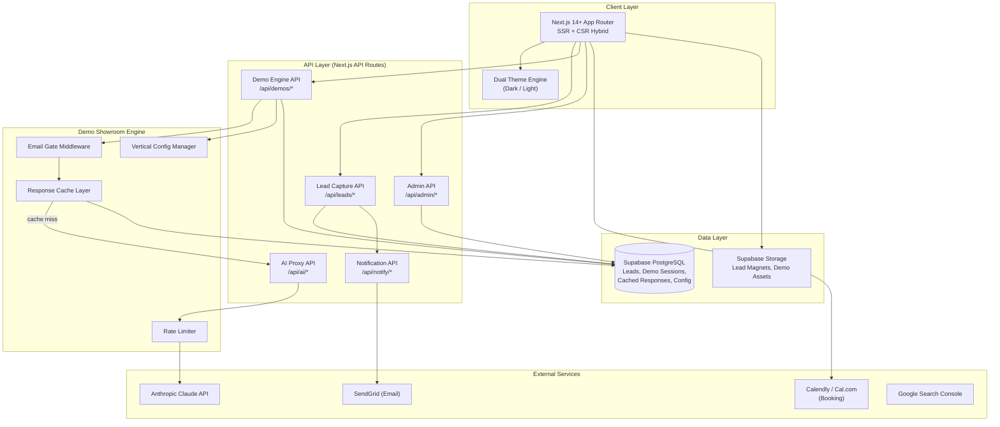
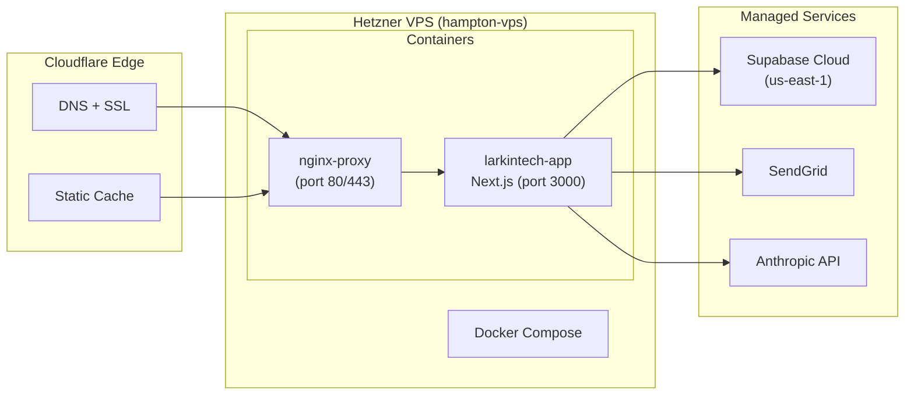
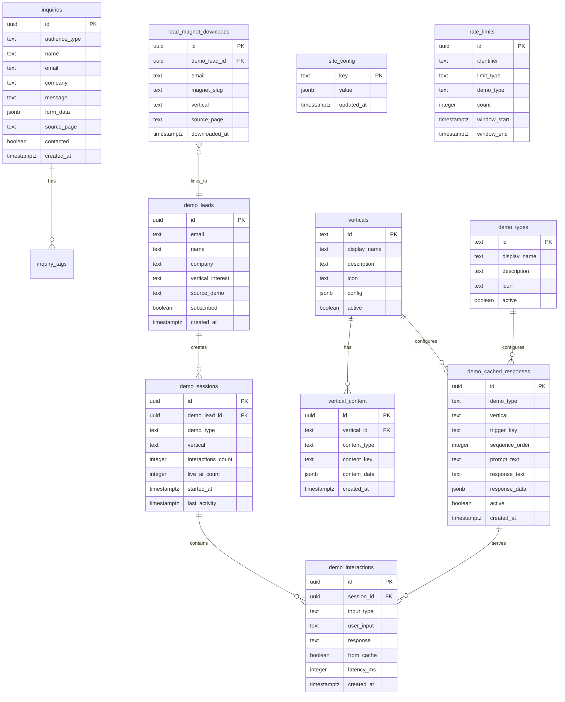

# Master Architecture Specification: Larkin Tech
**Version:** 1
**SOW Reference:** larkintech-sow.md
**Date:** March 26, 2026
**Status:** DRAFT

---

## 1. System Architecture Overview

### 1.1 Architecture Diagram



### 1.2 Technology Stack

| Layer | Technology | Version | Rationale |
|-------|-----------|---------|-----------|
| Frontend | Next.js (App Router) | 14.2+ | SSR for SEO service pages; RSC for performance; App Router for layout nesting (demo shell, main site); Adam's established stack |
| Language | TypeScript | 5.x | Type safety across full stack; catches demo engine config errors at compile time |
| Styling | Tailwind CSS | 3.4+ | Utility-first CSS; CSS custom properties for dual-theme system; rapid prototyping for 28 demo configs |
| Database | Supabase (PostgreSQL 15) | latest | Managed Postgres; built-in RLS; JS client for direct browser queries where appropriate; free tier sufficient at launch |
| Cache | Supabase (table-based) | - | No Redis needed at launch — cached demo responses stored in Postgres table with indexed lookups. Add Redis if cache hit latency becomes an issue (>50ms p95). |
| AI API | Anthropic Claude API | claude-sonnet-4-20250514 | Primary AI for all demo features; Sonnet for cost efficiency on demo interactions; Opus available for competitive analysis depth |
| Email | SendGrid | v3 API | Transactional emails (lead notifications, confirmations); free tier = 100/day, sufficient for launch |
| Booking | Calendly or Cal.com | embed | Embedded iframe/widget; no custom build at launch (SOW F-034, deferred to F-057) |
| Hosting | Hetzner VPS | CPX21 (3 vCPU, 4GB RAM) | Existing infrastructure; Docker deployment; sufficient for launch traffic |
| Containerization | Docker + Docker Compose | 24.x | Single-command deployment; reproducible environments; already in use on hampton-vps |
| Storage | Supabase Storage | - | Lead magnet PDFs, demo asset files, headshot image |
| DNS / CDN | Cloudflare | Free tier | DNS management, SSL termination, edge caching for static assets, DDoS protection |

### 1.3 Deployment Topology



**Deployment process:**
1. Push to `main` branch on GitHub
2. SSH to hampton-vps: `ssh hampton-vps`
3. `cd /opt/larkintech && git pull && docker compose up --build -d`
4. Health check: `curl -f http://localhost:3000/api/health`

**Future CI/CD (post-launch):** GitHub Actions → SSH deploy → Docker rebuild → health check → rollback on failure.

**Environment management:**
- `.env.local` — development (local machine)
- `.env.production` — production secrets on VPS (not in repo)
- Secrets: `SUPABASE_URL`, `SUPABASE_ANON_KEY`, `SUPABASE_SERVICE_KEY`, `ANTHROPIC_API_KEY`, `SENDGRID_API_KEY`, `ADMIN_SECRET`

---

## 2. Database Schema

### 2.1 Entity Relationship Diagram



### 2.2 Table Definitions

#### `inquiries`
**Implements:** F-033, F-036

| Column | Type | Constraints | Default | Description |
|--------|------|-------------|---------|-------------|
| id | uuid | PK | gen_random_uuid() | Primary key |
| audience_type | text | NOT NULL | - | Enum: 'hiring', 'smb_client', 'agency', 'other' |
| name | text | NOT NULL | - | Contact name |
| email | text | NOT NULL | - | Contact email |
| company | text | - | NULL | Company/organization name |
| phone | text | - | NULL | Phone number (optional) |
| message | text | NOT NULL | - | Inquiry message |
| form_data | jsonb | - | '{}' | Audience-specific fields (role_type, budget_range, project_type, etc.) |
| source_page | text | - | NULL | URL path where form was submitted |
| contacted | boolean | NOT NULL | false | Whether Adam has followed up |
| notes | text | - | NULL | Internal notes on this inquiry |
| created_at | timestamptz | NOT NULL | now() | Submission timestamp |

**Indexes:**
- `idx_inquiries_email` on `email` — lookup by email for dedup/history
- `idx_inquiries_audience_type` on `audience_type` — filter by type
- `idx_inquiries_created_at` on `created_at DESC` — recent-first listing
- `idx_inquiries_contacted` on `contacted` WHERE `contacted = false` — unread queue

---

#### `demo_leads`
**Implements:** F-019

| Column | Type | Constraints | Default | Description |
|--------|------|-------------|---------|-------------|
| id | uuid | PK | gen_random_uuid() | Primary key |
| email | text | UNIQUE, NOT NULL | - | Lead email (unique constraint = one record per email) |
| name | text | - | NULL | Lead name (optional at gate) |
| company | text | - | NULL | Company (optional) |
| vertical_interest | text | - | NULL | First vertical they accessed |
| source_demo | text | - | NULL | First demo type they accessed |
| subscribed | boolean | NOT NULL | true | Email opt-in status |
| created_at | timestamptz | NOT NULL | now() | First capture timestamp |
| last_seen_at | timestamptz | NOT NULL | now() | Most recent demo access |

**Indexes:**
- `idx_demo_leads_email` UNIQUE on `email` — primary lookup; prevents duplicates
- `idx_demo_leads_created_at` on `created_at DESC` — recent leads list

---

#### `demo_sessions`
**Implements:** F-020 through F-028

| Column | Type | Constraints | Default | Description |
|--------|------|-------------|---------|-------------|
| id | uuid | PK | gen_random_uuid() | Primary key |
| demo_lead_id | uuid | FK → demo_leads.id, NOT NULL | - | Which lead is using this demo |
| demo_type | text | NOT NULL | - | Enum: 'chatbot', 'analytics', 'email_sms', 'doc_processing', 'competitive_analysis', 'doc_drafting', 'marketing_engine' |
| vertical | text | NOT NULL | - | Enum: 'general_smb', 'construction', 'property_mgmt', 'legal' |
| interactions_count | integer | NOT NULL | 0 | Total interactions in this session |
| live_ai_count | integer | NOT NULL | 0 | Number of live AI calls (non-cached) |
| started_at | timestamptz | NOT NULL | now() | Session start |
| last_activity | timestamptz | NOT NULL | now() | Last interaction timestamp |

**Indexes:**
- `idx_demo_sessions_lead` on `demo_lead_id` — all sessions for a lead
- `idx_demo_sessions_type_vertical` on `(demo_type, vertical)` — analytics: which combos are popular

---

#### `demo_interactions`
**Implements:** F-020 through F-028

| Column | Type | Constraints | Default | Description |
|--------|------|-------------|---------|-------------|
| id | uuid | PK | gen_random_uuid() | Primary key |
| session_id | uuid | FK → demo_sessions.id, NOT NULL | - | Parent session |
| input_type | text | NOT NULL | 'text' | Enum: 'text', 'click', 'upload', 'preset_command' |
| user_input | text | - | NULL | What the user entered/clicked |
| response | text | NOT NULL | - | Response served to user |
| response_data | jsonb | - | NULL | Structured response (charts, tables, etc.) |
| from_cache | boolean | NOT NULL | - | Was this served from cache? |
| latency_ms | integer | - | NULL | Response time in milliseconds |
| created_at | timestamptz | NOT NULL | now() | Interaction timestamp |

**Indexes:**
- `idx_demo_interactions_session` on `session_id` — all interactions in a session
- `idx_demo_interactions_cache` on `from_cache` — cache hit rate analytics

---

#### `demo_cached_responses`
**Implements:** F-027

| Column | Type | Constraints | Default | Description |
|--------|------|-------------|---------|-------------|
| id | uuid | PK | gen_random_uuid() | Primary key |
| demo_type | text | NOT NULL | - | Which demo this cache entry belongs to |
| vertical | text | NOT NULL | - | Which vertical |
| trigger_key | text | NOT NULL | - | Normalized input trigger (lowercase, trimmed). For preset commands, this is the command ID. For free-text, this is a semantic key. |
| sequence_order | integer | NOT NULL | 0 | Order in preset command sequence (0 = not sequenced) |
| prompt_text | text | NOT NULL | - | The display text shown as the "user input" for preset commands |
| response_text | text | NOT NULL | - | Plain text response |
| response_data | jsonb | - | NULL | Structured data (chart data, table data, workflow steps, etc.) |
| active | boolean | NOT NULL | true | Soft delete / disable |
| created_at | timestamptz | NOT NULL | now() | Cache entry creation |

**Indexes:**
- `idx_cached_responses_lookup` UNIQUE on `(demo_type, vertical, trigger_key)` — primary cache lookup
- `idx_cached_responses_sequence` on `(demo_type, vertical, sequence_order)` WHERE `sequence_order > 0` — ordered preset sequence

---

#### `demo_types`
**Implements:** F-018

| Column | Type | Constraints | Default | Description |
|--------|------|-------------|---------|-------------|
| id | text | PK | - | Slug: 'chatbot', 'analytics', 'email_sms', 'doc_processing', 'competitive_analysis', 'doc_drafting', 'marketing_engine' |
| display_name | text | NOT NULL | - | Human-readable name |
| description | text | NOT NULL | - | One-line description for showroom card |
| icon | text | - | NULL | Lucide icon name |
| active | boolean | NOT NULL | true | Whether this demo is live |
| sort_order | integer | NOT NULL | 0 | Display order in showroom |

**Seed data:** 7 rows, one per demo type.

---

#### `verticals`
**Implements:** F-029 through F-032

| Column | Type | Constraints | Default | Description |
|--------|------|-------------|---------|-------------|
| id | text | PK | - | Slug: 'general_smb', 'construction', 'property_mgmt', 'legal' |
| display_name | text | NOT NULL | - | Human-readable name |
| description | text | NOT NULL | - | Vertical description |
| icon | text | - | NULL | Lucide icon name |
| config | jsonb | NOT NULL | '{}' | Vertical-specific configuration (industry terms, sample company names, color accent, etc.) |
| active | boolean | NOT NULL | true | Whether this vertical is live |

**Seed data:** 4 rows, one per vertical.

---

#### `vertical_content`
**Implements:** F-029 through F-032

| Column | Type | Constraints | Default | Description |
|--------|------|-------------|---------|-------------|
| id | uuid | PK | gen_random_uuid() | Primary key |
| vertical_id | text | FK → verticals.id, NOT NULL | - | Parent vertical |
| content_type | text | NOT NULL | - | Enum: 'sample_doc', 'dataset', 'company_profile', 'workflow_template', 'marketing_copy' |
| content_key | text | NOT NULL | - | Unique key within vertical + type |
| content_data | jsonb | NOT NULL | - | The actual content (JSON-structured) |
| created_at | timestamptz | NOT NULL | now() | Creation timestamp |

**Indexes:**
- `idx_vertical_content_lookup` UNIQUE on `(vertical_id, content_type, content_key)` — content lookup

---

#### `lead_magnet_downloads`
**Implements:** F-035

| Column | Type | Constraints | Default | Description |
|--------|------|-------------|---------|-------------|
| id | uuid | PK | gen_random_uuid() | Primary key |
| demo_lead_id | uuid | FK → demo_leads.id | NULL | Link to demo_leads if same email exists |
| email | text | NOT NULL | - | Downloader email |
| name | text | - | NULL | Downloader name |
| magnet_slug | text | NOT NULL | - | Which lead magnet was downloaded |
| vertical | text | - | NULL | Associated vertical |
| source_page | text | - | NULL | Page where download was triggered |
| downloaded_at | timestamptz | NOT NULL | now() | Download timestamp |

**Indexes:**
- `idx_magnet_downloads_email` on `email` — download history by email

---

#### `site_config`
**Implements:** F-042

| Column | Type | Constraints | Default | Description |
|--------|------|-------------|---------|-------------|
| key | text | PK | - | Config key (e.g., 'availability_status', 'pricing_tiers', 'feature_flags') |
| value | jsonb | NOT NULL | - | Config value |
| updated_at | timestamptz | NOT NULL | now() | Last update |

**Seed data:**
- `availability_status`: `{ "status": "available", "message": "Open to new engagements" }`
- `rate_limit_config`: `{ "chatbot": 5, "competitive_analysis": 1, "doc_drafting": 3, "default": 5 }`

---

#### `rate_limits`
**Implements:** F-028

| Column | Type | Constraints | Default | Description |
|--------|------|-------------|---------|-------------|
| id | uuid | PK | gen_random_uuid() | Primary key |
| identifier | text | NOT NULL | - | Email or session ID |
| limit_type | text | NOT NULL | - | Enum: 'session', 'email_daily', 'email_total' |
| demo_type | text | NOT NULL | - | Which demo |
| count | integer | NOT NULL | 0 | Current count in window |
| window_start | timestamptz | NOT NULL | now() | Window start |
| window_end | timestamptz | NOT NULL | - | Window expiration |

**Indexes:**
- `idx_rate_limits_lookup` on `(identifier, limit_type, demo_type)` WHERE `window_end > now()` — active limit check
- Cleanup: cron job or Supabase scheduled function to delete expired rows nightly

### 2.3 Migrations Strategy

**Tool:** Supabase CLI migrations (`supabase migration new`, `supabase db push`)

**Process:**
1. All schema changes created as timestamped SQL migration files in `/supabase/migrations/`
2. Local development uses `supabase start` (local Postgres instance)
3. Production migrations applied via `supabase db push` or manual SQL execution
4. Rollback: each migration includes a `-- ROLLBACK` comment block with reverse SQL. Manual execution if needed.

**Migration naming:** `YYYYMMDDHHMMSS_description.sql`

### 2.4 Seed Data

File: `/supabase/seed.sql`

Contents:
- 7 `demo_types` rows (one per demo feature)
- 4 `verticals` rows with config JSON
- `site_config` defaults (availability_status, rate_limit_config)
- Pre-generated `demo_cached_responses` for all 28 demo × vertical combinations (loaded from JSON fixtures in `/data/cache-seeds/`)

The cache seed data is the largest content artifact — estimated 28 × 10 interactions = ~280 cached response entries. These are generated during Phase 5-6 build using AI-assisted content generation.

---

## 3. API Design

### 3.1 API Conventions

- **Base URL:** `/api` (Next.js API routes, no versioning prefix at launch — single consumer)
- **Auth:** No user auth. Admin endpoints protected by `x-admin-secret` header matching `ADMIN_SECRET` env var.
- **Content-Type:** `application/json`
- **Error format:**
```json
{
  "error": {
    "code": "RATE_LIMITED",
    "message": "You've reached the demo limit. Book a call for full access.",
    "details": { "limit": 5, "reset_at": "2026-03-27T00:00:00Z" }
  }
}
```
- **Rate limiting:** Per-email and per-session, configurable per demo type. Enforced at API layer.

### 3.2 Endpoint Definitions

#### Lead Capture — Implements F-033, F-036

##### `POST /api/leads/inquiry`
**Purpose:** Submit a contact/inquiry form
**Auth:** Public

**Request:**
```json
{
  "audience_type": "hiring | smb_client | agency | other",
  "name": "string (required)",
  "email": "string (required, email format)",
  "company": "string (optional)",
  "phone": "string (optional)",
  "message": "string (required, max 5000 chars)",
  "form_data": {
    "role_type": "fulltime | contract | fractional (if hiring)",
    "budget_range": "string (if smb_client)",
    "project_type": "string (if smb_client or agency)",
    "timeline": "string (optional)"
  },
  "source_page": "string (URL path)"
}
```

**Response (201):**
```json
{
  "success": true,
  "id": "uuid",
  "message": "Thank you! I'll be in touch within 24 hours."
}
```

**Side effects:** Triggers `POST /api/notify/lead` internally.

**Error Responses:**
- `400` — Validation failure (missing required fields, invalid email)
- `429` — Spam protection (>3 submissions from same email in 24 hours)

---

##### `POST /api/leads/demo-gate`
**Purpose:** Email gate submission before accessing demos
**Auth:** Public
**Implements:** F-019

**Request:**
```json
{
  "email": "string (required)",
  "name": "string (optional)",
  "company": "string (optional)",
  "vertical_interest": "general_smb | construction | property_mgmt | legal (optional)",
  "source_demo": "string (demo type slug, optional)"
}
```

**Response (200):**
```json
{
  "success": true,
  "lead_id": "uuid",
  "session_token": "string (JWT, 24hr expiry)",
  "message": "Welcome! Explore our AI demos."
}
```

**Logic:**
1. Upsert into `demo_leads` (email as unique key — update `last_seen_at` if exists)
2. Generate session JWT containing `{ lead_id, email, exp }` — stored in httpOnly cookie
3. Trigger `POST /api/notify/lead` for new emails only

**Error Responses:**
- `400` — Invalid email format

---

##### `POST /api/leads/magnet-download`
**Purpose:** Gate lead magnet download behind email capture
**Auth:** Public
**Implements:** F-035

**Request:**
```json
{
  "email": "string (required)",
  "name": "string (optional)",
  "magnet_slug": "string (required — e.g., 'ai-playbook-construction')",
  "source_page": "string (URL path)"
}
```

**Response (200):**
```json
{
  "success": true,
  "download_url": "string (signed Supabase Storage URL, 1hr expiry)"
}
```

**Logic:**
1. Record in `lead_magnet_downloads`
2. Link to `demo_leads` if email matches
3. Generate signed download URL from Supabase Storage
4. Trigger notification

---

#### Demo Engine — Implements F-020 through F-028

##### `GET /api/demos/types`
**Purpose:** List all available demo types
**Auth:** Public

**Response (200):**
```json
{
  "demo_types": [
    {
      "id": "chatbot",
      "display_name": "AI Chatbot Agent",
      "description": "Interactive conversational AI configured for your industry",
      "icon": "MessageSquare",
      "active": true
    }
  ]
}
```

---

##### `GET /api/demos/verticals`
**Purpose:** List all available verticals
**Auth:** Public

**Response (200):**
```json
{
  "verticals": [
    {
      "id": "construction",
      "display_name": "Construction & Building Materials",
      "description": "AI tools for contractors, suppliers, and project managers",
      "icon": "HardHat",
      "active": true
    }
  ]
}
```

---

##### `POST /api/demos/session`
**Purpose:** Start a new demo session
**Auth:** Requires demo gate session token (cookie)
**Implements:** F-020 through F-026

**Request:**
```json
{
  "demo_type": "chatbot | analytics | email_sms | doc_processing | competitive_analysis | doc_drafting | marketing_engine",
  "vertical": "general_smb | construction | property_mgmt | legal"
}
```

**Response (200):**
```json
{
  "session_id": "uuid",
  "demo_type": "chatbot",
  "vertical": "construction",
  "preset_commands": [
    {
      "sequence": 1,
      "prompt_text": "Show me how AI handles a material quote request",
      "trigger_key": "quote_request_intro"
    },
    {
      "sequence": 2,
      "prompt_text": "What about bulk pricing for a commercial job?",
      "trigger_key": "bulk_pricing_commercial"
    }
  ],
  "rate_limit": {
    "live_ai_remaining": 5,
    "resets_at": "2026-03-27T00:00:00Z"
  }
}
```

**Logic:**
1. Validate session token from cookie
2. Create `demo_sessions` row
3. Load preset command sequence from `demo_cached_responses` for this demo_type + vertical
4. Check rate limits for this lead
5. Return session context

---

##### `POST /api/demos/interact`
**Purpose:** Process a demo interaction (user sends input, gets AI response)
**Auth:** Requires demo gate session token
**Implements:** F-020 through F-028

**Request:**
```json
{
  "session_id": "uuid",
  "input_type": "text | click | upload | preset_command",
  "user_input": "string (the text entered, button clicked, or preset trigger_key)",
  "input_data": {}
}
```

**Response (200):**
```json
{
  "response": "string (display text)",
  "response_data": {
    "type": "text | chart | table | workflow | document | analysis",
    "content": {}
  },
  "from_cache": true,
  "next_presets": [
    {
      "prompt_text": "Now show me the follow-up sequence",
      "trigger_key": "followup_sequence"
    }
  ],
  "rate_limit": {
    "live_ai_remaining": 4,
    "resets_at": "2026-03-27T00:00:00Z"
  }
}
```

**Logic (the core demo engine flow):**
1. Validate session token + session_id ownership
2. Normalize input → `trigger_key`
3. **Cache lookup:** Query `demo_cached_responses` for `(demo_type, vertical, trigger_key)`
4. **If cache hit:** Return cached response. Set `from_cache: true`. No API cost.
5. **If cache miss:** Check rate limit for this lead + demo_type
   - **If under limit:** Call Claude API via `/api/ai/generate`. Increment `live_ai_count`. Set `from_cache: false`.
   - **If over limit:** Return rate limit error with CTA to book a call.
6. Record interaction in `demo_interactions`
7. Update `demo_sessions.interactions_count` and `last_activity`
8. Return response + next preset suggestions (if any remaining in sequence)

---

##### `POST /api/demos/competitive-analysis`
**Purpose:** Special endpoint for the business & competitive analysis demo
**Auth:** Requires demo gate session token
**Implements:** F-024

**Request:**
```json
{
  "session_id": "uuid",
  "business_name": "string (required)",
  "business_url": "string (optional)",
  "competitors": [
    { "name": "string", "url": "string (optional)" }
  ],
  "vertical": "string"
}
```

**Response (200):**
```json
{
  "analysis_id": "uuid",
  "status": "generating | complete",
  "report": {
    "business_summary": "string",
    "competitor_summaries": [],
    "strengths": [],
    "opportunities": [],
    "ai_recommendations": [],
    "score": 78
  },
  "download_url": "string (PDF, if generated)"
}
```

**Rate limit:** 1 analysis per email per 24 hours (heavy API usage).

---

#### AI Proxy — Implements F-027, F-028

##### `POST /api/ai/generate`
**Purpose:** Internal-only proxy to Claude API. Not exposed directly — called by demo engine.
**Auth:** Internal only (not routable from client)

**Request:**
```json
{
  "demo_type": "string",
  "vertical": "string",
  "system_prompt_key": "string (lookup from vertical config)",
  "messages": [
    { "role": "user", "content": "string" }
  ],
  "max_tokens": 1024,
  "response_format": "text | json"
}
```

**Logic:**
1. Load system prompt from vertical config (stored in `verticals.config` or `vertical_content`)
2. Call Anthropic Claude API (Sonnet for standard demos, configurable per demo_type)
3. Parse response
4. Log API call for cost tracking
5. Return response to caller

---

#### Notifications — Implements F-036

##### `POST /api/notify/lead`
**Purpose:** Send email notification to Adam on new lead capture
**Auth:** Internal only

**Request:**
```json
{
  "type": "inquiry | demo_gate | magnet_download",
  "email": "string",
  "name": "string",
  "details": {}
}
```

**Logic:**
1. Format email based on type (different templates for inquiry vs. demo vs. download)
2. Send via SendGrid to Adam's email
3. Log notification sent

---

#### Admin — Implements F-042

##### `GET /api/admin/leads`
**Purpose:** List all leads (inquiries + demo leads + magnet downloads)
**Auth:** Admin secret header

**Query params:** `?type=inquiry|demo|magnet&page=1&limit=20&contacted=false`

**Response (200):**
```json
{
  "leads": [],
  "total": 150,
  "page": 1,
  "limit": 20
}
```

---

##### `PATCH /api/admin/config/:key`
**Purpose:** Update site config (availability status, rate limits, etc.)
**Auth:** Admin secret header
**Implements:** F-042

**Request:**
```json
{
  "value": { "status": "limited", "message": "Booking Q2 2026" }
}
```

**Response (200):**
```json
{
  "key": "availability_status",
  "value": { "status": "limited", "message": "Booking Q2 2026" },
  "updated_at": "2026-03-26T..."
}
```

---

##### `GET /api/health`
**Purpose:** Health check for deployment verification
**Auth:** Public

**Response (200):**
```json
{
  "status": "healthy",
  "timestamp": "2026-03-26T...",
  "version": "1.0.0",
  "database": "connected"
}
```

---

## 4. Component Architecture

### 4.1 Component Tree

```
app/
├── layout.tsx                          — Root layout: ThemeProvider, fonts, analytics, meta
├── page.tsx                            — Homepage (F-005, F-006, F-007)
├── globals.css                         — Tailwind base + CSS custom properties for dual-theme
│
├── (marketing)/                        — Marketing pages group (shared header/footer layout)
│   ├── layout.tsx                      — MarketingLayout: Navbar, Footer, CTABanner
│   ├── services/
│   │   ├── ai-solutions-architect/page.tsx     — F-008
│   │   ├── prompt-engineering/page.tsx          — F-009
│   │   ├── ai-automation/page.tsx               — F-010
│   │   ├── fractional-cto/page.tsx              — F-011
│   │   └── ai-implementation/page.tsx           — F-012
│   ├── portfolio/
│   │   ├── page.tsx                             — Portfolio index (F-013)
│   │   ├── orchestration-framework/page.tsx     — F-014
│   │   ├── customer-lifecycle-engine/page.tsx   — F-015
│   │   ├── hamptons-estate/page.tsx             — F-016
│   │   └── host-hampton/page.tsx                — F-017
│   ├── pricing/page.tsx                         — F-037, F-038, F-039
│   ├── about/page.tsx                           — F-040, F-041, F-042, F-043
│   └── contact/page.tsx                         — F-033, F-034
│
├── (demos)/                            — Demo showroom group (different layout: demo shell)
│   ├── layout.tsx                      — DemoLayout: DemoNav, VerticalSelector, email gate check
│   ├── page.tsx                        — Demo showroom index (F-018)
│   ├── gate/page.tsx                   — Email gate form (F-019) — shown as modal or page
│   └── [demoType]/
│       └── [vertical]/
│           └── page.tsx                — Individual demo page (F-020 through F-026)
│                                         Dynamic route: /demos/chatbot/construction
│
├── api/
│   ├── leads/
│   │   ├── inquiry/route.ts            — POST handler
│   │   ├── demo-gate/route.ts          — POST handler
│   │   └── magnet-download/route.ts    — POST handler
│   ├── demos/
│   │   ├── types/route.ts              — GET handler
│   │   ├── verticals/route.ts          — GET handler
│   │   ├── session/route.ts            — POST handler
│   │   ├── interact/route.ts           — POST handler
│   │   └── competitive-analysis/route.ts — POST handler
│   ├── ai/
│   │   └── generate/route.ts           — POST handler (internal only)
│   ├── notify/
│   │   └── lead/route.ts               — POST handler (internal only)
│   ├── admin/
│   │   ├── leads/route.ts              — GET handler
│   │   └── config/[key]/route.ts       — PATCH handler
│   └── health/route.ts                 — GET handler
│
├── lib/
│   ├── supabase/
│   │   ├── client.ts                   — Browser Supabase client
│   │   ├── server.ts                   — Server Supabase client (service role)
│   │   └── types.ts                    — Generated database types
│   ├── ai/
│   │   ├── claude.ts                   — Claude API wrapper
│   │   ├── prompts/                    — System prompts organized by demo_type
│   │   │   ├── chatbot.ts
│   │   │   ├── analytics.ts
│   │   │   ├── email-sms.ts
│   │   │   ├── doc-processing.ts
│   │   │   ├── competitive-analysis.ts
│   │   │   ├── doc-drafting.ts
│   │   │   └── marketing-engine.ts
│   │   └── vertical-configs/           — Vertical-specific AI context
│   │       ├── general-smb.ts
│   │       ├── construction.ts
│   │       ├── property-mgmt.ts
│   │       └── legal.ts
│   ├── demo-engine/
│   │   ├── cache.ts                    — Cache lookup/write logic
│   │   ├── rate-limiter.ts             — Rate limit check/increment
│   │   ├── session.ts                  — Session JWT create/verify
│   │   └── interaction-router.ts       — Routes input → cache or live AI
│   ├── email/
│   │   ├── sendgrid.ts                 — SendGrid client wrapper
│   │   └── templates/                  — Email HTML templates
│   │       ├── lead-notification.ts
│   │       └── demo-welcome.ts
│   ├── validation/
│   │   └── schemas.ts                  — Zod schemas for all API inputs
│   └── utils/
│       ├── seo.ts                      — Meta tag generation helpers
│       └── theme.ts                    — Theme detection/toggle utilities
│
├── components/
│   ├── ui/                             — Base UI components (shared, theme-aware)
│   │   ├── Button.tsx
│   │   ├── Card.tsx
│   │   ├── Input.tsx
│   │   ├── Badge.tsx
│   │   ├── Modal.tsx
│   │   ├── Tabs.tsx
│   │   ├── Select.tsx
│   │   └── Tooltip.tsx
│   ├── layout/
│   │   ├── Navbar.tsx                  — F-004: Primary navigation
│   │   ├── Footer.tsx                  — Site footer with links, socials
│   │   ├── ThemeToggle.tsx             — F-001: Dark/light switch
│   │   ├── CTABanner.tsx               — Floating/sticky CTA strip
│   │   └── MobileMenu.tsx              — F-004: Hamburger menu
│   ├── home/
│   │   ├── HeroSection.tsx             — F-005: Segmented hero with dual CTA
│   │   ├── ServicesOverview.tsx         — F-006: Service cards grid
│   │   ├── SocialProofStrip.tsx         — F-007: Metrics/results band
│   │   ├── DemoTeaser.tsx              — Showroom preview/link
│   │   └── AvailabilityBadge.tsx       — F-042: Green/yellow/red status
│   ├── services/
│   │   └── ServicePageLayout.tsx       — Shared layout for F-008 through F-012
│   ├── portfolio/
│   │   ├── PortfolioGrid.tsx           — F-013: Project cards grid
│   │   ├── CaseStudyLayout.tsx         — Shared layout for F-014 through F-017
│   │   ├── TechStackBadges.tsx         — Tech tags display
│   │   └── ArchitectureDiagram.tsx     — Mermaid diagram renderer
│   ├── pricing/
│   │   ├── RetainerTiers.tsx           — F-038: Tier comparison cards
│   │   └── ProjectPricing.tsx          — F-039: Project type pricing list
│   ├── about/
│   │   ├── BioSection.tsx              — F-040: Photo + narrative
│   │   ├── SkillsMatrix.tsx            — F-041: Visual skills display
│   │   ├── ResumeSection.tsx           — F-041: Integrated resume
│   │   └── ExternalLinks.tsx           — F-043: LinkedIn, GitHub, etc.
│   ├── contact/
│   │   ├── SegmentedForm.tsx           — F-033: Audience-adaptive form
│   │   ├── BookingEmbed.tsx            — F-034: Calendly/Cal.com widget
│   │   └── LeadMagnetGate.tsx          — F-035: Download gate form
│   ├── demos/
│   │   ├── DemoShowroomGrid.tsx        — F-018: Demo + vertical matrix
│   │   ├── EmailGateModal.tsx          — F-019: Email capture overlay
│   │   ├── DemoShell.tsx               — Shared demo page wrapper
│   │   ├── PresetCommandBar.tsx        — Clickable preset command buttons
│   │   ├── ChatInterface.tsx           — F-020: Conversational chatbot UI
│   │   ├── AnalyticsDashboard.tsx      — F-021: Charts + AI insights panel
│   │   ├── WorkflowBuilder.tsx         — F-022: Visual workflow display
│   │   ├── DocumentProcessor.tsx       — F-023: Upload/paste → extract UI
│   │   ├── CompetitiveAnalysis.tsx     — F-024: Business input → report
│   │   ├── DocumentDrafter.tsx         — F-025: Template select → draft
│   │   ├── MarketingEngine.tsx         — F-026: Pipeline stages UI
│   │   ├── RateLimitNotice.tsx         — F-028: Friendly limit message + CTA
│   │   └── DemoDisclaimer.tsx          — "Sample data" notice
│   └── shared/
│       ├── SEOHead.tsx                 — F-044: Dynamic meta tags
│       ├── StructuredData.tsx          — F-044: JSON-LD schemas
│       └── Logo.tsx                    — F-003: Stylized LaRKiN TECH
│
├── data/
│   ├── cache-seeds/                    — JSON fixture files for demo cached responses
│   │   ├── chatbot/
│   │   │   ├── general-smb.json
│   │   │   ├── construction.json
│   │   │   ├── property-mgmt.json
│   │   │   └── legal.json
│   │   ├── analytics/
│   │   │   └── [same 4 files per demo type]
│   │   └── ... (7 directories × 4 files = 28 JSON fixture files)
│   ├── case-studies/                   — Markdown content for portfolio
│   │   ├── orchestration-framework.md
│   │   ├── customer-lifecycle-engine.md
│   │   ├── hamptons-estate.md
│   │   └── host-hampton.md
│   └── service-pages/                  — Markdown content for service pages
│       ├── ai-solutions-architect.md
│       ├── prompt-engineering.md
│       ├── ai-automation.md
│       ├── fractional-cto.md
│       └── ai-implementation.md
│
├── public/
│   ├── images/
│   │   ├── headshot.jpg                — Adam's professional photo
│   │   ├── og-image.png                — Default Open Graph image
│   │   └── portfolio/                  — Case study screenshots/diagrams
│   ├── downloads/
│   │   └── ai-playbook-construction.pdf — Lead magnet
│   ├── robots.txt
│   └── sitemap.xml                     — Generated at build time
│
├── supabase/
│   ├── migrations/
│   │   └── 20260326000000_initial_schema.sql
│   ├── seed.sql
│   └── config.toml
│
├── docker/
│   ├── Dockerfile
│   └── docker-compose.yml
│
├── next.config.js
├── tailwind.config.ts
├── tsconfig.json
└── package.json
```

### 4.2 Shared Components

| Component | Key Props | Used By | Implements |
|-----------|-----------|---------|------------|
| ThemeToggle | - | Navbar (all pages) | F-001 |
| Navbar | currentPath, theme | All pages | F-004 |
| Footer | - | All marketing pages | F-004 |
| Logo | size, variant (full/mark) | Navbar, Footer, OG | F-003 |
| AvailabilityBadge | - (reads from site_config) | HeroSection, BioSection | F-042 |
| Button | variant, size, href, onClick | Global | - |
| Card | title, description, icon, href | Services, Portfolio, Demos | - |
| ServicePageLayout | title, keyword, content, relatedCaseStudies | All service pages | F-008 to F-012 |
| CaseStudyLayout | title, problem, approach, architecture, results, techStack | All case studies | F-014 to F-017 |
| DemoShell | demoType, vertical, sessionId, presets | All demo pages | F-020 to F-026 |
| PresetCommandBar | commands[], onSelect | All demo pages | F-027 |
| EmailGateModal | onSuccess, redirectTo | Demo showroom entry | F-019 |
| SegmentedForm | - | Contact page | F-033 |
| SEOHead | title, description, path, type | All pages | F-044 |
| StructuredData | type, data | All pages | F-044 |
| RateLimitNotice | limit, resetAt | Demo pages | F-028 |

### 4.3 State Management

**Principle:** Minimal client state. Server-first architecture.

| State Type | Technology | What Lives Here |
|-----------|-----------|-----------------|
| Theme preference | `localStorage` + React Context (`ThemeContext`) | Current theme (dark/light), persisted across sessions |
| Demo session | httpOnly cookie (JWT) + React Context (`DemoSessionContext`) | Lead ID, email, session token, current session_id |
| Demo interaction history | React state (`useState` in DemoShell) | Current session's messages/interactions (lost on page leave — intentional) |
| Server data (config, verticals, demo types) | React Server Components (RSC) | Fetched at request time via server components; no client cache needed |
| Form state | React Hook Form + Zod | Contact form, email gate form, competitive analysis input |
| Rate limit state | Returned from API, stored in DemoSessionContext | Remaining live AI calls, reset time |

**No global state library needed.** The app is primarily a content site with isolated interactive sections (demos). React Context handles the two cross-cutting concerns (theme + demo session). Everything else is local component state or server-fetched.

### 4.4 Routing & Navigation

**Route structure:**

| Path | Page | Type | SEO |
|------|------|------|-----|
| `/` | Homepage | SSR | Yes — primary landing |
| `/services/ai-solutions-architect` | Service page | SSR | Yes — keyword target |
| `/services/prompt-engineering` | Service page | SSR | Yes — keyword target |
| `/services/ai-automation` | Service page | SSR | Yes — keyword target |
| `/services/fractional-cto` | Service page | SSR | Yes — keyword target |
| `/services/ai-implementation` | Service page | SSR | Yes — keyword target |
| `/portfolio` | Portfolio index | SSR | Yes |
| `/portfolio/orchestration-framework` | Case study | SSR | Yes |
| `/portfolio/customer-lifecycle-engine` | Case study | SSR | Yes |
| `/portfolio/hamptons-estate` | Case study | SSR | Yes |
| `/portfolio/host-hampton` | Case study | SSR | Yes |
| `/pricing` | Pricing page | SSR | Yes |
| `/about` | About + resume | SSR | Yes |
| `/contact` | Contact form + booking | SSR | Yes |
| `/demos` | Demo showroom index | SSR | Yes — "AI demos" SEO |
| `/demos/gate` | Email gate (also shown as modal) | CSR | No — noindex |
| `/demos/[demoType]/[vertical]` | Individual demo | CSR | No — gated content, noindex |

**Protected routes:** `/demos/[demoType]/[vertical]` checks for valid session cookie. If missing, redirects to `/demos/gate?redirect=/demos/[demoType]/[vertical]`.

**Navigation behavior:**
- Sticky navbar on all pages (collapses to hamburger on mobile)
- Active page indicator in nav
- Demo showroom has its own sub-navigation (DemoNav) with vertical tabs
- All CTAs use `<Link>` for client-side navigation within the site
- External links (LinkedIn, GitHub, Calendly) open in new tab

---

## 5. Integration Requirements

### 5.1 Anthropic Claude API — Implements F-020 through F-026

- **Purpose:** Powers all live AI demo interactions (cache misses only)
- **API Docs:** https://docs.anthropic.com/en/api
- **Auth Method:** API key via `x-api-key` header (server-side only, never exposed to client)
- **Model:** `claude-sonnet-4-20250514` (default for demos — cost-efficient). Configurable per demo_type.
- **Data Flow:** Client → Next.js API route → `lib/ai/claude.ts` → Anthropic API → parsed response → client
- **Failure Handling:** On API error or timeout (30s): return friendly error message ("AI is momentarily unavailable — try a preset command") + log error. Never expose API errors to client.
- **Rate Limits:** Anthropic tier-based. Internal budget cap: track token usage per day. Alert if daily spend exceeds $5. Hard stop at $10/day.
- **Cost:** ~$3 per 1M input tokens, ~$15 per 1M output tokens (Sonnet). Target: <$2/day at moderate traffic with caching.

### 5.2 SendGrid — Implements F-036

- **Purpose:** Transactional email notifications to Adam on new leads
- **API Docs:** https://docs.sendgrid.com/api-reference
- **Auth Method:** API key via `Authorization: Bearer` header
- **Data Flow:** Lead captured → `api/notify/lead` → SendGrid API → Adam's inbox
- **Failure Handling:** Log failure; retry once after 30s. Lead is captured in Supabase regardless of email delivery.
- **Rate Limits:** Free tier: 100 emails/day. More than sufficient for launch.
- **Cost:** Free tier

### 5.3 Calendly / Cal.com — Implements F-034

- **Purpose:** Discovery call booking
- **Integration Method:** Embed (iframe or JS widget) — no API integration at launch
- **Data Flow:** Visitor interacts with embedded widget directly. Calendly/Cal.com handles scheduling, confirmation emails, and calendar sync.
- **Failure Handling:** If embed fails to load, show fallback CTA: "Email me to schedule a call" with mailto link
- **Cost:** Free tier (Calendly: 1 event type; Cal.com: unlimited if self-hosted)

### 5.4 Supabase — Implements all data storage

- **Purpose:** Database, auth (JWT generation only — no user accounts), file storage
- **API Docs:** https://supabase.com/docs
- **Auth Method:** `SUPABASE_URL` + `SUPABASE_ANON_KEY` (client) or `SUPABASE_SERVICE_KEY` (server)
- **Data Flow:** API routes → Supabase JS client → PostgreSQL
- **Failure Handling:** All API routes wrap Supabase calls in try/catch. On connection failure: return 503 with "Service temporarily unavailable." Health check endpoint monitors DB connectivity.
- **Rate Limits:** Free tier: 500MB DB, 1GB storage, 2GB bandwidth, 50K monthly active users. Sufficient for launch.
- **Cost:** Free tier at launch. Pro ($25/month) if limits are approached.

### 5.5 Cloudflare — Implements CDN/DNS

- **Purpose:** DNS management, SSL termination, static asset caching, DDoS protection
- **Integration Method:** Nameserver delegation from domain registrar
- **Data Flow:** All traffic routes through Cloudflare edge → origin (Hetzner VPS)
- **Failure Handling:** Cloudflare's Always Online feature serves cached version if origin is down
- **Cost:** Free tier

---

## 6. Build Phases

### Phase 1: Foundation & Core Site
**Dependencies:** None (greenfield)
**Implements:** F-001, F-002, F-003, F-004, F-005, F-006, F-007
**Estimated Complexity:** Moderate

**Deliverables:**
1. Next.js 14 project scaffolded with TypeScript, Tailwind, App Router
2. Dual-theme system: CSS custom properties in `globals.css`, ThemeProvider context, ThemeToggle component, localStorage persistence
3. Root layout with Navbar, Footer, MobileMenu
4. Homepage: HeroSection (segmented dual CTA), ServicesOverview (6 cards), SocialProofStrip
5. Logo component with stylized "LaRKiN TECH" rendering (A and I highlighted)
6. Responsive layout verified at 320px, 768px, 1024px, 1440px
7. Supabase project created, initial schema migration deployed
8. Docker + docker-compose configuration
9. Deployment to hampton-vps, Cloudflare DNS pointed to LarkinTECH.ai

**Acceptance Criteria:**
- [ ] Site loads at LarkinTECH.ai over HTTPS
- [ ] Theme toggle switches between dark and light; persists on reload
- [ ] Homepage renders all sections in both themes
- [ ] Mobile hamburger menu works; all nav links functional
- [ ] Lighthouse mobile performance ≥85
- [ ] Health check endpoint returns 200

### Phase 2: Service Pages, About & Lead Capture
**Dependencies:** Phase 1 complete
**Implements:** F-008 through F-012, F-033, F-034, F-035, F-036, F-040, F-041, F-042, F-043, F-044, F-045
**Estimated Complexity:** Moderate

**Deliverables:**
1. ServicePageLayout shared component
2. 5 service pages with SEO-optimized content, unique meta tags, JSON-LD structured data
3. About page: BioSection (headshot + narrative), SkillsMatrix, ResumeSection (generalized), ExternalLinks
4. AvailabilityBadge component reading from `site_config`
5. SegmentedForm component with audience-type routing
6. `POST /api/leads/inquiry` endpoint + Zod validation
7. `POST /api/notify/lead` endpoint + SendGrid integration
8. BookingEmbed component (Calendly or Cal.com iframe)
9. LeadMagnetGate component + `POST /api/leads/magnet-download` endpoint
10. `robots.txt`, `sitemap.xml` generation, Google Search Console setup

**Acceptance Criteria:**
- [ ] All 5 service pages render with unique meta titles and descriptions
- [ ] JSON-LD validates in Google Rich Results Test for Person + Service schemas
- [ ] Contact form submits successfully; data appears in Supabase `inquiries` table
- [ ] Email notification arrives within 60 seconds of form submission
- [ ] Availability badge reflects `site_config` value; updates via admin API
- [ ] Lead magnet download returns signed URL; download tracked in DB

### Phase 3: Portfolio & Pricing
**Dependencies:** Phase 2 complete
**Implements:** F-013 through F-017, F-037, F-038, F-039
**Estimated Complexity:** Moderate

**Deliverables:**
1. PortfolioGrid component with tag filtering
2. CaseStudyLayout shared component
3. 4 case study pages with architecture diagrams (Mermaid rendered client-side or as SVG), tech stack badges, problem/approach/results narrative, CTAs
4. RetainerTiers component (3 tiers comparison)
5. ProjectPricing component (4+ project types with "starting at" pricing)
6. Pricing page with both sections + CTAs linking to contact form with pre-selected context

**Acceptance Criteria:**
- [ ] Portfolio index shows all 4 projects; tag filtering works
- [ ] Each case study includes at least one architecture diagram
- [ ] Pricing page displays retainer tiers and project pricing
- [ ] CTA on pricing cards pre-fills contact form audience_type and project_type

### Phase 4: Demo Showroom Infrastructure
**Dependencies:** Phase 1 complete (can run parallel with Phases 2-3)
**Implements:** F-018, F-019, F-027, F-028
**Estimated Complexity:** Complex

**Deliverables:**
1. DemoLayout with DemoNav, vertical selector tabs
2. DemoShowroomGrid component (7 demo types × 4 verticals matrix)
3. EmailGateModal + `POST /api/leads/demo-gate` endpoint + JWT session creation
4. `demo_cached_responses` table populated with seed data (start with 5 preset interactions per demo × vertical = 140 entries minimum)
5. Cache lookup logic in `lib/demo-engine/cache.ts`
6. Rate limiter in `lib/demo-engine/rate-limiter.ts`
7. `POST /api/demos/session` and `POST /api/demos/interact` endpoints
8. DemoShell wrapper component with PresetCommandBar
9. RateLimitNotice component with CTA to book call

**Acceptance Criteria:**
- [ ] Email gate captures lead and sets session cookie
- [ ] Returning visitor (same email) bypasses gate
- [ ] Preset commands return cached responses (0 API calls)
- [ ] Free-text input after presets calls live AI (if under rate limit)
- [ ] Rate limit enforced; friendly message shown when exceeded
- [ ] All interactions logged in `demo_interactions` table

### Phase 5: Demo Features Build-Out
**Dependencies:** Phase 4 complete
**Implements:** F-020 through F-026
**Estimated Complexity:** Complex (largest phase)

**Deliverables — 7 demo UI components, each with:**
1. **ChatInterface (F-020):** Conversation bubble UI, typing indicator, preset command suggestions, markdown rendering in responses
2. **AnalyticsDashboard (F-021):** Recharts-based dashboard with revenue, customers, trends charts. AI insights panel (pre-generated per vertical). Filterable by date range (simulated).
3. **WorkflowBuilder (F-022):** Visual workflow display showing trigger → condition → action → AI-generated content chain. Step-through animation. Email/SMS preview panels.
4. **DocumentProcessor (F-023):** Text input area (paste) + file upload simulation. Structured data extraction display as table. Pre-loaded sample documents per vertical.
5. **CompetitiveAnalysis (F-024):** Business name + competitors input form. Generates report with scores, strengths, opportunities. Downloadable output. Special endpoint with heavy rate limiting.
6. **DocumentDrafter (F-025):** Document type selector (per vertical: legal docs, quotes, reports, marketing copy). Parameter input form. Generated document preview with download.
7. **MarketingEngine (F-026):** Multi-stage pipeline visualization (audience → content → channel → analytics). AI-generated content at each stage. "Run campaign" simulation.

Each component loads demo_type-specific system prompts from `lib/ai/prompts/` and vertical context from `lib/ai/vertical-configs/`.

**Acceptance Criteria:**
- [ ] All 7 demo types render and function with pre-loaded data for at least 1 vertical
- [ ] Each demo has ≥10 preset interactions (cached)
- [ ] Live AI fallback works when presets exhausted (rate-limited)
- [ ] Each demo clearly displays "Sample Data — For Demonstration Only" disclaimer

### Phase 6: Vertical Content Population & Launch
**Dependencies:** Phase 5 complete
**Implements:** F-029 through F-032, F-035
**Estimated Complexity:** Complex (content-heavy, not code-heavy)

**Deliverables:**
1. **General SMB vertical (F-029):** All 7 demos populated with retail/restaurant/general business data. Sample docs: invoices, customer lists, marketing emails, business plans.
2. **Construction vertical (F-030):** All 7 demos with material quotes, supplier comms, project bids, safety docs, equipment tracking data.
3. **Property Management vertical (F-031):** All 7 demos with lease agreements, tenant communications, maintenance requests, listing analytics, property financials.
4. **Legal / Estate Planning vertical (F-032):** All 7 demos with fictional estate plans, client intake forms, trust documents, billing records, case management data. **All content clearly marked as fictional — not legal advice.**
5. **AI Enablement Playbook PDF (F-035):** Construction/Materials vertical. Professionally formatted. Hosted in Supabase Storage.
6. Full QA pass: all 28 demo configurations tested, both themes, mobile + desktop
7. Google Search Console sitemap submission
8. Launch

**Acceptance Criteria:**
- [ ] All 28 demo configurations (7 types × 4 verticals) functional with ≥10 cached interactions each
- [ ] Legal vertical includes prominent disclaimer on every demo page
- [ ] Lead magnet PDF downloads successfully via gated flow
- [ ] All forms trigger email notifications
- [ ] Lighthouse scores: Performance ≥85, Accessibility ≥90, SEO ≥95 on all SSR pages
- [ ] Site loads in <3 seconds on 4G mobile connection

---

## 7. Security & Authentication

### 7.1 Authentication Flow

**No user authentication.** The site has no user accounts. Two auth-adjacent mechanisms exist:

1. **Demo Session Token (JWT):**
   - Generated on email gate submission (`POST /api/leads/demo-gate`)
   - Payload: `{ lead_id: uuid, email: string, iat: number, exp: number }`
   - Expiry: 24 hours
   - Storage: httpOnly, Secure, SameSite=Lax cookie
   - Signed with `JWT_SECRET` env var (HS256)
   - Purpose: Gate demo access, track interactions per lead, enforce rate limits

2. **Admin Secret:**
   - Static bearer token in `ADMIN_SECRET` env var
   - Sent as `x-admin-secret` header on admin API calls
   - Purpose: Protect admin endpoints (lead listing, config updates)
   - Access: Adam only, via direct API calls or future admin UI

### 7.2 Authorization Model

| Role | Access | Mechanism |
|------|--------|-----------|
| Anonymous visitor | All marketing pages, contact form, lead magnet gate | None required |
| Gated demo user | All demo features (rate-limited) | Demo session JWT cookie |
| Admin (Adam) | Lead listing, config updates, cache management | `x-admin-secret` header |

### 7.3 Data Protection

- **Encryption in transit:** TLS 1.2+ via Cloudflare SSL (Full Strict mode). All traffic HTTPS.
- **Encryption at rest:** Supabase encrypts data at rest (managed by Supabase). VPS disk encryption via Hetzner.
- **PII handling:** Email addresses and names are the primary PII. Stored in Supabase. No PII in logs. No PII in client-side JavaScript (demo session JWT contains lead_id and email but is httpOnly — not accessible to JS).
- **Secrets management:** All secrets in `.env.production` on VPS, not in repo. `.env.production` in `.gitignore`. Keys: `SUPABASE_URL`, `SUPABASE_ANON_KEY`, `SUPABASE_SERVICE_KEY`, `ANTHROPIC_API_KEY`, `SENDGRID_API_KEY`, `JWT_SECRET`, `ADMIN_SECRET`.
- **API key exposure:** Anthropic API key NEVER sent to client. All AI calls proxied through server-side API routes.

### 7.4 Input Validation & Sanitization

**Validation library:** Zod (TypeScript-first schema validation)

**Validation points:**
1. **API route entry:** Every `POST` handler validates request body against Zod schema before processing. Invalid requests return 400 with field-level error details.
2. **Email validation:** Zod `.email()` + additional check: no disposable email domains (optional, configurable blocklist in `site_config`).
3. **Text input sanitization:** All user text inputs sanitized before storage — strip HTML tags, limit length (message: 5000 chars, name: 200 chars, company: 200 chars).
4. **Demo input sanitization:** User inputs to demo engine are passed to Claude API as-is (Claude handles arbitrary input safely), but stored in DB after sanitization.
5. **SQL injection prevention:** Supabase JS client uses parameterized queries by default. No raw SQL from user input.
6. **XSS prevention:** Next.js JSX auto-escapes by default. Demo responses rendered with `dangerouslySetInnerHTML` ONLY for markdown-to-HTML (via a sanitization library like `dompurify` or `sanitize-html`).

**Zod schemas defined in `lib/validation/schemas.ts`:**
```typescript
// Example schemas
export const inquirySchema = z.object({
  audience_type: z.enum(['hiring', 'smb_client', 'agency', 'other']),
  name: z.string().min(1).max(200),
  email: z.string().email(),
  company: z.string().max(200).optional(),
  phone: z.string().max(20).optional(),
  message: z.string().min(1).max(5000),
  form_data: z.record(z.any()).optional(),
  source_page: z.string().max(500).optional(),
});

export const demoGateSchema = z.object({
  email: z.string().email(),
  name: z.string().max(200).optional(),
  company: z.string().max(200).optional(),
  vertical_interest: z.enum(['general_smb', 'construction', 'property_mgmt', 'legal']).optional(),
  source_demo: z.string().max(100).optional(),
});

export const demoInteractSchema = z.object({
  session_id: z.string().uuid(),
  input_type: z.enum(['text', 'click', 'upload', 'preset_command']),
  user_input: z.string().max(2000),
  input_data: z.record(z.any()).optional(),
});
```

---

## 8. Error Handling & Observability

### 8.1 Error Taxonomy

| Error Code | HTTP Status | Meaning | User Message |
|------------|-------------|---------|--------------|
| VALIDATION_ERROR | 400 | Request body failed Zod validation | "Please check your input: [field-level details]" |
| INVALID_EMAIL | 400 | Email format invalid | "Please enter a valid email address" |
| DEMO_GATE_REQUIRED | 401 | Demo access without session token | Redirect to email gate |
| SESSION_EXPIRED | 401 | Demo session JWT expired | "Your demo session has expired. Please re-enter your email." |
| ADMIN_UNAUTHORIZED | 403 | Invalid admin secret | "Unauthorized" (no details) |
| NOT_FOUND | 404 | Demo type or vertical doesn't exist | "This demo isn't available. Browse all demos." |
| RATE_LIMITED | 429 | Demo rate limit exceeded | "You've explored this demo's live AI features! Book a discovery call for unlimited access." |
| SPAM_DETECTED | 429 | Too many form submissions from same email | "You've already submitted a request. We'll be in touch soon." |
| AI_UNAVAILABLE | 503 | Claude API error or timeout | "Our AI is taking a moment. Try a preset command, or come back shortly." |
| SERVICE_ERROR | 500 | Unexpected server error | "Something went wrong. Please try again or contact us directly." |
| DB_ERROR | 503 | Supabase connection failure | "Service temporarily unavailable. Please try again in a moment." |

### 8.2 Logging Strategy

**Library:** `pino` (lightweight, JSON-structured, fast)

**Log levels:**
- `error` — Unhandled exceptions, API failures, DB connection errors
- `warn` — Rate limit hits, spam detection, AI API retries
- `info` — Lead captures, demo sessions started, API requests
- `debug` — Cache hits/misses, request/response details (dev only)

**Log format:** Structured JSON
```json
{
  "level": "info",
  "timestamp": "2026-03-26T14:30:00Z",
  "event": "lead_captured",
  "type": "inquiry",
  "audience_type": "hiring",
  "source_page": "/contact"
}
```

**Log destination:**
- Development: stdout
- Production: stdout → Docker logs → rotated log files (`docker compose logs`)
- Future: ship to a log aggregator (Grafana Loki, Betterstack) when volume justifies it

**PII in logs:** NEVER log email addresses or names. Use lead_id for correlation.

### 8.3 Monitoring & Alerting

**Health check:** `GET /api/health` checks:
- Server running (responds 200)
- Database connected (Supabase ping)
- Timestamp for uptime tracking

**Monitoring (launch-tier):**
- Uptime: Cloudflare Analytics (free) or UptimeRobot (free tier)
- API cost: Daily token usage logged to `site_config` key `daily_api_usage`. Alert (email via SendGrid) if exceeds $5/day.
- Error rate: Log grep for `level: "error"` — manual at launch, automated later

**Future monitoring (post-launch):**
- Vercel Analytics or Plausible for page views and conversion tracking
- Supabase dashboard for DB metrics
- Custom analytics dashboard for demo usage (built from `demo_sessions` + `demo_interactions` data — F-056)

---

## 9. Feature-to-Component Traceability Matrix

| SOW Feature | Spec Section | Database Tables | API Endpoints | UI Components | Build Phase |
|-------------|-------------|-----------------|---------------|---------------|-------------|
| F-001 Dual Theme | 4.3, 4.2 | site_config (preference) | - | ThemeToggle, ThemeProvider | Phase 1 |
| F-002 Responsive Layout | 4.1 | - | - | All components (Tailwind responsive) | Phase 1 |
| F-003 Stylized Logo | 4.2 | - | - | Logo | Phase 1 |
| F-004 Primary Nav | 4.2, 4.4 | - | - | Navbar, MobileMenu, Footer | Phase 1 |
| F-005 Segmented Hero | 4.1 | - | - | HeroSection | Phase 1 |
| F-006 Services Overview | 4.1 | - | - | ServicesOverview | Phase 1 |
| F-007 Social Proof | 4.1 | - | - | SocialProofStrip | Phase 1 |
| F-008 AI Solutions Architect Page | 4.1, 4.4 | - | - | ServicePageLayout | Phase 2 |
| F-009 Prompt Engineering Page | 4.1, 4.4 | - | - | ServicePageLayout | Phase 2 |
| F-010 AI Automation Page | 4.1, 4.4 | - | - | ServicePageLayout | Phase 2 |
| F-011 Fractional CTO Page | 4.1, 4.4 | - | - | ServicePageLayout | Phase 2 |
| F-012 AI Implementation Page | 4.1, 4.4 | - | - | ServicePageLayout | Phase 2 |
| F-013 Portfolio Index | 4.1, 4.2 | - | - | PortfolioGrid | Phase 3 |
| F-014 Case Study: Orchestration | 4.1, 4.2 | - | - | CaseStudyLayout, ArchitectureDiagram | Phase 3 |
| F-015 Case Study: Eastern LM | 4.1, 4.2 | - | - | CaseStudyLayout, ArchitectureDiagram | Phase 3 |
| F-016 Case Study: Hamptons Estate | 4.1, 4.2 | - | - | CaseStudyLayout | Phase 3 |
| F-017 Case Study: HostHampton | 4.1, 4.2 | - | - | CaseStudyLayout | Phase 3 |
| F-018 Demo Showroom Index | 4.1, 4.2 | demo_types, verticals | GET /api/demos/types, GET /api/demos/verticals | DemoShowroomGrid | Phase 4 |
| F-019 Email Gate | 4.1, 4.2, 7.1 | demo_leads | POST /api/leads/demo-gate | EmailGateModal | Phase 4 |
| F-020 Demo: Chatbot | 4.1, 4.2, 5.1 | demo_sessions, demo_interactions, demo_cached_responses | POST /api/demos/session, POST /api/demos/interact | ChatInterface, DemoShell | Phase 5 |
| F-021 Demo: Analytics | 4.1, 4.2, 5.1 | demo_sessions, demo_interactions, demo_cached_responses | POST /api/demos/session, POST /api/demos/interact | AnalyticsDashboard, DemoShell | Phase 5 |
| F-022 Demo: Email/SMS Workflows | 4.1, 4.2, 5.1 | demo_sessions, demo_interactions, demo_cached_responses | POST /api/demos/session, POST /api/demos/interact | WorkflowBuilder, DemoShell | Phase 5 |
| F-023 Demo: Doc Processing | 4.1, 4.2, 5.1 | demo_sessions, demo_interactions, demo_cached_responses | POST /api/demos/session, POST /api/demos/interact | DocumentProcessor, DemoShell | Phase 5 |
| F-024 Demo: Competitive Analysis | 4.1, 4.2, 5.1 | demo_sessions, demo_interactions, demo_cached_responses | POST /api/demos/competitive-analysis | CompetitiveAnalysis, DemoShell | Phase 5 |
| F-025 Demo: Doc Drafting | 4.1, 4.2, 5.1 | demo_sessions, demo_interactions, demo_cached_responses | POST /api/demos/session, POST /api/demos/interact | DocumentDrafter, DemoShell | Phase 5 |
| F-026 Demo: Marketing Engine | 4.1, 4.2, 5.1 | demo_sessions, demo_interactions, demo_cached_responses | POST /api/demos/session, POST /api/demos/interact | MarketingEngine, DemoShell | Phase 5 |
| F-027 Cached Response System | 3.2, 4.1 | demo_cached_responses | POST /api/demos/interact (cache layer) | PresetCommandBar | Phase 4 |
| F-028 Rate Limiting | 3.2, 7.1 | rate_limits, site_config | POST /api/demos/interact (rate check) | RateLimitNotice | Phase 4 |
| F-029 Vertical: General SMB | 2.2 | verticals, vertical_content, demo_cached_responses | - (data population) | - (demo components) | Phase 6 |
| F-030 Vertical: Construction | 2.2 | verticals, vertical_content, demo_cached_responses | - (data population) | - (demo components) | Phase 6 |
| F-031 Vertical: Property Mgmt | 2.2 | verticals, vertical_content, demo_cached_responses | - (data population) | - (demo components) | Phase 6 |
| F-032 Vertical: Legal | 2.2 | verticals, vertical_content, demo_cached_responses | - (data population) | - (demo components) | Phase 6 |
| F-033 Segmented Contact Form | 3.2, 4.2 | inquiries | POST /api/leads/inquiry | SegmentedForm | Phase 2 |
| F-034 Discovery Call Booking | 5.3, 4.2 | - (external) | - (embed) | BookingEmbed | Phase 2 |
| F-035 Lead Magnet: Playbook | 3.2, 5.4 | lead_magnet_downloads | POST /api/leads/magnet-download | LeadMagnetGate | Phase 6 |
| F-036 Email Notification | 3.2, 5.2 | - (side effect) | POST /api/notify/lead | - (server-side only) | Phase 2 |
| F-037 Pricing Tiers Display | 4.1 | - | - | RetainerTiers, ProjectPricing | Phase 3 |
| F-038 Retainer Packages | 4.1, 4.2 | - (static content or site_config) | - | RetainerTiers | Phase 3 |
| F-039 Project-Based Pricing | 4.1, 4.2 | - (static content or site_config) | - | ProjectPricing | Phase 3 |
| F-040 About Page | 4.1, 4.2 | - | - | BioSection | Phase 2 |
| F-041 Integrated Resume | 4.1, 4.2 | - | - | SkillsMatrix, ResumeSection | Phase 2 |
| F-042 Availability Badge | 3.2, 4.2 | site_config | PATCH /api/admin/config/:key | AvailabilityBadge | Phase 2 |
| F-043 External Links | 4.2 | - | - | ExternalLinks | Phase 2 |
| F-044 SEO Meta Tags | 4.2 | - | - | SEOHead, StructuredData | Phase 2 |
| F-045 Sitemap & Robots | 4.1 | - | - | next-sitemap config | Phase 2 |

**Traceability verification:** All 45 core features (F-001 through F-045) are mapped. No orphaned features.
