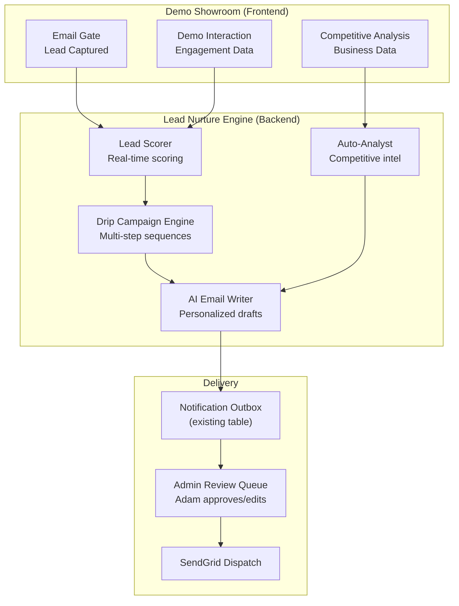

# Larkin Tech — Spec v2 Addendum: Lead Nurture Engine + Build Skills

**Appends to:** larkintech-spec-v2.md
**Status:** LOCKED (extends v2, does not replace)
**Date:** March 27, 2026

---

## Part 1: AI-Powered Lead Nurture Engine

### Strategic Concept

The 7 frontend demo engines are not just demos — they are the **same AI capabilities** that power the backend lead nurture pipeline. Every demo interaction generates data that feeds an automated follow-up system. The system eats its own dog food: the email workflow demo that impresses prospects is the same engine that nurtures them afterward.

This is the ultimate portfolio proof point. Every follow-up email Adam sends can include: *"This message was drafted by the same AI system you just experienced."*

### Architecture Overview



### 1. Automated Lead Scoring

**Purpose:** Assign a numeric score (0-100) to every lead based on engagement signals. Prioritizes Adam's follow-up queue.

**Scoring Dimensions:**

| Signal | Points | Source Table |
|--------|--------|-------------|
| Email gate completed | +10 | demo_leads |
| Each demo session started | +5 (max 35) | demo_sessions |
| Each live AI interaction (non-cached) | +3 (max 15) | demo_interactions |
| Used competitive analysis demo | +15 | competitive_analyses |
| Downloaded lead magnet | +10 | lead_magnet_downloads |
| Submitted contact form | +20 | inquiries |
| Booked discovery call | +25 | inquiries (audience_type='booking') |
| Returned within 24 hours | +10 | demo_leads.last_seen_at |
| Used legal vertical demos | +5 (high-value signal) | demo_sessions |
| Used construction vertical demos | +5 (domain expertise signal) | demo_sessions |

**Schema Addition:**

#### `lead_scores`

| Column | Type | Constraints | Default | Description |
|--------|------|-------------|---------|-------------|
| id | uuid | PK | gen_random_uuid() | Primary key |
| demo_lead_id | uuid | FK → demo_leads.id ON DELETE CASCADE, UNIQUE | - | One score per lead |
| score | integer | NOT NULL | 0 | Composite score (0-100) |
| score_breakdown | jsonb | NOT NULL | '{}' | Per-dimension breakdown |
| tier | text | NOT NULL, CHECK (tier IN ('cold', 'warm', 'hot', 'on_fire')) | 'cold' | Score tier |
| last_calculated | timestamptz | NOT NULL | now() | Last recalculation |

**Tier Thresholds:** cold (0-19), warm (20-44), hot (45-69), on_fire (70+)

**Recalculation trigger:** Score recalculated on every new demo_session, demo_interaction (live AI only), inquiry, lead_magnet_download, or competitive_analysis insert. Implemented as PostgreSQL trigger or application-level event.

---

### 2. AI Drip Campaign Engine

**Purpose:** Automatically enqueue personalized follow-up sequences based on lead tier, vertical interest, and demo engagement. Each step uses the AI Email Writer to generate content.

**Schema Addition:**

#### `drip_campaigns`

| Column | Type | Constraints | Default | Description |
|--------|------|-------------|---------|-------------|
| id | uuid | PK | gen_random_uuid() | Primary key |
| name | text | NOT NULL | - | Campaign name (e.g., "construction_hot_lead") |
| trigger_tier | text | NOT NULL | - | Minimum tier to trigger: 'warm', 'hot', 'on_fire' |
| trigger_vertical | text | FK → verticals.id | NULL | Vertical filter (NULL = all) |
| trigger_event | text | NOT NULL | - | 'score_change', 'demo_completed', 'competitive_analysis', 'lead_magnet_download' |
| steps | jsonb | NOT NULL | '[]' | Array of campaign steps |
| active | boolean | NOT NULL | true | Enable/disable |
| created_at | timestamptz | NOT NULL | now() | Creation |

**Steps schema (jsonb array):**
```json
[
  {
    "step_number": 1,
    "delay_hours": 0,
    "email_template": "welcome_personalized",
    "subject_prompt": "Write a subject line for a follow-up to {{lead_name}} who just tried our {{demo_type}} demo for {{vertical}}",
    "body_prompt": "Write a personalized follow-up email to {{lead_name}} at {{company}}. They explored our {{demo_type}} demo in the {{vertical}} vertical and were particularly engaged with {{top_interactions}}. Position Adam Larkin as an AI implementation expert. Include a soft CTA to book a discovery call.",
    "requires_approval": true
  },
  {
    "step_number": 2,
    "delay_hours": 48,
    "email_template": "value_add",
    "subject_prompt": "Write a subject line delivering AI insights relevant to {{vertical}} businesses",
    "body_prompt": "Write a value-add email sharing 2-3 specific AI automation opportunities for {{vertical}} businesses. Reference their competitive analysis if available: {{competitive_data}}. Position as thought leadership, not a hard sell.",
    "requires_approval": true
  },
  {
    "step_number": 3,
    "delay_hours": 168,
    "email_template": "case_study_share",
    "subject_prompt": "Write a subject line sharing a relevant case study with {{lead_name}}",
    "body_prompt": "Write an email sharing the most relevant Larkin Tech case study for {{vertical}}. Map the case study outcomes to the lead's likely pain points. Soft CTA to schedule a call.",
    "requires_approval": false
  }
]
```

#### `drip_enrollments`

| Column | Type | Constraints | Default | Description |
|--------|------|-------------|---------|-------------|
| id | uuid | PK | gen_random_uuid() | Primary key |
| demo_lead_id | uuid | FK → demo_leads.id ON DELETE CASCADE | - | Enrolled lead |
| campaign_id | uuid | FK → drip_campaigns.id ON DELETE CASCADE | - | Which campaign |
| current_step | integer | NOT NULL | 0 | Current step (0 = not started) |
| status | text | NOT NULL, CHECK (status IN ('active', 'completed', 'paused', 'unsubscribed')) | 'active' | Enrollment status |
| enrolled_at | timestamptz | NOT NULL | now() | Enrollment time |
| next_step_at | timestamptz | - | NULL | When to execute next step |

#### `drip_messages`

| Column | Type | Constraints | Default | Description |
|--------|------|-------------|---------|-------------|
| id | uuid | PK | gen_random_uuid() | Primary key |
| enrollment_id | uuid | FK → drip_enrollments.id ON DELETE CASCADE | - | Parent enrollment |
| step_number | integer | NOT NULL | - | Which step generated this |
| subject | text | NOT NULL | - | AI-generated subject line |
| body_html | text | NOT NULL | - | AI-generated email body (HTML) |
| status | text | NOT NULL, CHECK (status IN ('pending_review', 'approved', 'sent', 'rejected', 'failed')) | 'pending_review' | Message status |
| ai_model | text | NOT NULL | - | Model used for generation |
| input_tokens | integer | - | NULL | Token usage |
| output_tokens | integer | - | NULL | Token usage |
| reviewed_by | text | - | NULL | 'adam' or 'auto' |
| reviewed_at | timestamptz | - | NULL | When reviewed |
| sent_at | timestamptz | - | NULL | When sent |
| created_at | timestamptz | NOT NULL | now() | Generation time |

---

### 3. AI Email Writer

**Purpose:** Generates personalized email drafts using Claude, enriched with the lead's full engagement context.

**Implementation:** `lib/nurture/email-writer.ts`

**Context assembly per lead:**
```typescript
interface LeadContext {
  lead: DemoLead;
  score: LeadScore;
  sessions: DemoSession[];         // Which demos they used
  interactions: DemoInteraction[];  // What they asked/clicked
  competitive: CompetitiveAnalysis | null;  // Their business data
  magnet_downloads: LeadMagnetDownload[];
  inquiry: Inquiry | null;         // Contact form data
  vertical_preference: string;     // Most-used vertical
  engagement_summary: string;      // "Tried 3 demos, spent 12 min, used live AI 8 times"
}
```

**System prompt pattern:**
```
You are writing a follow-up email on behalf of Adam Larkin, AI Solutions Architect at Larkin Tech.

The recipient just explored AI demos on LarkinTECH.ai. Here is their engagement data:
- Name: {{lead_name}}
- Company: {{company}}
- Vertical interest: {{vertical}}
- Demos explored: {{demo_list}}
- Key interactions: {{top_interactions}}
- Competitive analysis: {{competitive_summary_if_available}}
- Lead score: {{score}} ({{tier}})

Write a personalized, professional email that:
1. References their specific demo experience naturally
2. Connects their vertical to relevant AI capabilities
3. Positions Adam as a hands-on AI implementation expert (not a salesperson)
4. Includes a specific, relevant CTA

Tone: warm, knowledgeable, concise. No AI hype. No "unlock the power of AI" language.
Max length: 200 words. Use short paragraphs.
```

**Approval flow:**
- `requires_approval: true` → Message status = 'pending_review'. Adam sees it in admin UI, can edit and approve/reject.
- `requires_approval: false` → Message status = 'approved'. Auto-sent after generation (for lower-stakes messages like step 3 case study shares).

---

### 4. Auto-Competitive Analysis

**Purpose:** When a lead enters their business name in the competitive analysis demo (F-024), the system automatically generates a full analysis and stores it — regardless of whether the demo rate limit truncated the frontend display. Adam gets the complete report.

**Implementation:** On `competitive_analyses` INSERT, a background job:
1. Checks if `report_data` is complete (frontend may have been rate-limited mid-generation)
2. If incomplete, re-runs the full analysis using Claude (server-side, no rate limit)
3. Generates a PDF report via @react-pdf/renderer
4. Stores in Supabase Storage
5. Notifies Adam with lead context + the report attached
6. Updates lead_scores (competitive analysis = +15 points, auto-enrolls in relevant drip campaign)

This means even if the demo visitor only got a partial preview on the frontend, Adam has the *complete* competitive analysis as an outreach asset.

---

### 5. New API Endpoints

#### `GET /api/admin/leads/:id/full-context`
**Purpose:** Returns complete lead context for admin UI + email writer
**Auth:** Admin secret

**Response:**
```json
{
  "lead": { "...demo_leads fields..." },
  "score": { "score": 72, "tier": "on_fire", "breakdown": {...} },
  "sessions": [...],
  "top_interactions": [...],
  "competitive_analysis": {...},
  "drip_enrollment": { "campaign": "...", "current_step": 2, "next_step_at": "..." },
  "pending_messages": [{ "id": "...", "subject": "...", "body_html": "...", "status": "pending_review" }]
}
```

#### `PATCH /api/admin/drip-messages/:id`
**Purpose:** Approve, edit, or reject a drip message
**Auth:** Admin secret

**Request:**
```json
{
  "action": "approve | reject | edit",
  "edited_subject": "string (optional, if editing)",
  "edited_body": "string (optional, if editing)"
}
```

#### `POST /api/admin/drip-messages/:lead_id/generate`
**Purpose:** Manually trigger AI email generation for a specific lead (outside drip schedule)
**Auth:** Admin secret

#### `GET /api/admin/nurture-dashboard`
**Purpose:** Overview of nurture pipeline: leads by tier, pending messages, campaign performance
**Auth:** Admin secret

---

### 6. Background Processing

**Drip campaign processor** (runs every 15 minutes via Docker cron):
1. Query `drip_enrollments WHERE status = 'active' AND next_step_at <= now()`
2. For each: load lead context, get next step's prompt template, call AI Email Writer
3. Insert generated message into `drip_messages` (status = pending_review or approved based on step config)
4. Update `drip_enrollments.current_step` and `next_step_at`
5. If `requires_approval = false` and status = 'approved', insert into `notification_outbox` for immediate SendGrid dispatch
6. If final step reached, set enrollment status = 'completed'

**Lead score recalculator** (triggered on relevant table inserts):
- Lightweight: runs inline as a Supabase Edge Function or application-level trigger
- Recalculates from scratch each time (simple SUM query across tables)
- Updates `lead_scores` row + checks if tier changed → if tier upgraded, evaluates drip campaign triggers

---

### 7. Admin UI Additions (Phase 06)

Extend the `/admin` route with:

- **Nurture Dashboard** — Lead pipeline visualization: cold/warm/hot/on_fire counts, pending messages queue, campaign enrollment stats
- **Message Review Queue** — List of pending_review drip messages. Each card shows: lead name, score, subject, body preview, approve/edit/reject buttons
- **Lead Detail View** — Full context page for each lead: score breakdown, demo history, competitive analysis, drip enrollment, sent messages
- **Campaign Manager** — List active drip campaigns, toggle active/inactive, view enrollment counts

---

### 8. Default Drip Campaigns (Seed Data)

**Campaign 1: "Warm Lead — General"**
- Trigger: score reaches 'warm' (20+), any vertical
- Step 1 (0h): Personalized welcome + "here's what you explored" recap
- Step 2 (48h): Value-add AI insights for their vertical
- Step 3 (7d): Case study share
- All steps require approval

**Campaign 2: "Hot Lead — Competitive Analysis"**
- Trigger: competitive_analysis completed, any vertical
- Step 1 (0h): "Your competitive analysis is ready" + full PDF attached
- Step 2 (72h): "3 AI opportunities we spotted for [business]" — insights from the analysis
- Step 1 auto-approved (time-sensitive), Step 2 requires approval

**Campaign 3: "On Fire — Contact Form Submitted"**
- Trigger: inquiry submitted, score ≥70
- Step 1 (0h): "Thanks for reaching out" + personalized based on demos explored
- All steps require approval (Adam will likely respond personally)

**Campaign 4: "Legal Vertical Specialist"**
- Trigger: score reaches 'warm' + legal vertical demos used
- Step 1 (0h): Personalized follow-up referencing legal AI capabilities
- Step 2 (48h): "How AI is transforming estate planning" — thought leadership
- Step 3 (7d): Duffley Law-style engagement pitch
- All steps require approval

---

## Part 2: Claude Build Skills

Five purpose-built skills to accelerate the content-heavy phases of the Larkin Tech build. Each skill is designed to be invoked during the relevant build phase, generating production-ready content that goes directly into the project.

### Skill 1: `larkintech-cache-seed-generator`

**Purpose:** Generates the 280 demo cached response entries (28 configs × 10 interactions each) for Phase 04-06.

**Trigger:** "generate cache seeds for [demo_type] [vertical]" or "seed the [vertical] demos"

**Inputs:**
- Demo type (chatbot, analytics, email_sms, doc_processing, competitive_analysis, doc_drafting, marketing_engine)
- Vertical (general_smb, construction, property_mgmt, legal)
- Number of preset interactions (default: 10)

**Output:** JSON file matching `demo_cached_responses` schema:
```json
[
  {
    "demo_type": "chatbot",
    "vertical": "construction",
    "trigger_key": "material_quote_intro",
    "sequence_order": 1,
    "prompt_text": "Show me how AI handles a material quote request",
    "response_text": "...",
    "response_data": { "type": "text", "content": "..." }
  }
]
```

**Quality rules:**
- Each interaction must be realistic for the vertical (use real industry terminology)
- Responses must demonstrate the AI capability being demoed (not generic)
- Preset sequences should tell a coherent story (each builds on the previous)
- Response length should match what the demo UI will render well (~100-300 words)
- Include `response_data` with structured content where applicable (chart data for analytics, workflow steps for email_sms, extracted fields for doc_processing)

**Batch mode:** "seed all demos for construction" generates 7 × 10 = 70 entries in one pass.

---

### Skill 2: `larkintech-vertical-content-generator`

**Purpose:** Generates vertical-specific sample data, documents, and datasets for the `vertical_content` table and demo UIs.

**Trigger:** "generate vertical content for [vertical]" or "create sample data for [vertical] [content_type]"

**Content types per vertical:**

| Content Type | General SMB | Construction | Property Mgmt | Legal |
|-------------|-------------|-------------|---------------|-------|
| sample_doc | Invoices, receipts | Material quotes, bids | Leases, maintenance requests | Estate plans, trust docs |
| dataset | Revenue/customer data | Project tracking data | Tenant/property financials | Case management data |
| company_profile | Fictional retail/restaurant | Fictional contractor | Fictional PM company | Fictional law firm |
| workflow_template | Marketing sequences | Safety compliance flows | Tenant comms workflows | Client intake processes |
| marketing_copy | Social media, email campaigns | Bid follow-ups, safety bulletins | Listing descriptions, tenant newsletters | Client education content |

**Output:** JSON matching `vertical_content` schema, ready for seed insertion.

**Quality rules:**
- All company names, addresses, and people are fictional (clearly not real businesses)
- Legal vertical content includes "FICTIONAL — NOT LEGAL ADVICE" in every generated document
- Data should be internally consistent (invoice totals match line items, dates are sequential)
- Use industry-appropriate language and formatting

---

### Skill 3: `larkintech-service-page-writer`

**Purpose:** Generates SEO-optimized content for the 5 service pages (F-008 through F-012).

**Trigger:** "write the [service] page content" or "generate service page for [keyword]"

**Target pages:**
1. `/ai-solutions-architect` — keyword: "AI solutions architect"
2. `/prompt-engineering` — keyword: "prompt engineer"
3. `/ai-automation` — keyword: "AI automation architect"
4. `/fractional-cto` — keyword: "fractional CTO AI advisor"
5. `/ai-implementation` — keyword: "AI implementation consultant"

**Output per page:**
- Meta title (≤60 chars, keyword in first 30)
- Meta description (≤155 chars, keyword included, CTA-oriented)
- H1 heading
- Page body (≥500 words): what the role means, how Adam operates, relevant case studies, engagement model, CTA
- JSON-LD structured data (Service schema)
- Internal linking suggestions (which case studies and demos to reference)

**Quality rules:**
- Write for human readers first, SEO second
- No AI hype language ("unlock the power of", "revolutionize your")
- Concrete examples and outcomes, not abstract promises
- Position Adam as practitioner, not consultant-speak
- Each page must have a unique angle — not 5 variations of the same pitch

---

### Skill 4: `larkintech-case-study-writer`

**Purpose:** Generates full case study content for the 4 portfolio projects (F-014 through F-017).

**Trigger:** "write the [project] case study" or "generate case study for [project name]"

**Target projects:**
1. Multi-Agent Orchestration Framework (LEAD)
2. Eastern LM Customer Lifecycle Engine
3. Hamptons Estate Property Management (obfuscated Happy Home)
4. HostHampton

**Output per case study:**
- Problem statement (what was broken/missing, business impact)
- Approach (how Adam scoped and attacked the problem)
- Architecture section (Mermaid diagram code for the system)
- Technical implementation highlights (specific patterns, tools, decisions)
- Results / outcomes (metrics where available, qualitative improvements)
- Tech stack badges list
- CTA (different per audience: recruiter vs. SMB client)

**Quality rules:**
- Problem → Approach → Architecture → Results structure strictly followed
- Architecture diagrams must be accurate Mermaid syntax
- Hamptons Estate: all references to Happy Home / Johanna obfuscated
- No specific company names in employment history
- Metrics should be specific where available, honest where estimated
- Each case study should highlight different competencies (system design, data engineering, client delivery, frontend craft)

**Context needed from Adam:** For each project, the skill will prompt for specific metrics, technical decisions, and outcomes that only Adam knows. The skill generates the *structure and prose* — Adam fills in the *facts*.

---

### Skill 5: `larkintech-lead-magnet-generator`

**Purpose:** Generates the AI Enablement Playbook PDF content for F-035.

**Trigger:** "generate the AI playbook for [vertical]" or "create the lead magnet PDF content"

**Target:** Construction / Building Materials vertical (v1 at launch)

**Output:** Structured markdown content ready for @react-pdf/renderer or manual PDF design:

1. **Cover page** — "AI Enablement Playbook: Construction & Building Materials"
2. **Executive summary** — Why AI matters for construction (1 page)
3. **Current state assessment** — Common pain points AI solves in construction (2 pages)
4. **AI opportunity map** — 8-10 specific use cases with estimated ROI:
   - Material quote automation
   - Inventory demand forecasting
   - Customer communication workflows
   - Project document management
   - Safety compliance automation
   - Competitive pricing intelligence
   - Marketing and lead generation
   - Billing and collections optimization
5. **Implementation roadmap** — 3 phases: Quick wins (30 days), Foundation (90 days), Transformation (6 months)
6. **How to sell AI internally** — Scripts and talking points for convincing partners/leadership
7. **About Larkin Tech** — Positioning page with CTA to book a call
8. **Appendix: AI readiness checklist** — Self-assessment tool

**Quality rules:**
- Written as a tool the reader can hand to their boss/partner to justify AI investment
- No technical jargon unless immediately explained
- Every use case includes "Before AI" and "After AI" comparison
- ROI estimates should be conservative and defensible
- The playbook should work standalone — it IS the sales tool
- Include "This playbook was generated by the same AI systems demonstrated at LarkinTECH.ai" on the back cover

---

## Part 3: Updated Build Plan Impact

### Phase 06 Scope Expansion

Phase 06 now includes the Lead Nurture Engine. Updated components:

**New tables (add to Phase 01 migration):**
- `lead_scores`
- `drip_campaigns`
- `drip_enrollments`
- `drip_messages`

**New lib modules (Phase 06):**
- `lib/nurture/lead-scorer.ts`
- `lib/nurture/drip-engine.ts`
- `lib/nurture/email-writer.ts`
- `lib/nurture/auto-analyst.ts`

**New API endpoints (Phase 06):**
- `GET /api/admin/leads/:id/full-context`
- `PATCH /api/admin/drip-messages/:id`
- `POST /api/admin/drip-messages/:lead_id/generate`
- `GET /api/admin/nurture-dashboard`

**New admin UI components (Phase 06):**
- NurtureDashboard (pipeline visualization)
- MessageReviewQueue (approve/edit/reject)
- LeadDetailView (full context)
- CampaignManager (toggle campaigns)

**New background job (Phase 06):**
- Drip campaign processor (Docker cron, every 15 min)

**Phase 06 `--max-turns` update:** 75 → 100 (scope increase)

### Skill Usage Timeline

| Build Phase | Skills Used | Content Generated |
|-------------|------------|-------------------|
| Phase 02 | service-page-writer, lead-magnet-generator | 5 service pages, 1 lead magnet PDF |
| Phase 03 | case-study-writer | 4 case study pages |
| Phase 04 | cache-seed-generator | 35 minimal cache entries (1 vertical) |
| Phase 05 | cache-seed-generator, vertical-content-generator | 70 cache entries (general_smb), sample data |
| Phase 06 | cache-seed-generator, vertical-content-generator | 210 remaining cache entries (3 verticals), all vertical content |

### Updated SOW Enhancement Features

The nurture engine maps to these deferred features from the SOW, now promoted to core:

| SOW ID | Feature | Status Change |
|--------|---------|---------------|
| F-052 | Lead Scoring System | Promoted to Phase 06 core |
| F-053 | CRM Pipeline View | Partially implemented via admin nurture dashboard |
| F-056 | Demo Analytics Dashboard | Partially implemented via lead detail view |

**New feature IDs (F-046 through F-049, previously reserved):**

| ID | Feature | Phase |
|----|---------|-------|
| F-046 | Lead Scoring Engine | Phase 06 |
| F-047 | Drip Campaign Engine | Phase 06 |
| F-048 | AI Email Writer | Phase 06 |
| F-049 | Auto-Competitive Analysis | Phase 06 |
