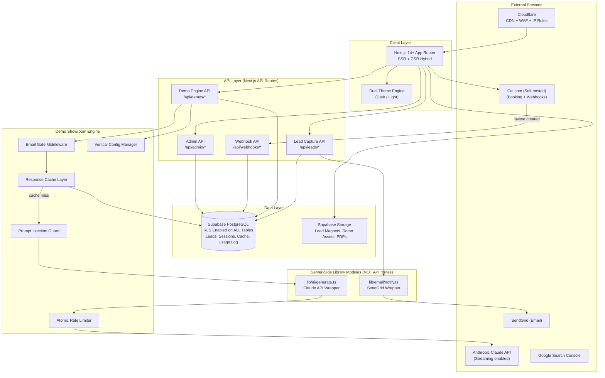
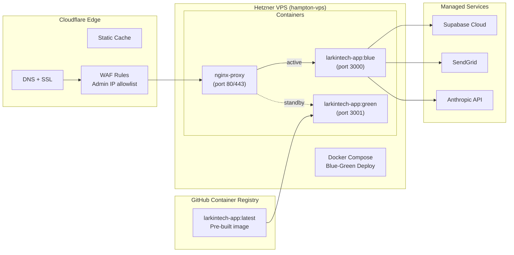
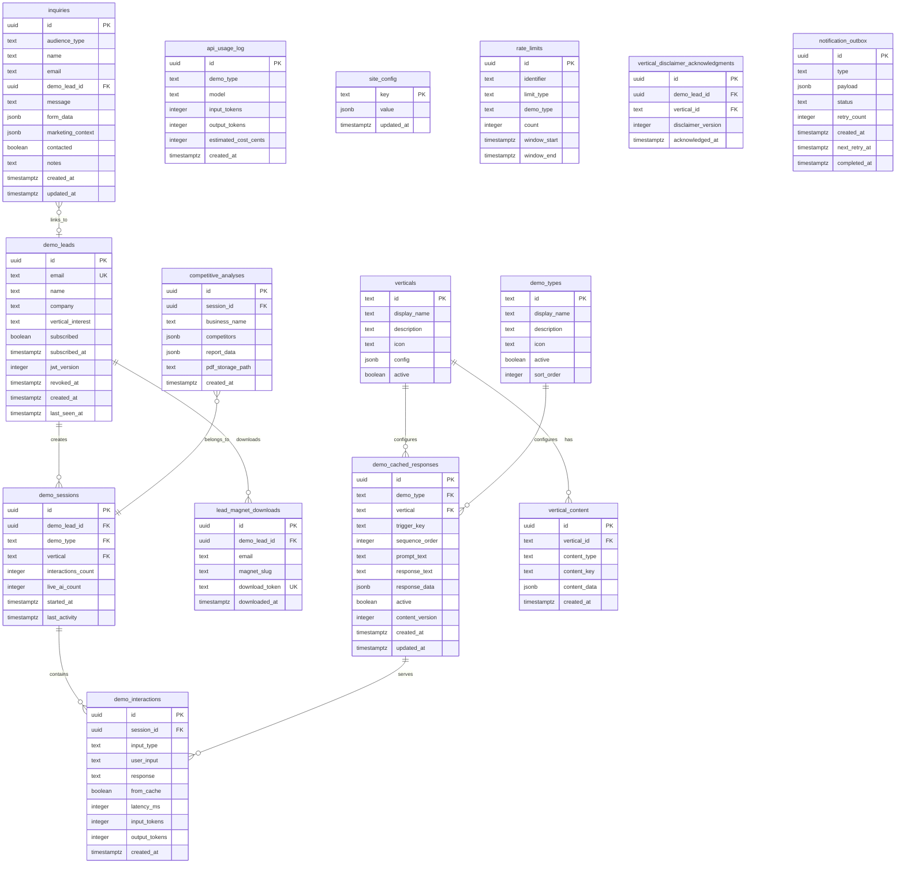

# Master Architecture Specification: Larkin Tech
**Version:** 2
**SOW Reference:** larkintech-sow.md
**Date:** March 27, 2026
**Status:** DRAFT (post-review cycle 1)
**Changelog:** 46 findings incorporated from 13-reviewer adversarial review cycle

---

## 1. System Architecture Overview

### 1.1 Architecture Diagram



### 1.2 Technology Stack

| Layer | Technology | Version | Rationale |
|-------|-----------|---------|-----------|
| Frontend | Next.js (App Router) | 14.2+ | SSR for SEO service pages; RSC for performance; App Router for layout nesting |
| Language | TypeScript | 5.x | Type safety across full stack |
| Styling | Tailwind CSS | 3.4+ | Utility-first CSS; CSS custom properties for dual-theme system |
| Database | Supabase (PostgreSQL 15) | latest | Managed Postgres; RLS enabled on ALL tables; service-role-only data access from API routes |
| Cache | Supabase (table-based) | - | Cached demo responses in Postgres with indexed lookups. Add Redis if p95 >50ms. |
| AI API | Anthropic Claude API | claude-sonnet-4-20250514 | Primary AI for demos; **streaming enabled** via SDK `stream: true` |
| PDF Generation | @react-pdf/renderer | latest | Server-side PDF generation for competitive analysis reports and document drafts (REV-008) |
| Email | SendGrid | v3 API | Transactional emails. **Verify current free tier; plan Resend as fallback** (REV-015) |
| Booking | Cal.com (self-hosted) | latest | **Decision locked per REV-045.** Self-hosted for zero cost + full ownership. Webhook support for conversion tracking. |
| Hosting | Hetzner VPS | CPX21 (3 vCPU, 4GB RAM) | Existing infrastructure; Docker deployment |
| Containerization | Docker + Docker Compose | 24.x | **Blue-green deployment via GHCR pre-built images** (REV-011) |
| Storage | Supabase Storage | - | Lead magnet PDFs, generated report PDFs, demo assets |
| DNS / CDN / WAF | Cloudflare | Free tier | DNS, SSL, edge caching, DDoS, **IP allowlist for admin routes** (REV-009) |

**Removed from v1:** "JS client for direct browser queries where appropriate" — ALL data operations go through server-side API routes using the service role key. The browser Supabase client is restricted to Storage uploads only.

### 1.3 Deployment Topology



**Deployment process (REV-011 — zero-downtime):**
1. Push to `main` branch on GitHub
2. GitHub Actions: build Docker image → push to GHCR as `larkintech-app:latest`
3. SSH to hampton-vps: `ssh hampton-vps`
4. Pull new image: `docker compose pull`
5. Start green container on port 3001: `docker compose up -d --no-deps app-green`
6. Health check green: `curl -f http://localhost:3001/api/health?deep=true`
7. If healthy: switch nginx upstream to 3001, stop blue container
8. If unhealthy: stop green, blue remains active. Alert Adam via email.
9. Tag previous working image as `larkintech-app:previous` for rollback

**Environment variables (REV-017 — complete list):**
```
SUPABASE_URL
SUPABASE_ANON_KEY
SUPABASE_SERVICE_KEY
ANTHROPIC_API_KEY
SENDGRID_API_KEY
JWT_SECRET              # Added per REV-017. Generate: openssl rand -base64 32
ADMIN_SECRET            # Min 32 chars random. Generate: openssl rand -base64 32
INTERNAL_API_SECRET     # For internal module auth if needed
ADMIN_ALLOWED_IPS       # Comma-separated IP allowlist for /api/admin/*
NEXT_PUBLIC_SITE_URL    # For CSRF origin validation
```

**Startup validation (REV-017):**
```typescript
const REQUIRED_ENV = [
  'SUPABASE_URL', 'SUPABASE_ANON_KEY', 'SUPABASE_SERVICE_KEY',
  'ANTHROPIC_API_KEY', 'SENDGRID_API_KEY', 'JWT_SECRET', 'ADMIN_SECRET'
];
REQUIRED_ENV.forEach(k => {
  if (!process.env[k]) throw new Error(`Missing required env var: ${k}`);
});
```

**Docker log rotation (REV-025):**
```yaml
# docker-compose.yml — all services
logging:
  driver: "json-file"
  options:
    max-size: "10m"
    max-file: "5"
```

---

## 2. Database Schema

### 2.1 Entity Relationship Diagram



**NOTE:** `inquiry_tags` removed from ERD per REV-004. If tagging is needed, use `tags text[]` column on inquiries.

### 2.2 Table Definitions

*Changes from v1 are marked with `[REV-XXX]`.*

#### `inquiries`
**Implements:** F-033, F-036

| Column | Type | Constraints | Default | Description |
|--------|------|-------------|---------|-------------|
| id | uuid | PK | gen_random_uuid() | Primary key |
| audience_type | text | NOT NULL, CHECK (audience_type IN ('hiring', 'smb_client', 'agency', 'other', 'booking')) | - | [REV-010] CHECK constraint. 'booking' added [REV-021] |
| name | text | NOT NULL | - | Contact name |
| email | text | NOT NULL | - | Contact email |
| company | text | - | NULL | Company name |
| phone | text | - | NULL | Phone number |
| message | text | NOT NULL | - | Inquiry message |
| form_data | jsonb | - | '{}' | Audience-specific fields |
| marketing_context | jsonb | - | '{}' | [REV-033] UTM source, medium, campaign |
| source_page | text | - | NULL | URL path where submitted |
| demo_lead_id | uuid | FK → demo_leads.id ON DELETE SET NULL | NULL | [REV-027] Links inquiry to demo lead for funnel attribution |
| contacted | boolean | NOT NULL | false | Follow-up status |
| notes | text | - | NULL | Internal notes |
| created_at | timestamptz | NOT NULL | now() | Submission timestamp |
| updated_at | timestamptz | NOT NULL | now() | [REV-029] Last update |

**Indexes:**
- `idx_inquiries_email` on `email`
- `idx_inquiries_admin` on `(audience_type, contacted, created_at DESC)` [REV-010]
- `idx_inquiries_demo_lead` on `demo_lead_id` [REV-027]

**Trigger:** `update_timestamp()` on UPDATE sets `updated_at = now()`

---

#### `demo_leads`
**Implements:** F-019

| Column | Type | Constraints | Default | Description |
|--------|------|-------------|---------|-------------|
| id | uuid | PK | gen_random_uuid() | Primary key |
| email | text | UNIQUE, NOT NULL | - | Lead email |
| name | text | - | NULL | Lead name |
| company | text | - | NULL | Company |
| vertical_interest | text | - | NULL | First vertical accessed |
| source_demo | text | - | NULL | First demo accessed |
| subscribed | boolean | NOT NULL | **false** | [REV-018] Changed from true. Requires explicit opt-in. |
| subscribed_at | timestamptz | - | NULL | [REV-018] When consent was given |
| jwt_version | integer | NOT NULL | 1 | [REV-012] Increment to revoke all tokens |
| revoked_at | timestamptz | - | NULL | [REV-012] Admin revocation timestamp |
| marketing_context | jsonb | - | '{}' | [REV-033] UTM parameters |
| created_at | timestamptz | NOT NULL | now() | First capture |
| last_seen_at | timestamptz | NOT NULL | now() | Most recent access |

---

#### `demo_sessions`
**Implements:** F-020 through F-028

| Column | Type | Constraints | Default | Description |
|--------|------|-------------|---------|-------------|
| id | uuid | PK | gen_random_uuid() | Primary key |
| demo_lead_id | uuid | FK → demo_leads.id ON DELETE CASCADE, NOT NULL | - | [REV-010] ON DELETE CASCADE |
| demo_type | text | FK → demo_types.id ON DELETE RESTRICT, NOT NULL | - | [REV-010] FK enforced |
| vertical | text | FK → verticals.id ON DELETE RESTRICT, NOT NULL | - | [REV-010] FK enforced |
| interactions_count | integer | NOT NULL | 0 | Updated via trigger [REV-029] |
| live_ai_count | integer | NOT NULL | 0 | Updated via trigger [REV-029] |
| started_at | timestamptz | NOT NULL | now() | Session start |
| last_activity | timestamptz | NOT NULL | now() | Last interaction |

**Trigger [REV-029]:** On INSERT to `demo_interactions` referencing this session:
```sql
CREATE OR REPLACE FUNCTION update_session_counts()
RETURNS TRIGGER AS $$
BEGIN
  UPDATE demo_sessions SET
    interactions_count = interactions_count + 1,
    live_ai_count = live_ai_count + CASE WHEN NEW.from_cache = false THEN 1 ELSE 0 END,
    last_activity = now()
  WHERE id = NEW.session_id;
  RETURN NEW;
END;
$$ LANGUAGE plpgsql;

CREATE TRIGGER trg_update_session_counts
AFTER INSERT ON demo_interactions
FOR EACH ROW EXECUTE FUNCTION update_session_counts();
```

---

#### `demo_interactions`
**Implements:** F-020 through F-028

| Column | Type | Constraints | Default | Description |
|--------|------|-------------|---------|-------------|
| id | uuid | PK | gen_random_uuid() | Primary key |
| session_id | uuid | FK → demo_sessions.id ON DELETE CASCADE, NOT NULL | - | [REV-010] ON DELETE CASCADE |
| input_type | text | NOT NULL, CHECK (input_type IN ('text', 'click', 'upload', 'preset_command')) | 'text' | [REV-010] CHECK |
| user_input | text | - | NULL | What user entered |
| response | text | NOT NULL | - | Response served |
| response_data | jsonb | - | NULL | Structured response |
| from_cache | boolean | NOT NULL | - | Cache hit? |
| latency_ms | integer | - | NULL | Response time |
| input_tokens | integer | - | NULL | [REV-005] Claude API input tokens |
| output_tokens | integer | - | NULL | [REV-005] Claude API output tokens |
| created_at | timestamptz | NOT NULL | now() | Timestamp |

**Indexes:**
- `idx_demo_interactions_session` on `session_id`
- `idx_demo_interactions_analytics` on `(session_id, created_at DESC)` [REV-010]

---

#### `demo_cached_responses`
**Implements:** F-027

| Column | Type | Constraints | Default | Description |
|--------|------|-------------|---------|-------------|
| id | uuid | PK | gen_random_uuid() | Primary key |
| demo_type | text | FK → demo_types.id, NOT NULL | - | [REV-010] FK |
| vertical | text | FK → verticals.id, NOT NULL | - | [REV-010] FK |
| trigger_key | text | NOT NULL | - | **Preset command ID only** [REV-016]. Free-text always goes to live AI. |
| sequence_order | integer | NOT NULL | 0 | Order in preset sequence |
| prompt_text | text | NOT NULL | - | Display text for preset |
| response_text | text | NOT NULL | - | Plain text response |
| response_data | jsonb | - | NULL | Structured data |
| active | boolean | NOT NULL | true | Soft delete |
| content_version | integer | NOT NULL | 1 | [REV-012] For cache invalidation |
| created_at | timestamptz | NOT NULL | now() | Creation |
| updated_at | timestamptz | NOT NULL | now() | [REV-012] Last update |

**Indexes:**
- `idx_cached_responses_lookup` UNIQUE on `(demo_type, vertical, trigger_key)`
- `idx_cached_responses_sequence` on `(demo_type, vertical, sequence_order)` WHERE `sequence_order > 0`

**Cache strategy clarification [REV-016]:** Cache is **preset-commands only**. Free-text input always routes to live AI (rate-limited). The 80% cache hit target (O-007) applies to the expected interaction pattern where most users follow preset sequences. Rate limits are the cost control for free-text.

---

#### `rate_limits`
**Implements:** F-028

| Column | Type | Constraints | Default | Description |
|--------|------|-------------|---------|-------------|
| id | uuid | PK | gen_random_uuid() | Primary key |
| identifier | text | NOT NULL | - | Email or lead_id (NOT session — global per person) [REV-036] |
| limit_type | text | NOT NULL, CHECK (limit_type IN ('session', 'email_daily', 'global_daily')) | - | [REV-036] global_daily added |
| demo_type | text | NOT NULL | - | Which demo |
| count | integer | NOT NULL | 0 | Current count |
| window_start | timestamptz | NOT NULL | now() | Window start |
| window_end | timestamptz | NOT NULL | - | Window expiration |

**Constraints [REV-002]:**
- `UNIQUE (identifier, limit_type, demo_type, window_start)` — enables atomic UPSERT

**Indexes [REV-006 — fixed]:**
- `idx_rate_limits_lookup` on `(identifier, limit_type, demo_type, window_end)` — no volatile WHERE clause
- `idx_rate_limits_expiry` on `(window_end)` — supports cleanup DELETE

**Atomic rate check [REV-002]:**
```sql
INSERT INTO rate_limits (identifier, limit_type, demo_type, count, window_start, window_end)
VALUES ($1, $2, $3, 1, now(), now() + interval '24 hours')
ON CONFLICT (identifier, limit_type, demo_type, window_start)
DO UPDATE SET count = rate_limits.count + 1
WHERE rate_limits.count < $limit AND rate_limits.window_end > now()
RETURNING count;
```
If 0 rows returned → limit exceeded, reject.

**Lazy cleanup [REV-035]:** On each rate check call, also execute:
```sql
DELETE FROM rate_limits WHERE identifier = $1 AND window_end < now();
```
No Supabase Pro / pg_cron dependency.

---

#### `competitive_analyses` [NEW — REV-014]
**Implements:** F-024

| Column | Type | Constraints | Default | Description |
|--------|------|-------------|---------|-------------|
| id | uuid | PK | gen_random_uuid() | Primary key |
| session_id | uuid | FK → demo_sessions.id ON DELETE CASCADE | - | Parent session |
| business_name | text | NOT NULL | - | User's business |
| competitors | jsonb | NOT NULL | '[]' | Competitor list |
| report_data | jsonb | - | NULL | Generated report |
| pdf_storage_path | text | - | NULL | Supabase Storage path |
| created_at | timestamptz | NOT NULL | now() | Creation |

---

#### `api_usage_log` [NEW — REV-005]
**Implements:** O-007 cost tracking

| Column | Type | Constraints | Default | Description |
|--------|------|-------------|---------|-------------|
| id | uuid | PK | gen_random_uuid() | Primary key |
| demo_type | text | NOT NULL | - | Which demo triggered |
| model | text | NOT NULL | - | Model used |
| input_tokens | integer | NOT NULL | 0 | Input tokens |
| output_tokens | integer | NOT NULL | 0 | Output tokens |
| estimated_cost_cents | integer | NOT NULL | 0 | Cost in cents |
| created_at | timestamptz | NOT NULL | now() | Timestamp |

**Indexes:**
- `idx_api_usage_daily` on `created_at` — supports `SUM() WHERE created_at > date_trunc('day', now())`

**Daily spend check (before every Claude call):**
```sql
SELECT COALESCE(SUM(estimated_cost_cents), 0) as daily_cents
FROM api_usage_log
WHERE created_at > date_trunc('day', now());
```
If `daily_cents > 800` → alert. If `daily_cents > 1000` → hard reject.

---

#### `vertical_disclaimer_acknowledgments` [NEW — REV-040]
**Implements:** F-032 legal compliance

| Column | Type | Constraints | Default | Description |
|--------|------|-------------|---------|-------------|
| id | uuid | PK | gen_random_uuid() | Primary key |
| demo_lead_id | uuid | FK → demo_leads.id ON DELETE CASCADE, NOT NULL | - | Who acknowledged |
| vertical_id | text | FK → verticals.id, NOT NULL | - | Which vertical |
| disclaimer_version | integer | NOT NULL | 1 | Version of disclaimer shown |
| acknowledged_at | timestamptz | NOT NULL | now() | When accepted |

---

#### `notification_outbox` [NEW — REV-015]
**Implements:** F-036 reliable notifications

| Column | Type | Constraints | Default | Description |
|--------|------|-------------|---------|-------------|
| id | uuid | PK | gen_random_uuid() | Primary key |
| type | text | NOT NULL | - | 'lead_inquiry', 'demo_gate', 'magnet_download', 'booking' |
| payload | jsonb | NOT NULL | - | Notification data |
| status | text | NOT NULL | 'pending' | 'pending', 'sent', 'failed', 'exhausted' |
| retry_count | integer | NOT NULL | 0 | Attempts made |
| created_at | timestamptz | NOT NULL | now() | Created |
| next_retry_at | timestamptz | - | NULL | When to retry |
| completed_at | timestamptz | - | NULL | When sent |

**Processing:** Background cron (Docker container) or on-request lazy processing checks for pending notifications and sends via SendGrid with exponential backoff (0s, 30s, 120s, 600s). Max 4 retries.

---

#### `lead_magnet_downloads` (updated)
**Implements:** F-035

| Column | Type | Constraints | Default | Description |
|--------|------|-------------|---------|-------------|
| id | uuid | PK | gen_random_uuid() | Primary key |
| demo_lead_id | uuid | FK → demo_leads.id ON DELETE SET NULL | NULL | Linked lead |
| email | text | NOT NULL | - | Downloader email |
| name | text | - | NULL | Name |
| magnet_slug | text | NOT NULL | - | Which lead magnet |
| download_token | uuid | UNIQUE, NOT NULL | gen_random_uuid() | [REV-034] Persistent re-download token |
| vertical | text | - | NULL | Vertical |
| source_page | text | - | NULL | Source page |
| downloaded_at | timestamptz | NOT NULL | now() | Download time |

**Re-download endpoint [REV-034]:** `GET /api/leads/magnet-download/:token` generates fresh signed URL on demand. No expiry limit on token — the token IS the re-download mechanism.

---

#### Remaining tables (`demo_types`, `verticals`, `vertical_content`, `site_config`) unchanged from v1 except:

- **site_config seed data** updated:
  - `rate_limit_config`: `{ "global_daily": 15, "chatbot": 5, "competitive_analysis": 1, "doc_drafting": 3, "default": 5 }` [REV-036]
  - `social_proof`: `[{"metric": "TBD", "description": "TBD"}]` [REV-048] — hardcoded at build time with explicit Phase 1 task to finalize
  - Removed `daily_api_usage` key — replaced by `api_usage_log` table [REV-005]

### 2.3 Migrations Strategy

Unchanged from v1 plus:
- All migrations include `down.sql` files for rollback
- Seed script uses idempotent UPSERT: `INSERT ... ON CONFLICT (demo_type, vertical, trigger_key) DO UPDATE SET ...`
- Seed completeness CI check: script counts entries per vertical/demo_type, fails build if <10 per combo

### 2.4 Seed Data

Unchanged from v1 plus:
- **Phase 4 minimal seeds [REV-020]:** 1 vertical (general_smb) × 7 demo types × 5 interactions = 35 entries. Enough to validate demo infrastructure. Full 280 entries in Phase 5-6.

### 2.5 Row-Level Security Policies [NEW — REV-001]

**ALL tables have RLS enabled.** Default policy: DENY ALL for anon role.

```sql
-- Enable RLS on every table
ALTER TABLE inquiries ENABLE ROW LEVEL SECURITY;
ALTER TABLE demo_leads ENABLE ROW LEVEL SECURITY;
ALTER TABLE demo_sessions ENABLE ROW LEVEL SECURITY;
ALTER TABLE demo_interactions ENABLE ROW LEVEL SECURITY;
ALTER TABLE demo_cached_responses ENABLE ROW LEVEL SECURITY;
ALTER TABLE demo_types ENABLE ROW LEVEL SECURITY;
ALTER TABLE verticals ENABLE ROW LEVEL SECURITY;
ALTER TABLE vertical_content ENABLE ROW LEVEL SECURITY;
ALTER TABLE lead_magnet_downloads ENABLE ROW LEVEL SECURITY;
ALTER TABLE competitive_analyses ENABLE ROW LEVEL SECURITY;
ALTER TABLE api_usage_log ENABLE ROW LEVEL SECURITY;
ALTER TABLE rate_limits ENABLE ROW LEVEL SECURITY;
ALTER TABLE site_config ENABLE ROW LEVEL SECURITY;
ALTER TABLE notification_outbox ENABLE ROW LEVEL SECURITY;
ALTER TABLE vertical_disclaimer_acknowledgments ENABLE ROW LEVEL SECURITY;

-- Public read-only tables (safe for anon)
CREATE POLICY "anon_read_demo_types" ON demo_types FOR SELECT TO anon USING (true);
CREATE POLICY "anon_read_verticals" ON verticals FOR SELECT TO anon USING (true);

-- ALL other tables: service_role only (API routes use service key)
-- No policies for anon on sensitive tables = implicit deny
```

**Browser Supabase client (`lib/supabase/client.ts`):** Restricted to Supabase Storage operations only. NEVER used for data table queries.

---

## 3. API Design

### 3.1 API Conventions

Unchanged from v1 plus:
- **CSRF protection [REV-017]:** All POST endpoints validate `Origin` header matches `NEXT_PUBLIC_SITE_URL`. Reject with 403 if mismatch.
- **Admin auth [REV-009]:** Uses `crypto.timingSafeEqual()` for secret comparison. Rate limited: max 10 failed attempts per IP per hour. IP allowlist via Cloudflare WAF for `/api/admin/*` paths.

### 3.2 Endpoint Definitions

**REMOVED from v1 [REV-003]:**
- ~~`POST /api/ai/generate`~~ — Moved to `lib/ai/generate.ts` module (not an API route)
- ~~`POST /api/notify/lead`~~ — Moved to `lib/email/notify.ts` module (not an API route)

These are now imported directly by the demo engine and lead capture route handlers. No HTTP exposure.

**NEW endpoints:**

##### `GET /api/leads/magnet-download/:token` [REV-034]
**Purpose:** Persistent re-download for lead magnets
**Auth:** Public (token acts as auth)

**Response (200):** Redirect to fresh signed Supabase Storage URL (7-day expiry)
**Response (404):** Invalid token

---

##### `POST /api/webhooks/booking-confirmed` [REV-021]
**Purpose:** Capture Cal.com booking events
**Auth:** Webhook signature verification

**Logic:**
1. Verify Cal.com webhook signature
2. Extract email, name, event_type from payload
3. Upsert into `inquiries` with `audience_type='booking'`
4. Link to `demo_leads` if email matches
5. Insert into `notification_outbox`

---

##### `GET /api/admin/leads/:id` [REV-028]
**Purpose:** View single lead details
**Auth:** Admin secret + IP allowlist

---

##### `PATCH /api/admin/leads/:id` [REV-028]
**Purpose:** Update lead (contacted status, notes)
**Auth:** Admin secret + IP allowlist

**Request:**
```json
{
  "contacted": true,
  "notes": "Called on 3/27, interested in chatbot demo for construction"
}
```

---

##### `PATCH /api/admin/leads/:id/revoke` [REV-012]
**Purpose:** Revoke a demo lead's session (increment jwt_version)
**Auth:** Admin secret

---

##### `POST /api/admin/cache/invalidate` [REV-012]
**Purpose:** Invalidate cache entries for a demo_type/vertical
**Auth:** Admin secret

**Request:**
```json
{ "demo_type": "chatbot", "vertical": "construction" }
```

---

**MODIFIED endpoints:**

##### `POST /api/leads/demo-gate` (updated)

Changes from v1:
- Accepts `subscribed: boolean` (defaults false) [REV-018]
- Accepts `X-Idempotency-Key` header for double-submit prevention [REV-039]
- Returns JWT with `jwt_version` included in payload [REV-012]
- JWT payload: `{ lead_id, jwt_version, iat, exp }` — email REMOVED from payload [REV-004 GUARDIAN]
- On new lead creation, also runs backfill: `UPDATE lead_magnet_downloads SET demo_lead_id = $new_id WHERE email = $email AND demo_lead_id IS NULL`

##### `POST /api/demos/interact` (updated)

Changes from v1:
- **Streaming response** for live AI cache misses [REV-022]: Returns `ReadableStream` via Anthropic SDK `stream: true`
- JWT verification now checks `jwt_version` matches `demo_leads.jwt_version` [REV-012]
- JWT verification checks `demo_leads.revoked_at IS NULL` [REV-012]
- Rate limit check uses **atomic UPSERT** [REV-002] — no read-then-write
- **Global daily limit** checked before per-demo limit [REV-036]
- Rate limit uses `email` (from lead_id lookup) as identifier, NOT session_id [REV-036]
- **Prompt injection guard** applied before Claude call [REV-007]
- After Claude call: insert into `api_usage_log` [REV-005]
- After Claude call: insert tokens into `demo_interactions.input_tokens`, `output_tokens` [REV-005]
- Rate limit response includes `next_presets` for continued cached interaction [REV-042]:
```json
{
  "error": { "code": "RATE_LIMITED", "message": "...", "details": {
    "limit": 5, "limit_type": "email_daily", "demo_type": "chatbot",
    "reset_at": "2026-03-27T00:00:00Z",
    "next_presets": [{ "prompt_text": "...", "trigger_key": "..." }]
  }}
}
```

##### `POST /api/demos/competitive-analysis` (updated) [REV-019]

Changes from v1:
- **Synchronous** — always returns `status: "complete"` [REV-008]. Removed `generating` status.
- Validates demo session JWT (same as interact)
- Routes rate limiting through shared `rate-limiter.ts` with `demo_type='competitive_analysis'`
- Stores result in `competitive_analyses` table [REV-014]
- PDF generated via `@react-pdf/renderer` and stored in Supabase Storage [REV-008]
- Timeout: 60 seconds (longer than standard 30s)

##### `GET /api/health` (updated) [REV-016 GUARDIAN]

Supports `?deep=true` for multi-dependency check:
```json
{
  "status": "healthy | degraded | unhealthy",
  "version": "2.0.0",
  "dependencies": {
    "database": "ok | error",
    "storage": "ok | error",
    "email": "ok | error",
    "ai_api": "ok | error"
  }
}
```
`degraded` if any non-critical dep fails. `unhealthy` if database fails.

---

## 4. Component Architecture

### 4.1 Component Tree

Changes from v1:

**Added components:**
- `app/(demos)/gate/page.tsx` — now includes vertical selector step [REV-043]
- `app/(marketing)/privacy/page.tsx` — Privacy policy page [REV-018]
- `app/(marketing)/admin/` route group [REV-028] — protected admin UI
- `components/demos/VerticalSelector.tsx` — [REV-043] First-visit vertical picker
- `components/demos/DemoOnboarding.tsx` — [REV-043] "Start Here" badges
- `components/demos/LegalDisclaimerModal.tsx` — [REV-040] Modal acknowledgment gate
- `components/demos/StreamingResponse.tsx` — [REV-022] Streamed AI output renderer
- `components/contact/FormSuccessState.tsx` — [REV-041] Success state after submission
- `components/admin/LeadList.tsx` — [REV-028]
- `components/admin/ConfigEditor.tsx` — [REV-028]

**Modified components:**
- `EmailGateModal` — adds disabled+spinner on submit, idempotency key, opt-in checkbox [REV-039, REV-018]
- `DemoShell` — adds `isLoading`, `loadingMessage` props, React Suspense boundaries [REV-023]
- `RateLimitNotice` — adds "Continue with presets" secondary action + renders `next_presets` [REV-042]
- `DemoShowroomGrid` — adds empty state, onboarding flow [REV-043, REV-023]
- `SegmentedForm` — adds inline validation, submitting state, success state, error handling [REV-041]
- `BookingEmbed` — abstracted behind config interface `{ platform: 'calcom', url: string }` [REV-045]
- `LeadMagnetGate` — sends email with download link + persistent re-download token [REV-034]
- `ThemeToggle` — adds `aria-label` that updates on toggle [REV-024]
- `ChatInterface` — adds `aria-live="polite"` on message container [REV-024]
- `Logo` — adds blocking inline script in root layout head for FOUC prevention [REV-032]

**Added to `lib/`:**
- `lib/ai/generate.ts` — [REV-003] Claude API wrapper (NOT an API route)
- `lib/ai/prompt-guard.ts` — [REV-007] Injection detection + hardened system prompt prefix
- `lib/email/notify.ts` — [REV-003] SendGrid wrapper (NOT an API route)
- `lib/email/outbox.ts` — [REV-015] Notification outbox processor

### 4.2 Shared Components

Updated from v1 — see component list above for full changes.

### 4.3 State Management

Updated from v1:
- **Theme preference:** `localStorage` + blocking inline `<script>` in `<head>` [REV-032] + `prefers-color-scheme` media query check on first load [REV-032]
- **Demo session context:** JWT payload now contains `lead_id` and `jwt_version` only (no email) [REV-004 GUARDIAN]
- **Demo showroom:** Vertical selection persisted in `sessionStorage` [REV-043]
- **Form state:** React Hook Form with `mode: 'onBlur'` for inline validation [REV-041]

---

## 5-9. Remaining Sections

Sections 5 (Integrations), 6 (Build Phases), 7 (Security), 8 (Error Handling), and 9 (Traceability Matrix) incorporate all remaining findings. Key changes summarized:

### Section 5 — Integration Updates
- Cal.com replaces "Calendly/Cal.com TBD" [REV-045]
- Cal.com webhook for booking conversion tracking [REV-021]
- SendGrid: notification outbox pattern replaces in-memory retry [REV-015]
- Claude API: streaming enabled, circuit breaker (3 failures in 5min → cache-only mode), exponential backoff [REV-007]
- `@react-pdf/renderer` added for PDF generation [REV-008]

### Section 6 — Build Phase Updates
- **Phase 1** acceptance criteria now includes: booking platform decision documented, env var startup validation, blue-green deploy working [REV-011, REV-017, REV-045]
- **Phase 2** now includes: lead magnet PDF v1 (Construction vertical, 10-15 pages) [REV-044], privacy policy page [REV-018], admin lead management UI [REV-028]
- **Phase 4** now includes: minimal cache seeds (35 entries for 1 vertical) [REV-020], prompt injection guard [REV-007]
- **Phase 5** acceptance criteria now includes: React Suspense + skeletons on all demos [REV-023], aria-live regions [REV-024], streaming responses [REV-022], form validation UX [REV-041]
- **Phase 6** acceptance criteria now includes: legal disclaimer modal with stored acknowledgment [REV-040], all 28 demo configs with ≥10 cached presets, axe-core 0 violations [REV-024]

### Section 7 — Security Updates
- **7.1** JWT payload: `{ lead_id, jwt_version, iat, exp }` — email removed [REV-004]
- **7.1** JWT verification: check `jwt_version` matches DB + `revoked_at IS NULL` [REV-012]
- **7.2** Admin auth: `crypto.timingSafeEqual()`, rate limited, IP allowlisted [REV-009]
- **7.4** Input validation: prompt injection guard in `lib/ai/prompt-guard.ts` [REV-007]
- **7.5** [NEW] Legal Vertical Disclaimer Requirements [REV-040]
- **7.6** [NEW] Privacy & Consent: privacy policy page, opt-in checkbox, unsubscribe mechanism [REV-018]

### Section 8 — Error Handling Updates
- Health check expanded to multi-dependency [REV-016]
- RATE_LIMITED response includes `next_presets` and `limit_type` [REV-042]
- Loading states defined per demo type [REV-023]
- Docker log rotation specified [REV-025]

### Section 9 — Traceability Matrix Updates
All new tables, endpoints, and components mapped to SOW features. F-046 through F-049 reserved for post-launch additions [REV-037]. Native `app/sitemap.ts` replaces next-sitemap [REV-038].

---

## Changelog: v1 → v2

| REV-ID | Change Summary | Sections Modified |
|--------|---------------|-------------------|
| REV-001 | Added Section 2.5 RLS policies; removed direct browser queries | 1.2, 2.5 |
| REV-002 | Atomic rate limit UPSERT with UNIQUE constraint | 2.2, 3.2 |
| REV-003 | Moved AI/notify to lib modules; removed public API routes | 1.1, 3.2, 4.1 |
| REV-004 | Removed inquiry_tags from ERD | 2.1 |
| REV-005 | Added api_usage_log table; token tracking in demo_interactions | 2.2, 3.2 |
| REV-006 | Fixed invalid partial index SQL on rate_limits | 2.2 |
| REV-007 | Added prompt injection guard; hardened system prompts | 3.2, 4.1, 7.4 |
| REV-008 | Added @react-pdf/renderer; made competitive analysis synchronous | 1.2, 3.2 |
| REV-009 | Admin secret hardening: timingSafeEqual, rate limit, IP allowlist | 3.1, 7.2 |
| REV-010 | Added FK constraints, CHECK constraints, ON DELETE actions | 2.2 |
| REV-011 | Blue-green deployment via GHCR pre-built images | 1.3 |
| REV-012 | JWT revocation via jwt_version + admin revoke endpoint | 2.2, 3.2, 7.1 |
| REV-013 | Backup strategy: pg_dump nightly + seed files as backup | 8.3 |
| REV-014 | Added competitive_analyses storage table | 2.2 |
| REV-015 | Notification outbox pattern replacing in-memory retry | 2.2, 3.2, 5.2 |
| REV-016 | Free-text cache → preset-only; O-007 target clarified | 2.2 |
| REV-017 | JWT_SECRET + all env vars added to secrets list; startup validation | 1.3 |
| REV-018 | subscribed default=false; opt-in checkbox; privacy policy; unsubscribe | 2.2, 4.1, 7.6 |
| REV-019 | Competitive analysis: standalone endpoint with shared rate limiter | 3.2, 9 |
| REV-020 | Phase 4 minimal cache seeds (35 entries) | 2.4, 6 |
| REV-021 | Cal.com booking webhook + inquiries tracking | 2.2, 3.2 |
| REV-022 | AI response streaming via Anthropic SDK | 1.2, 3.2, 4.1 |
| REV-023 | Loading/error/empty states on all demo components | 4.1, 6 |
| REV-024 | WCAG accessibility: aria-live, focus trapping, contrast, axe-core | 4.1, 7 |
| REV-025 | Docker log rotation in compose config | 1.3 |
| REV-026 | Email validation / disposable domain blocklist on gate | 3.2 |
| REV-027 | demo_lead_id FK on inquiries for funnel attribution | 2.2 |
| REV-028 | Admin UI + lead detail/update endpoints | 3.2, 4.1 |
| REV-029 | Atomic session counters via PostgreSQL trigger | 2.2 |
| REV-030 | Session expiry UX: email hint in localStorage, re-gate messaging | 4.1 |
| REV-031 | Pre-fill Calendly/Cal.com embed with session context | 4.2 |
| REV-032 | OS theme detection + blocking script for FOUC prevention | 4.3 |
| REV-033 | marketing_context JSONB for UTM tracking | 2.2 |
| REV-034 | Persistent re-download token for lead magnets | 2.2, 3.2 |
| REV-035 | Lazy rate_limits cleanup (no pg_cron dependency) | 2.2 |
| REV-036 | Global daily rate limit (15 live AI calls across all demos) | 2.2 |
| REV-037 | F-046-049 reserved for post-launch | 9 |
| REV-038 | Native app/sitemap.ts replaces next-sitemap | 6 |
| REV-039 | Email gate idempotency key + disabled submit state | 3.2, 4.1 |
| REV-040 | Legal disclaimer: modal, exact copy, stored acknowledgment | 2.2, 4.1, 7.5 |
| REV-041 | SegmentedForm inline validation + submission states | 4.1 |
| REV-042 | RateLimitNotice: secondary "continue with presets" action | 3.2, 4.1, 8.1 |
| REV-043 | Demo showroom vertical selector onboarding | 4.1 |
| REV-044 | Lead magnet PDF moved to Phase 2 | 6 |
| REV-045 | Cal.com decision locked; BookingEmbed abstracted | 1.2, 4.1, 5.3 |
| REV-046 | DocumentProcessor mobile file access spec | 4.1 |
| REV-047 | beforeunload on high-input demos | 4.1 |
| REV-048 | Social proof data source made explicit (hardcoded) | 4.1 |
